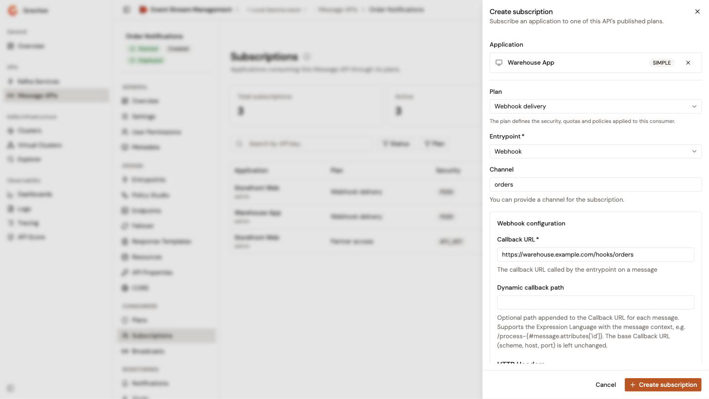

# Manage subscriptions

A subscription binds one application to one plan of a Message API. The **Subscriptions** page lists the subscriptions of a Message API, and each subscription opens on a detail page with its lifecycle actions, its metadata, for API key plans, its API keys, and, for Push plans, its delivery configuration.

## Open the subscriptions

1. From the Gamma console, open **Event Stream Management**.
2. In the sidebar, click **Message APIs**.
3. Click the name of the Message API.
4. In the **Consumers** group of the Message API sidebar, click **Subscriptions**.

While the Message API has no subscription, the page explains what subscriptions are for and offers **Create subscription**. Once the Message API has a subscription, the explanation hides behind the ⓘ button next to the **Subscriptions** title, and the page shows three counters: **Total subscriptions**, **Active** for accepted and resumed subscriptions, and **Pending approval**. Click a counter to filter the list on it.

## Find a subscription

Narrow the list with the following filters:

* The search box finds a subscription by its API key.
* **Status** keeps the subscriptions with the selected statuses: **Pending**, **Accepted**, **Paused**, **Resumed**, **Rejected**, or **Closed**.
* **Plan** keeps the subscriptions to the selected plans.

To clear every filter, click **Reset**. When no subscription matches, the list names the search and the filters, and **Clear filters** resets them.

To download the subscriptions that match the filters, click **Export CSV**. The file holds up to 1,000 subscriptions. When more subscriptions match, a warning above the list says that the file holds only the first 1,000, and suggests narrowing the filters. When the export fails, an alert offers **Retry**.

## Create a subscription

1. Open the subscriptions of the Message API.
2. Click **Create subscription**.
3. In **Application**, type at least two characters of the application's name, then select the application.
4. In **Plan**, select a published plan. Keyless plans aren't offered, because consumers don't subscribe to them.
5. Optional: For an API key plan, enter a key in **Custom API key (optional)**. Left empty, the key is generated. The field appears for every API key plan, whatever the custom API key setting of the environment.
6. For a Push plan, set where the gateway pushes the messages. See [Set the push delivery of a subscription](#set-the-push-delivery-of-a-subscription).

    <figure><figcaption>
A Push subscription created from the console
</figcaption></figure>

7. Click **Create subscription**.

A JWT or OAuth2 plan needs an application that has a client ID. The panel shows a reminder when you select one.

If you close the panel with unsaved edits, the **Discard unsaved changes?** dialog asks you to confirm. Click **Keep editing** to go back to the panel, or **Discard** to close it.

The console accepts the new subscription at once, whatever the subscription validation of the plan. The validation applies to the subscriptions that consumers request from the Developer Portal.

## Handle a subscription

Click the application of a subscription to open its detail page. The actions depend on the status of the subscription:

<table>
    <thead>
        <tr>
            <th width="190">Status</th>
            <th>Actions</th>
        </tr>
    </thead>
    <tbody>
        <tr>
            <td>Pending</td>
            <td><strong>Approve</strong>, with optional start and end dates, a custom API key for an API key plan, and a reason. <strong>Reject</strong>, with a required reason.</td>
        </tr>
        <tr>
            <td>Accepted or resumed</td>
            <td><strong>Transfer</strong> to another published plan with the same security type. <strong>Change end date</strong>. <strong>Pause</strong>. <strong>Close</strong>.</td>
        </tr>
        <tr>
            <td>Paused</td>
            <td><strong>Resume</strong>. <strong>Close</strong>.</td>
        </tr>
        <tr>
            <td>Rejected or closed</td>
            <td>None.</td>
        </tr>
    </tbody>
</table>

A subscription whose consumer is in failure also offers **Resume from failure**, which clears the failure and resumes consumption.

A subscription managed by the Gravitee Kubernetes Operator shows **Managed by Kubernetes** and offers no actions. Change it in its custom resource instead.

Without permission to change the Message API's subscriptions, the detail page offers no actions.

## Manage the metadata of a subscription

The **Metadata** card of the subscription's detail page lists the key-value pairs of the subscription, with the **Key**, **Value**, and **Actions** columns. Consumers fill them in, for example, through the subscription form of the Developer Portal. Policies read an entry at runtime with the expression `{#subscription.metadata['key']}`. To copy the expression of an entry, click the copy icon of its row.

You can change the metadata of a pending, accepted, resumed, or paused subscription when you have permission to change the Message API's subscriptions. A subscription managed by the Gravitee Kubernetes Operator stays read-only.

* To add an entry, click **Add**. In the **Add metadata** dialog, enter a **Key** and a **Value**, then click **Save**.
* To change an entry, click the edit icon of its row. In the **Edit metadata** dialog, change the **Key** or the **Value**, then click **Save**.
* To remove an entry, click the delete icon of its row. In the **Delete metadata <key>?** dialog, click **Delete metadata**.

A key holds up to 100 letters, digits, dashes, or underscores, and must be unique on the subscription. A value is required. The Management API removes anything between angle brackets from a value before storing it, and the dialog warns you when a value contains some.

When the Message API uses a subscription form, the card shows **This API has a subscription form**. The answers of the consumers who subscribe from the Developer Portal are validated against the form, but the values you edit here aren't. Following the form is still safer: a value that the form would refuse gets the consumer rejected the next time they update their subscription. Past 25 entries, a badge warns that a consumer who submits the subscription form again would be refused. The card doesn't block more entries.

A subscription to a JWT or OAuth2 plan also shows a **Credentials** card. It explains that the plan authenticates with the client credentials of the application, not with keys issued on this page.

## Set the push delivery of a subscription

A subscription to a Push plan tells the gateway where to push the messages, for example to a webhook callback URL.

When you create the subscription, the **Create subscription** panel asks for the following fields once you select a Push plan:

* **Entrypoint**. Required. The subscription entrypoint that delivers the messages, for example **Webhook**. The list holds the subscription entrypoints of the Message API.
* **Channel**. Optional. The channel of the subscription.
* `<entrypoint> configuration`. The settings of the entrypoint for this subscriber, built from the entrypoint, for example the callback URL, its authentication, and the retry settings of **Webhook**. With retries on failure, the initial delay can't exceed the maximum delay between attempts: **Initial retry delay should be less than maximum delay between attempts.**

The detail page of a Push subscription shows the **Consumer subscription configuration** card, with the **Entrypoint**, the **Channel**, and the **Callback URL**. To change them, click **Edit**, change the fields, then click **Save**. The entrypoint can't change. **Edit** appears when you have permission to change the Message API's subscriptions, while the subscription isn't closed, and when the Gravitee Kubernetes Operator doesn't manage it.

## Manage the API keys of a subscription

A subscription to an API key plan lists its API keys once it's accepted, paused, or resumed.

* **Renew** issues a new key for the subscription. Optional: Enter a custom API key.
* **Expire** stops a key on the date you choose.
* **Revoke** stops a key immediately.
* **Reactivate** restores a revoked or expired key while the subscription is accepted, paused, or resumed.

An application that shares one API key across its subscriptions shows **Shared API key**. Renew or revoke that key from the application instead.

## Verification

To verify that an application can consume the Message API, follow these steps:

1. Open the subscriptions of the Message API.
2. Click the **Active** counter.
3. Check that the application is listed with the plan you expect.
