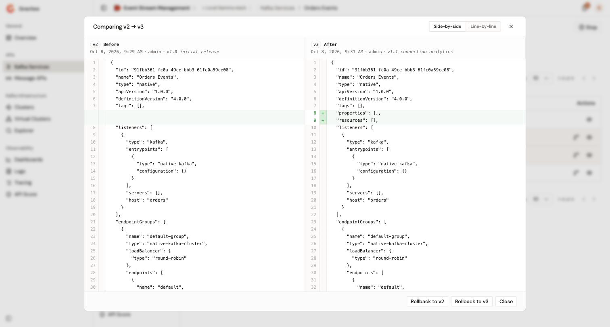

# Start, stop, and deploy a Message API

A Message API runs on the gateway when it's started and deployed. Starting and stopping decide whether the gateway serves the Message API. Deploying pushes your saved changes to the gateway.

## Start or stop a Message API

The actions above every page of a Message API include **Start** while it's stopped, and **Stop** while it's started.

1. Open the Message API.
2. Click **Start**, or click **Stop**. To stop, confirm in the **Stop <name>?** dialog by clicking **Stop Message API**.

The console confirms with **Message API started** or **Message API stopped**. The same actions are in the row menu of the **Message APIs** list, and in the **Message API events** card of the **Settings** page as **Start Message API** and **Stop Message API**.

A Message API starts only when it has at least one published or deprecated plan. See [Manage plans](manage-plans.md). The first start of a Message API that was never deployed also deploys it.

When the environment uses the API review workflow, a Message API can't start until a reviewer accepts it. Until then, the page header and the **Message API events** card don't offer **Start** or **Stop**. A Message API created before the environment turned on the workflow still offers **Start**, but starting it fails until a reviewer accepts it. The actions menu of its row in the **Message APIs** list offers **Start** and **Stop** in every case. See [Publish and review a Message API](publish-and-review-a-message-api.md).

Without permission to change the Message APIs of the environment, the actions don't appear. When the Gravitee Kubernetes Operator manages the Message API, **Start** and **Stop** don't appear, but **Deploy** does. See [Manage general settings](manage-general-settings.md#kubernetes-managed-message-apis).

## Deploy your changes

A change to what the gateway runs is saved first and reaches the gateway at the next deployment. Until then, the header of the Message API sidebar shows **Out of sync**, and, if you can deploy the Message API, the page header shows **Deploy**.

1. Click **Deploy**. The **Message API events** card of the **Settings** page offers the same action as **Deploy changes**.
2. Optional: In the **Deploy your API** dialog, enter a **Deployment label** of up to 32 characters. The label identifies the deployment in the deployment history.
3. Click **Deploy**.

The console confirms with **Deployment triggered**, and the badge changes to **Deployed**.

The **Deploy** action of the row menu of the **Message APIs** list deploys at once, without the dialog and without a label.

The following changes need a deployment:

* The entrypoints, the context paths or virtual hosts, the webhook logs settings, and the CORS settings.
* The endpoints and the failover settings.
* The flows of the Policy Studio and their execution mode.
* The plans, when you publish or close a plan, and the changes to a published plan that affect the gateway, such as its flows.
* The API properties, the dynamic properties, and the resources.
* The response templates, the reporter settings, and the sharding tags.

The name, version, description, labels, categories, images, visibility, and publication of the Message API don't need a deployment, and neither do its members, metadata, notifications, and alerts.

## Choose the gateways that load the Message API

Sharding tags decide which gateway instances load the Message API. A gateway configured with sharding tags loads it when it carries one of the gateway's tags and none of the tags that the gateway excludes. A gateway configured with no sharding tags loads every API.

1. In the **Operations** group of the Message API sidebar, click **Sharding Tags**.
2. Select one or more tags.
3. In the save bar at the bottom of the page, click **Save changes**.
4. Click **Deploy**.

The tags come from your organization. When none exist, the page says so. See [Manage entrypoints and sharding tags](../../../platform-management/manage-entrypoints-and-sharding-tags.md).

## Review the deployment history

1. In the **Operations** group of the Message API sidebar, click **Deployment History**.

The page lists every deployment of the Message API, newest first, with its version, date, user, and the label entered in the **Deploy your API** dialog. The newest deployment carries a **live** badge.

* To compare two deployments, select their checkboxes. The comparison opens at once, side by side or line by line, under the title **Comparing v<older> → v<newer>**. The older deployment is always on the left, whatever the order you select them in.
* To compare an earlier deployment with the live one, click its **Compare with live** icon. The icon appears on the first page of the history only.
* To read the full definition of a deployment, click its **View definition** icon.

Without permission to read the events of the Message API, the page shows **You cannot view deployment history**.

## Roll back to a past deployment

A rollback replaces the definition of the Message API with the definition of a past deployment. You need permission to change the Message API's definition. Rollback is available on a Message API that the Gravitee Kubernetes Operator manages too.

1. In the **Operations** group of the Message API sidebar, click **Deployment History**.
2. Open the deployment to roll back to:
    * Click its **View definition** icon, then click **Rollback**.
    * Or compare it with another deployment, then click **Rollback to v<version>** under the comparison.
3. In the **Rollback API** dialog, click **Rollback**.

The console confirms with **API deployment has been rolled back successfully**.

The rollback doesn't deploy: the restored definition is saved, the Message API shows **Out of sync**, and the gateway keeps running the live deployment until you deploy. See [Deploy your changes](#deploy-your-changes).

While the Message API is in sync with its live deployment, the live deployment doesn't offer a rollback. Once the Message API has undeployed changes, rolling back to the live deployment discards them.

<figure><figcaption>
Two deployments compared, with their rollback buttons
</figcaption></figure>

## Verification

To verify that the Message API is started and deployed, follow these steps:

1. Open the Message API.
2. Check that the header of the Message API sidebar shows **Started** and **Deployed**.
