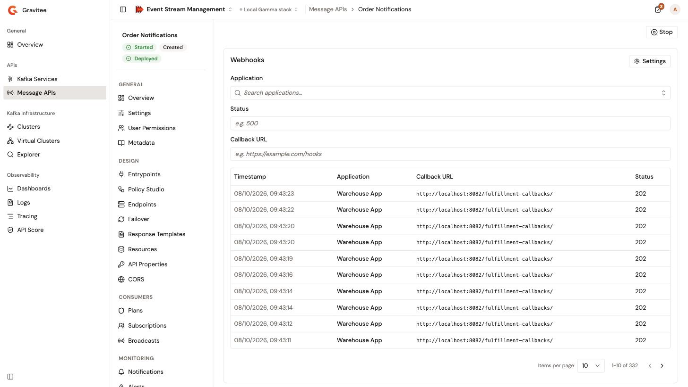
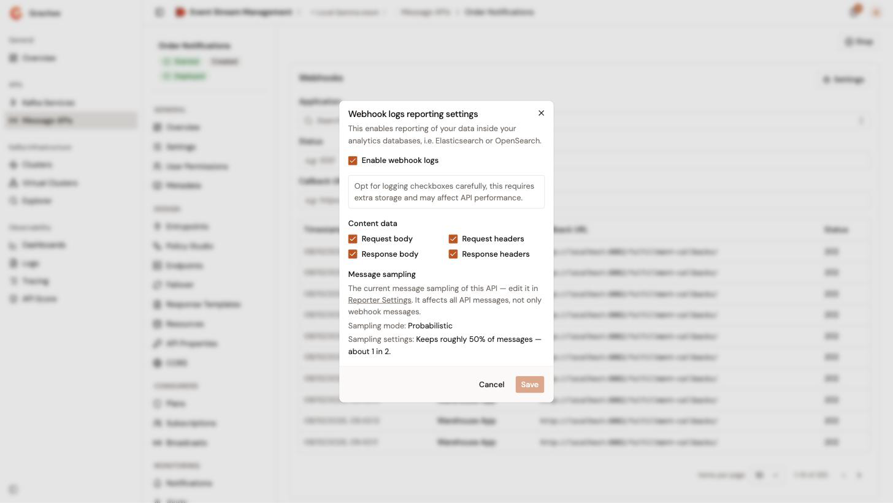
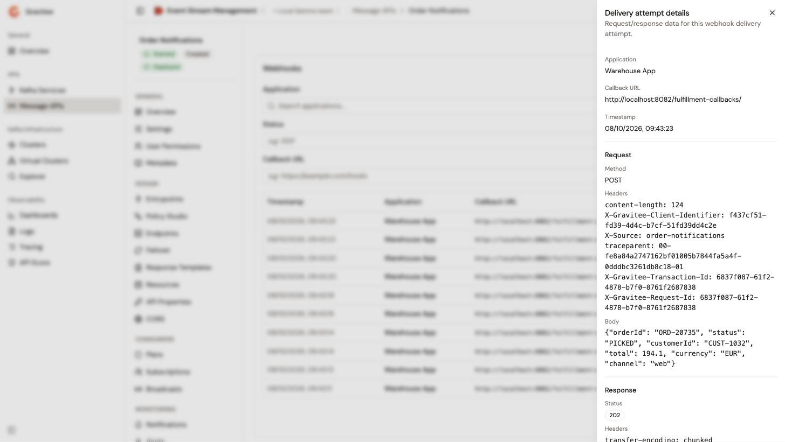

# View webhook delivery attempts

When a Message API has a **Webhook** entrypoint, the gateway pushes messages to the callback URL of each webhook subscription. Each call is a delivery attempt. The **Webhooks** page lists these attempts with their application, callback URL, and response status, and opens the request and the response of each one.

## Prerequisites

* A Message API with a **Webhook** entrypoint. Without one, the **Webhooks** item doesn't appear in the Message API sidebar. See [Configure entrypoints](configure-entrypoints.md).
* Permission to read the logs of the Message API. Without it, the **Webhooks** item doesn't appear in the Message API sidebar.
* Reporting enabled on the Message API. On the **Reporter Settings** page, **Enable analytics** must be selected. See [Configure reporter settings](configure-reporter-settings.md).
* Webhook logs turned on. See [Turn on webhook logs](#turn-on-webhook-logs). Without them, the gateway records no delivery attempt.

## Open the delivery attempts

1. From the Gamma console, open **Event Stream Management**.
2. In the sidebar, click **Message APIs**.
3. Click the name of the Message API.
4. In the **Monitoring** group of the Message API sidebar, click **Webhooks**.

The **Webhooks** card lists the delivery attempts, newest first, with the following columns:

* **Timestamp**. When the attempt happened.
* **Application**. The name of the subscribing application, or its ID when the console can't resolve the name.
* **Callback URL**. The URL that the gateway called.
* **Status**. The HTTP status code that the callback URL returned. `0` means that the call got no response.

<figure><figcaption>
The <strong>Webhooks</strong> page lists the delivery attempts of a Message API.
</figcaption></figure>

While the attempts aren't recorded, the card shows **Delivery attempts are not recorded**, with the setting to turn on: **Enable callback metrics** of the **Webhook** entrypoint, with a link to **Entrypoints**, or the runtime reporting of the Message API, with a link to **Reporter Settings**.

Message sampling applies to delivery attempts too, so the list can hold fewer attempts than the messages that the gateway pushed. Messages in error are always recorded. See [Configure reporter settings](configure-reporter-settings.md).

## Turn on webhook logs

The **Settings** button of the **Webhooks** card opens the **Webhook logs reporting settings** dialog. The button appears when you have permission to change the Message API's definition, also on a Message API that the Gravitee Kubernetes Operator manages.

1. Click **Settings**.
2. Select **Enable webhook logs**. Logging needs extra storage and can affect the performance of the Message API, so select only what you need.
3. Under **Content data**, select what each attempt records: **Request body**, **Request headers**, **Response body**, or **Response headers**. Clearing **Enable webhook logs** clears them too.

    <figure><figcaption>
The <strong>Webhook logs reporting settings</strong> dialog
</figcaption></figure>

4. Click **Save**.

The dialog also shows the **Message sampling** of the Message API, with a link to **Reporter Settings**, where you change it. The sampling applies to every message of the Message API, not only to webhook messages.

The dialog sets the same option as **Enable callback metrics** under **Callback reporting settings** in the configuration of the **Webhook** entrypoint. The console confirms with **API updated**. The change reaches the gateway at the next deployment. See [Start, stop, and deploy a Message API](start-stop-and-deploy-a-message-api.md).

## Filter the delivery attempts

Narrow the list with the following filters:

* **Application**. Type the name of an application, then select it in the list.
* **Status**. Enter a status code, for example `500`.
* **Callback URL**. Enter a callback URL, or part of one.

When the list is empty, it shows one of the following:

* **No delivery attempts recorded**, while the attempts aren't recorded. Turn on the settings that the card names.
* **No delivery attempts**, while a filter is set. Clear a filter to widen the search.
* **No delivery attempts yet**, until the gateway calls the callback URL of a subscriber.

## Inspect a delivery attempt

Click the application of an attempt. The **Delivery attempt details** panel opens with the following details:

* The **Application**, by name, the **Callback URL**, and the **Timestamp** of the attempt.
* Under **Request**, the **Method**, **Headers**, and **Body** of the call to the callback URL.
* Under **Response**, the **Status**, **Headers**, and **Body** that the callback URL returned.

<figure><figcaption>
The details of a delivery attempt
</figcaption></figure>

The headers and the bodies appear only when the webhook logs include them, under **Content data** in the **Webhook logs reporting settings** dialog. Otherwise, the panel shows `—` for them.

## Verification

To verify that delivery attempts are recorded, follow these steps:

1. Publish a message to the topic or the queue that a webhook subscription of the Message API receives.
2. Open the **Webhooks** page of the Message API.
3. Check that a new attempt appears with the callback URL of the subscription and the status code it returned.
