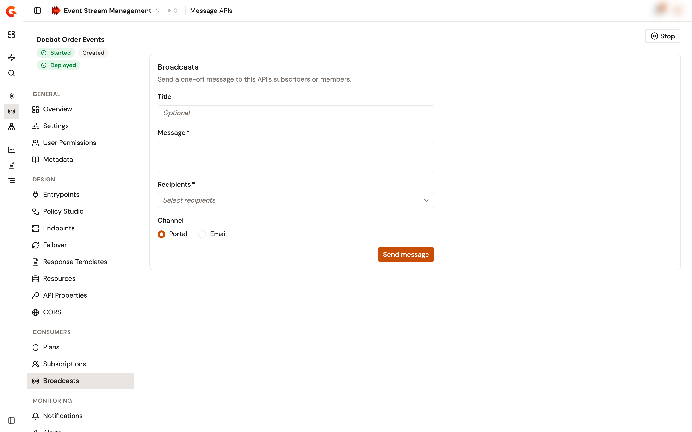

# Broadcast messages to consumers

A broadcast sends a one-off message about a Message API to the people who consume it, for example to announce maintenance or a deprecation. It goes out as a portal notification or by email.

## Prerequisites

* Permission to send messages about the Message API. Without it, the **Broadcasts** item doesn't appear in the Message API sidebar.

## Send a broadcast

1. From the Gamma console, open **Event Stream Management**.
2. In the sidebar, click **Message APIs**.
3. Click the name of the Message API.
4. In the **Consumers** group of the Message API sidebar, click **Broadcasts**.
5. Complete the following fields:

<table>
    <thead>
        <tr>
            <th width="160">Field</th>
            <th>Description</th>
        </tr>
    </thead>
    <tbody>
        <tr>
            <td><strong>Title</strong></td>
            <td>Optional. The title of the message. By email, it's the subject.</td>
        </tr>
        <tr>
            <td><strong>Message</strong></td>
            <td>Required. The text of the message.</td>
        </tr>
        <tr>
            <td><strong>Recipients</strong></td>
            <td>Required. <strong>API subscribers</strong> sends the message to the users who subscribed to the Message API, whatever the status of their subscription. The console also offers one option per application role, for example <strong>Members with the Owner role on subscribed applications</strong>, which sends the message to the members that hold that role on the applications with an accepted subscription to the Message API.</td>
        </tr>
        <tr>
            <td><strong>Channel</strong></td>
            <td><strong>Portal</strong> sends the message as a portal notification. <strong>Email</strong> sends it by email. The default is <strong>Portal</strong>.</td>
        </tr>
    </tbody>
</table>

<figure><figcaption>
The Broadcasts page of a Message API
</figcaption></figure>

6. Click **Send message**.

The message goes out at once, without a confirmation step.

## Verification

To verify that the broadcast was sent, follow these steps:

1. Check the confirmation under the form. It reads **Message sent**, with the number of recipients that the message was addressed to.
2. If the number is 0, check the recipients. For example, **API subscribers** reaches no one on a Message API without subscriptions.
