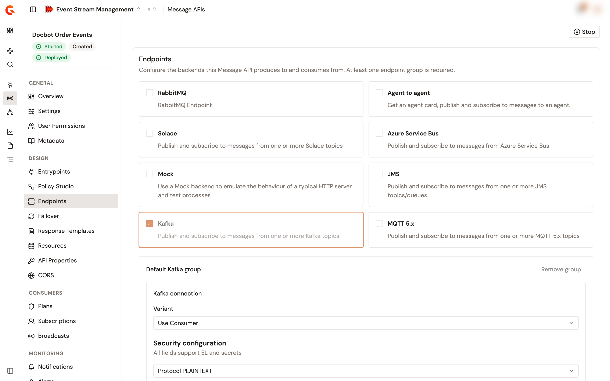

# Configure endpoints and failover

The endpoints of a Message API are the backends that it produces to and consumes from, such as a Kafka cluster or an MQTT broker. Endpoints sit in endpoint groups: a group holds the connection settings that its endpoints share, and each endpoint holds its own settings. Failover retries a failed call to the backend and stops calling a backend that keeps failing.

## Configure the endpoints

1. From the Gamma console, open **Event Stream Management**.
2. In the sidebar, click **Message APIs**.
3. Click the name of the Message API.
4. In the **Design** group of the Message API sidebar, click **Endpoints**.

<figure><figcaption>
The Endpoints page of a Message API
</figcaption></figure>

Without permission to change the Message API's definition, the page shows a read-only list of the endpoint groups, with the connector and the number of endpoints of each.

### Add or remove an endpoint group

The cards cover every endpoint connector that supports Message APIs, for example **Kafka**, **MQTT 5.x**, **Solace**, **RabbitMQ**, and **Mock**. A checked card has at least one endpoint group on the Message API.

* To add an endpoint group, click an unchecked card. The new group is named `Default <connector> group` and holds one endpoint named `Default <connector>`.
* To remove every endpoint group of a connector, click its checked card.
* To remove one endpoint group, click **Remove group** on its card.

A Message API keeps at least one endpoint group. While only one remains, its card and its **Remove group** button are disabled.

### Configure an endpoint group

Each endpoint group card holds the group's connection settings in a form titled `<connector> connection`, followed by the group's endpoints.

* To add an endpoint to the group, click **Add endpoint**. The new endpoint uses the connector's name followed by a number, for example `Kafka 2`. It starts with empty settings that the console doesn't let you fill in, so saving a new **Kafka**, **MQTT 5.x**, **Solace**, **RabbitMQ**, or **Agent to agent** endpoint fails.
* To remove an endpoint, click **Remove** on its row. A group keeps at least one endpoint.

### Configure an endpoint

When the connector has group connection settings, each endpoint shows **Inherit connection settings from group**, turned on for every endpoint that the console creates. While the toggle is on, the endpoint uses the connection settings of its group, and the page hides the endpoint's **Endpoint settings** form.

Recommended: Keep **Inherit connection settings from group** turned on. Event Stream Management has no form for the connection settings of a single endpoint. Turning the toggle off makes the save fail for **Kafka**, **MQTT 5.x**, **Solace**, **RabbitMQ**, and **Azure Service Bus** endpoints.

### Save the endpoints

**Save changes** and **Discard** appear as soon as the page holds an unsaved change.

1. Click **Save changes**.

The console saves the endpoints and confirms with **API updated**. The save fails when an endpoint connector of the Message API doesn't support the quality of service of an entrypoint. The change reaches the gateway at the next deployment, and until then the Message API shows **Out of sync**. See [Start, stop, and deploy a Message API](start-stop-and-deploy-a-message-api.md).

## Configure failover

1. In the **Design** group of the Message API sidebar, click **Failover**.
2. Turn on **Enable failover**. The other fields become editable.
3. Complete the following fields:

<table>
    <thead>
        <tr>
            <th width="220">Field</th>
            <th>Description</th>
        </tr>
    </thead>
    <tbody>
        <tr>
            <td><strong>Max retries</strong></td>
            <td>How many times the gateway retries a failed call to the backend before it fails the request.</td>
        </tr>
        <tr>
            <td><strong>Max failures</strong></td>
            <td>How many recent calls the circuit breaker weighs. When that many calls have all failed, or have all run slow, the circuit breaker opens, and the gateway stops calling the backend.</td>
        </tr>
        <tr>
            <td><strong>Slow call duration (ms)</strong></td>
            <td>How long each attempt to reach the backend can run before the gateway abandons it and retries. A call that takes longer than this in total, retries included, counts as slow.</td>
        </tr>
        <tr>
            <td><strong>Open state duration (ms)</strong></td>
            <td>How long the circuit breaker stays open before the gateway tries the backend again with a single call.</td>
        </tr>
        <tr>
            <td><strong>Per subscription</strong></td>
            <td>Keeps a separate circuit breaker for each subscription instead of one for the whole Message API.</td>
        </tr>
    </tbody>
</table>

4. Click **Save changes**.

The console confirms with **API updated**. Like the endpoints, failover reaches the gateway at the next deployment.

Turning off **Enable failover** keeps the other values, so they're back the next time you turn it on.

## Verification

To verify that the endpoints and failover are saved, follow these steps:

1. Reload the **Endpoints** page, and check that each endpoint group shows the connection settings you entered.
2. Open **Failover**, and check that **Enable failover** and the values you entered are still set.
3. Check that the header of the Message API sidebar shows **Out of sync** until you deploy.
