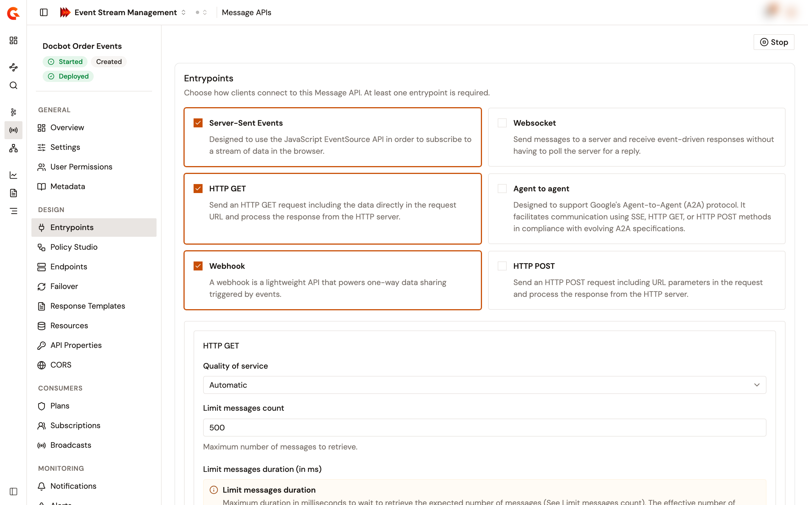

# Configure entrypoints

The entrypoints of a Message API decide how clients connect to it. The **Entrypoints** page shows one card per entrypoint that your Gravitee installation offers for Message APIs, and the enabled ones are checked. The configuration of each enabled entrypoint appears below the cards.

## Open the entrypoints

1. From the Gamma console, open **Event Stream Management**.
2. In the sidebar, click **Message APIs**.
3. Click the name of the Message API.
4. In the **Design** group of the Message API sidebar, click **Entrypoints**.

<figure><figcaption>
The Entrypoints page of a Message API
</figcaption></figure>

Without permission to change the Message API's definition, the page shows a read-only list of the enabled entrypoints, their quality of service, and the context path.

## Add or remove an entrypoint

The cards cover every entrypoint that supports Message APIs, for example **HTTP GET**, **HTTP POST**, **Server-Sent Events**, and **Webhook**. A checked card is enabled on the Message API.

* To add an entrypoint, click its card. Its configuration appears below the cards.
* To remove an entrypoint, click its card again, or click **Remove** under its configuration.

A Message API keeps at least one entrypoint. While only one is enabled, its card and its **Remove** button are disabled.

Adding **Webhook** also lets the **Plans** page create Push plans. See [Manage plans](manage-plans.md).

## Configure an entrypoint

Each enabled entrypoint shows the following settings:

* **Quality of service**. Appears when the entrypoint declares quality-of-service levels. Choose one of the levels it offers: **None**, **Automatic**, **At most once**, or **At least once**. A newly added entrypoint starts on **Automatic** when it offers that level.
* The entrypoint's own configuration form, built from the entrypoint. An entrypoint with nothing to configure shows **No additional configuration required.**

## Set the context path

The **Context path** field appears while at least one enabled entrypoint listens over HTTP. Of the entrypoints that Gravitee ships for Message APIs, only **Webhook** doesn't listen over HTTP, so a Message API whose only entrypoint is **Webhook** has no context path.

Enter the path that clients call, starting with `/`:

* A path that doesn't start with `/` shows **Context path must start with a slash (/).** and disables **Save changes**.
* An empty path also disables **Save changes**.

The context path can't overlap the context path of another API in the environment, unless that API listens on a virtual host. Two paths overlap when they're identical, or when one extends the other by whole path segments. For example, `/orders` and `/orders/eu` overlap, but `/orders` and `/orders-eu` don't. When the path overlaps, the save fails, and **Save failed** shows the path that's already in use.

## Save your changes

**Save changes** and **Discard** appear as soon as the page holds an unsaved change.

1. Click **Save changes**.

The console saves the entrypoints and confirms with **API updated**. The save fails when an endpoint connector of the Message API doesn't support the quality of service of an entrypoint. The change reaches the gateway at the next deployment, and until then the Message API shows **Out of sync**. See [Start, stop, and deploy a Message API](start-stop-and-deploy-a-message-api.md).

To drop your changes instead, click **Discard**.

## Verification

To verify that the entrypoints are saved, follow these steps:

1. Reload the **Entrypoints** page.
2. Check that the cards of the entrypoints you enabled are checked, and that **Context path** shows the path you entered, ending with `/`.
3. Check that the header of the Message API sidebar shows **Out of sync**, and, if you can deploy the Message API, that the page header shows **Deploy**.
