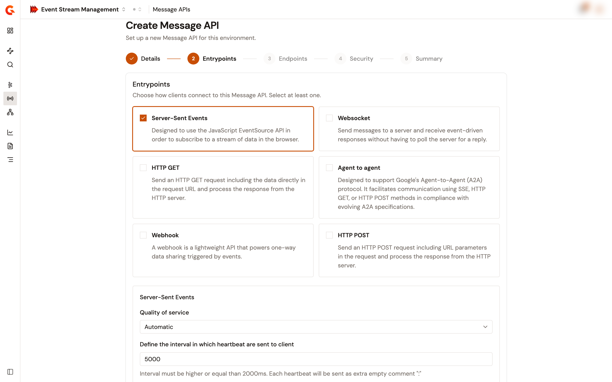
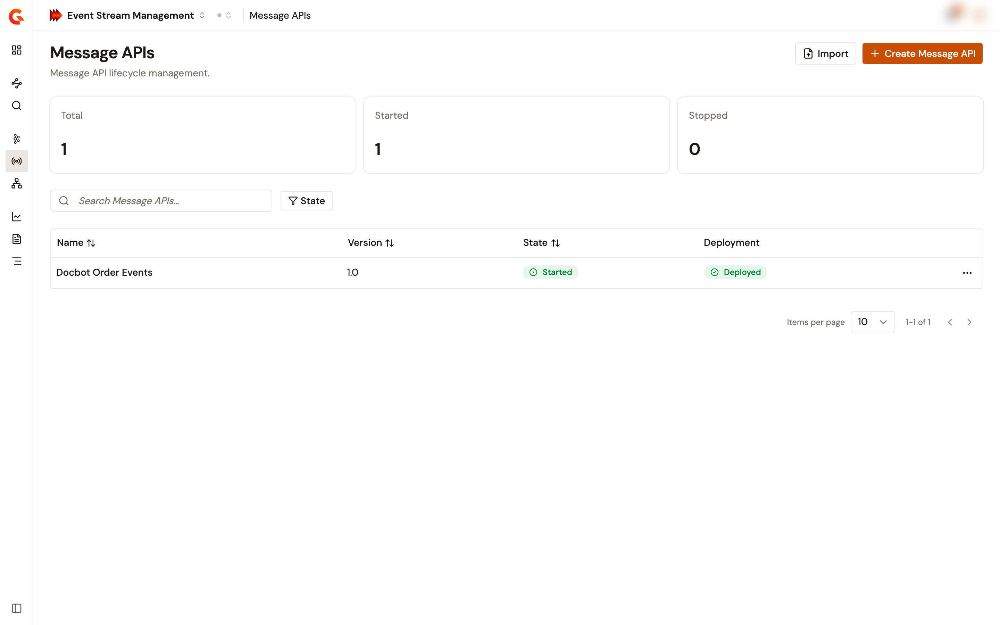

# Create a Message API

A Message API connects clients to a message backend. Its entrypoints set how clients connect, and its endpoints set the backend that the API produces to and consumes from. Create one with the creation wizard, or import an existing Gravitee API definition.

## Prerequisites

* A license that includes the `apim-en-message-reactor` feature. Without it, **Create Message API** opens an upgrade message instead of the wizard.
* An environment role that can create APIs. Without it, the **Message APIs** page shows no **Create Message API** or **Import** button.

## Create a Message API with the wizard

1. From the Gamma console, open **Event Stream Management**.
2. In the sidebar, click **Message APIs**.
3. Click **Create Message API**.

The wizard has five steps: **Details**, **Entrypoints**, **Endpoints**, **Security**, and **Summary**. **Next** stays disabled until the current step is complete.

### Details

Describe the Message API.

<table>
    <thead>
        <tr>
            <th width="160">Field</th>
            <th>Description</th>
        </tr>
    </thead>
    <tbody>
        <tr>
            <td><strong>Name</strong></td>
            <td>Required. The name shown in the Message API list and detail views, up to 255 characters.</td>
        </tr>
        <tr>
            <td><strong>Version</strong></td>
            <td>Required. Pre-filled with <code>1.0</code>.</td>
        </tr>
        <tr>
            <td><strong>Description</strong></td>
            <td>Optional. What the Message API is used for.</td>
        </tr>
    </tbody>
</table>

### Entrypoints

Select one or more entrypoints. Each card is an entrypoint installed on your Gravitee installation that supports Message APIs, for example **HTTP GET**, **HTTP POST**, **Server-Sent Events**, or **Webhook**.

<figure><figcaption>
The Entrypoints step of the creation wizard
</figcaption></figure>

Each selected entrypoint shows its settings below the cards:

* **Quality of service**, when the entrypoint declares quality-of-service levels. **Automatic** is selected by default when the entrypoint offers it.
* The entrypoint's own configuration form. An entrypoint with nothing to configure shows **No additional configuration required.**

When at least one selected entrypoint listens over HTTP, the step also shows **Context path**. Of the entrypoints that Gravitee ships for Message APIs, only **Webhook** doesn't listen over HTTP. Enter the path that clients call, starting with `/`. The path can't overlap the context path of another API in the environment, unless that API listens on a virtual host. Two paths overlap when they're identical, or when one extends the other by whole path segments. For example, `/orders` and `/orders/eu` overlap, but `/orders` and `/orders-eu` don't.

### Endpoints

Select one or more endpoints. Each card is an endpoint connector installed on your Gravitee installation that supports Message APIs, for example **Kafka**, **MQTT 5.x**, **Solace**, **RabbitMQ**, or **Mock**.

Each selected endpoint shows two configuration forms, both built from the connector:

* **Connection**. The settings that the endpoint group shares.
* **Endpoint settings**. The settings of the endpoint itself.

Each endpoint that you select becomes its own endpoint group, named `Default <connector> group`, that holds one endpoint named `Default <connector>`.

### Security

Add the plans that govern who can consume the Message API. Plans are optional.

On the first visit, the step adds default plans:

* A **Keyless plan**, when at least one selected entrypoint isn't a subscription entrypoint.
* A **Push plan**, when a subscription entrypoint such as **Webhook** is selected.

To add another plan, select a type in **Plan type**, then click **Add plan**. The types are **Keyless**, **API key**, **OAuth2**, **JWT**, and **mTLS**, plus **Push (webhook)** when a subscription entrypoint is selected. **Keyless** disappears from the list once the plans include a Keyless plan. To remove a plan, click the remove icon on its row.

When the Message API is created, Keyless and Push plans are published immediately. Plans of every other type are created in Staging. Configure and publish them later from the **Plans** page. See [Manage plans](manage-plans.md).

The wizard sets the subscription validation of every plan to manual.

### Summary

Review the name, version, entrypoints, context path, endpoints, and plans. Then choose what happens right after the Message API is created:

* **Deploy now** starts the Message API on the gateway. Starting it also deploys it. The option appears when the environment doesn't use the API review workflow.
* **Ask for review** submits the Message API for review. The option appears when the environment uses the API review workflow.

Starting a new Message API needs a published plan. If you turn on **Deploy now** after removing every Keyless and Push plan, the Message API is still created, and a message reports that the start failed.

Click **Create Message API**. The console confirms with **Message API created** and returns to the **Message APIs** list.

## Import a Message API

Create a Message API from a Gravitee API definition in JSON format, such as one exported from another environment.

1. From the Gamma console, open **Event Stream Management**.
2. In the sidebar, click **Message APIs**.
3. Click **Import**.
4. In the **Import API Definition** panel, choose the source of the definition:
    * **Local file**. Drop the JSON file on the drop zone, or click it to browse. The console accepts only a v4 definition of a Message API.
    * **Remote URL**. Enter the http or https address of the definition in **Definition URL**. The Management API fetches the definition itself, so the address must be reachable from the Management API. When the Management API restricts the addresses that it imports from, the address must also be allowed.
5. Click **Import**.

The console confirms with **Message API imported** and opens the new Message API.

The console can't check the type of a definition that the Management API fetches from a URL. When that definition describes another type of API, the API is still created, but the console doesn't open it. A warning says to manage it from the API Management console.

## Verification

To verify that the Message API is created, follow these steps:

1. From the Gamma console, open **Event Stream Management**.
2. In the sidebar, click **Message APIs**.
3. Enter the name of the Message API in the search box.

The Message API appears in the list with its version, its **State**, and its **Deployment** status.

<figure><figcaption>
The Message APIs list
</figcaption></figure>

## Next steps

* Configure and publish the plans that the wizard created in Staging. See [Manage plans](manage-plans.md).
* Add policies to the Message API. See [Design flows in the Policy Studio](design-flows-in-the-policy-studio.md).
* Start and deploy the Message API when it's ready to accept clients. See [Start, stop, and deploy a Message API](start-stop-and-deploy-a-message-api.md).
