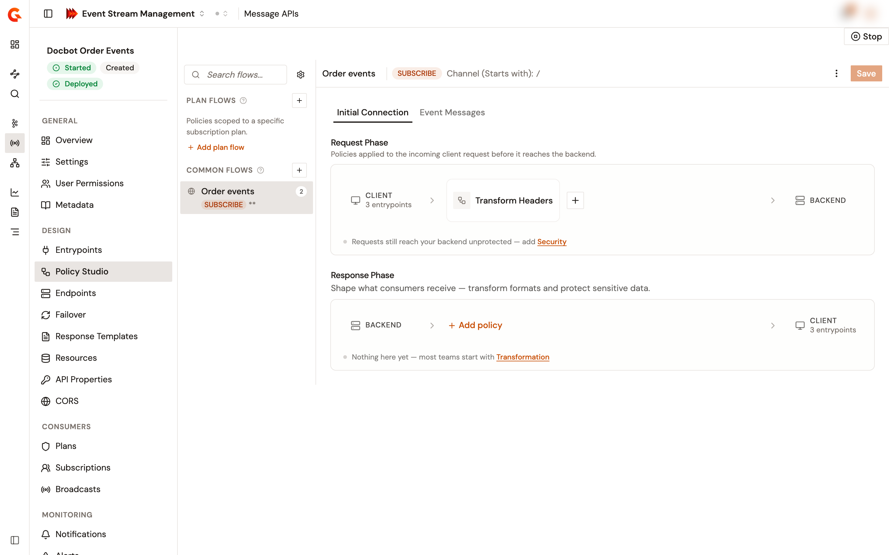

# Design flows in the Policy Studio

The Policy Studio of a Message API holds its flows. A flow selects part of the traffic, by channel, operation, entrypoint, or condition, and applies policies to it in four phases:

* The **Initial Connection** tab holds the **Request Phase** and the **Response Phase**, for the client's request and the response it gets back.
* The **Event Messages** tab holds the **Publish Phase** and the **Subscribe Phase**, for the messages that clients publish to the backend and the messages they consume from it.

## Open the Policy Studio

1. From the Gamma console, open **Event Stream Management**.
2. In the sidebar, click **Message APIs**.
3. Click the name of the Message API.
4. In the **Design** group of the Message API sidebar, click **Policy Studio**.

<figure><figcaption>
The Policy Studio of a Message API
</figcaption></figure>

Without permission to change the Message API's definition, the Policy Studio is read-only.

## Choose where a flow applies

The flows list on the left has two sections:

* **Plan Flows**. The flows attached to a plan, listed under the name of their plan. A plan flow applies to the traffic of that plan only. A plan appears here once it holds a flow.
* **Common Flows**. Flows that apply to all traffic, whatever the plan.

A plan flow needs a plan to attach to, so **Plan Flows** accepts new flows only once the Message API has a published or deprecated plan.

## Add a flow

1. Click the add icon next to **Plan Flows** or **Common Flows**. While no plan holds a flow, **Add plan flow** under **Plan Flows** opens the same panel.
2. Complete the fields of the **Create a new plan flow** or **Create a new common flow** panel:

<table>
    <thead>
        <tr>
            <th width="170">Field</th>
            <th>Description</th>
        </tr>
    </thead>
    <tbody>
        <tr>
            <td><strong>Flow name</strong></td>
            <td>Optional. Left blank, the name is built from the channel and the operations.</td>
        </tr>
        <tr>
            <td><strong>Associated plan</strong></td>
            <td>Plan flows only. The plan whose traffic the flow applies to.</td>
        </tr>
        <tr>
            <td><strong>Operator</strong></td>
            <td>How the channel is matched: <strong>Equals</strong> or <strong>Starts With</strong>.</td>
        </tr>
        <tr>
            <td><strong>Channel</strong></td>
            <td>The channel that the flow applies to. Left blank, the channel is <code>/</code>.</td>
        </tr>
        <tr>
            <td><strong>Entrypoints</strong></td>
            <td>Optional. The entrypoints that the flow runs on. Left empty, the flow runs on every entrypoint.</td>
        </tr>
        <tr>
            <td><strong>Operations</strong></td>
            <td>Optional. <code>PUBLISH</code>, <code>SUBSCRIBE</code>, or both. Left empty, the flow applies to every operation.</td>
        </tr>
        <tr>
            <td><strong>Condition</strong></td>
            <td>Optional. A condition, in Gravitee Expression Language, that decides whether the flow runs.</td>
        </tr>
    </tbody>
</table>

3. Click **Create**.

To change a flow later, select it, open its actions menu, and click `Edit flow...`. The same menu turns the flow off with **Enabled** and removes it with **Delete flow**.

## Add policies to the phases

1. Select the flow in the flows list.
2. Click the **Initial Connection** tab or the **Event Messages** tab.
3. On the phase that needs the policy, click **Add policy**. When the phase already holds a policy, click its add icon instead.
4. Search the catalog, then select the policy.
5. Complete the policy's configuration.

The catalog lists the policies that support the phase for Message APIs. It also lists the deployed shared policy groups of the environment that were built for Message APIs and for that phase, under **Shared Policy Group**.

## Set the flow execution mode

The flow execution settings decide how the gateway picks the flows to run.

1. Click the **Flow execution settings** icon next to the flows search box.
2. In **Mode**, select **Default** or **Best match**.
3. Optional: Turn on **Match required** to respond with an error when no flow matches.

## Save the flows

1. Click **Save**.

Saving writes the flows to the Message API but doesn't deploy them. The Message API then shows **Out of sync**, and the gateway applies the new flows at the next deployment. See [Start, stop, and deploy a Message API](start-stop-and-deploy-a-message-api.md).

If the save fails, the **Save** button turns red, and its tooltip starts with **Save failed:** followed by the reason.

## Verification

To verify that the flows are in place, follow these steps:

1. Reload the **Policy Studio** page, and check that your flows and their policies are listed.
2. Deploy the Message API, and check that the header of the Message API sidebar shows **Deployed**.
