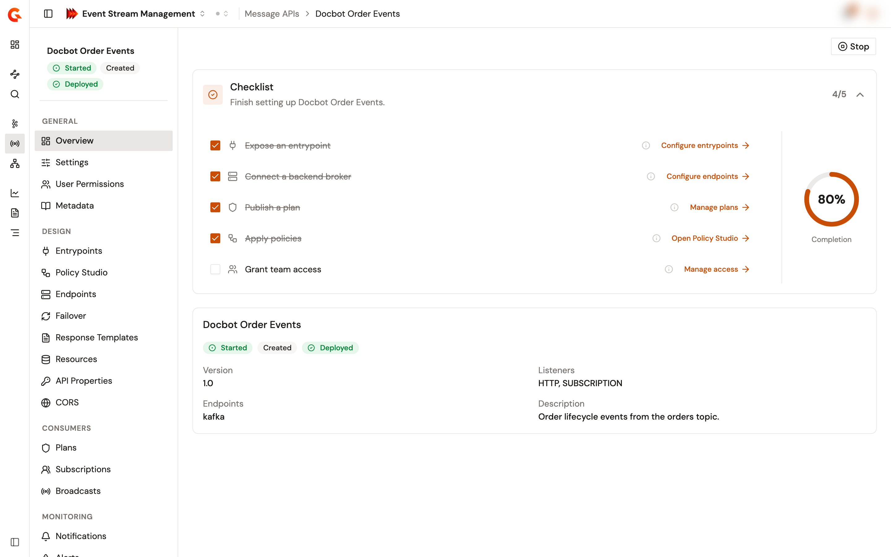

# Follow the setup checklist

A Message API opens on its **Overview** page. The page holds a setup checklist, a summary of the Message API, and a banner when its reporting is off or its logging settings are incomplete.

## Open the overview

1. From the Gamma console, open **Event Stream Management**.
2. In the sidebar, click **Message APIs**.
3. Click the name of the Message API.

The **Overview** page opens. To come back to it from another page of the Message API, click **Overview** in the **General** group of the Message API sidebar.

<figure><figcaption>
The Overview page of a Message API
</figcaption></figure>

## Work through the checklist

The **Checklist** card lists five items, with a counter and a completion ring. Each item links to the page that completes it:

<table>
    <thead>
        <tr>
            <th width="220">Item</th>
            <th width="190">Link</th>
            <th>Ticks itself when</th>
        </tr>
    </thead>
    <tbody>
        <tr>
            <td><strong>Expose an entrypoint</strong></td>
            <td><strong>Configure entrypoints</strong></td>
            <td>The Message API has at least one entrypoint.</td>
        </tr>
        <tr>
            <td><strong>Connect a backend broker</strong></td>
            <td><strong>Configure endpoints</strong></td>
            <td>The Message API has at least one endpoint.</td>
        </tr>
        <tr>
            <td><strong>Publish a plan</strong></td>
            <td><strong>Manage plans</strong></td>
            <td>At least one plan is published.</td>
        </tr>
        <tr>
            <td><strong>Apply policies</strong></td>
            <td><strong>Open Policy Studio</strong></td>
            <td>A flow of the Message API, or a flow of one of its plans, holds at least one policy.</td>
        </tr>
        <tr>
            <td><strong>Grant team access</strong></td>
            <td><strong>Manage access</strong></td>
            <td>The Message API has more than one direct member. Access given through groups doesn't count.</td>
        </tr>
    </tbody>
</table>

Depending on your role, policies that sit only on plan flows may not tick **Apply policies**. Tick it by hand in that case.

To mark an item done or not done by hand, click its checkbox. An item that you clear by hand stays cleared even when its condition is met. These manual marks are stored in your browser only, so other users and other browsers don't see them.

## Read the summary

The card under the checklist is titled with the name of the Message API. It shows the state, lifecycle, and deployment badges of the Message API, and the following details:

* **Version**. The version of the Message API.
* **Listeners**. The types of listener that its entrypoints use, for example `HTTP` or `SUBSCRIPTION`.
* **Endpoints**. The connectors of its endpoint groups, for example `kafka`.
* **Description**. Shown when the Message API has one.

## Fix a reporting banner

In two cases, a banner at the top of the page says what the Message API doesn't report, and links to **Reporter Settings**:

* **Runtime reporting is disabled**. Reporting is off, so **Logs** in Observability stays empty for this Message API.
* **Message content is not recorded**. Reporting is on, and the Message API has logging settings, but they don't include both a logging mode and a logging phase. The connections of this Message API appear in **Logs** without their messages.

To clear the banner, turn on reporting and choose at least one logging mode and one logging phase.

A new Message API has reporting turned on and no logging settings, so it shows no banner. See [Configure reporter settings](configure-reporter-settings.md).

## Verification

To verify that the Message API is set up, follow these steps:

1. Open the **Overview** page of the Message API.
2. Check that the counter of the **Checklist** card reads 5/5. Items that you ticked by hand count toward it too.
