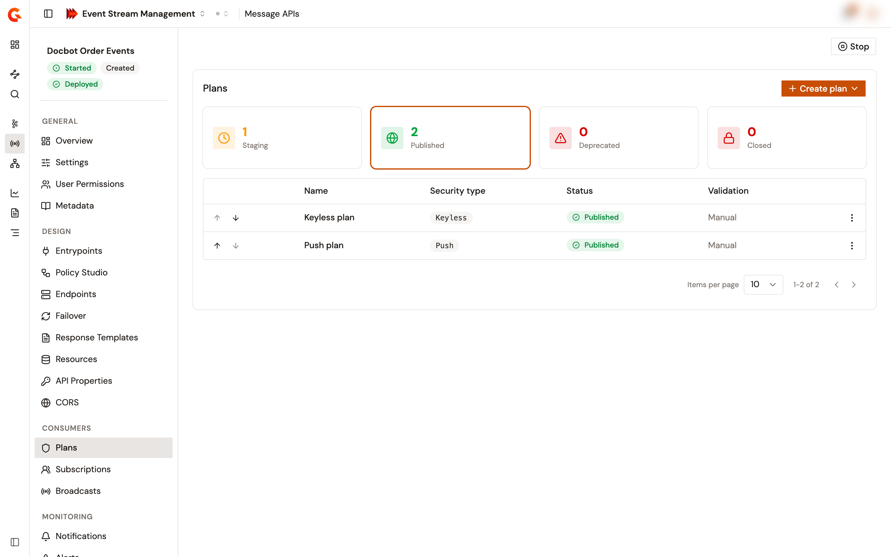

# Manage plans

A plan decides how consumers access a Message API. They connect with no credentials, with an API key, a JWT, an OAuth2 token, or a client certificate, or they receive messages on their own webhook. The **Plans** page lists the plans of a Message API by status and holds their lifecycle actions.

## Open the plans

1. From the Gamma console, open **Event Stream Management**.
2. In the sidebar, click **Message APIs**.
3. Click the name of the Message API.
4. In the **Consumers** group of the Message API sidebar, click **Plans**.

<figure><figcaption>
The Plans page of a Message API
</figcaption></figure>

The status cards, **Staging**, **Published**, **Deprecated**, and **Closed**, show how many plans have each status. Click a card to list its plans. The page opens on **Staging**.

Without permission to change the Message API's plans, the page is read-only.

## Plan types

The security type of a plan is set when you create it, and it can't change later.

<table>
    <thead>
        <tr>
            <th width="160">Type</th>
            <th>How consumers access the Message API</th>
        </tr>
    </thead>
    <tbody>
        <tr>
            <td><strong>Keyless</strong></td>
            <td>Without credentials. Consumers don't subscribe to a Keyless plan.</td>
        </tr>
        <tr>
            <td><strong>API key</strong></td>
            <td>With the API key issued for their subscription.</td>
        </tr>
        <tr>
            <td><strong>OAuth2</strong></td>
            <td>With an OAuth2 token. The subscribing application needs a client ID, and the plan validates the tokens with an OAuth2 resource of the Message API. See <a href="configure-resources.md">Configure resources</a>.</td>
        </tr>
        <tr>
            <td><strong>JWT</strong></td>
            <td>With a JSON Web Token. The subscribing application needs a client ID.</td>
        </tr>
        <tr>
            <td><strong>mTLS</strong></td>
            <td>With a client certificate presented on the TLS connection. The subscribing application needs a client certificate.</td>
        </tr>
        <tr>
            <td><strong>Push (webhook)</strong></td>
            <td>Messages are pushed to the consumer through a subscription entrypoint. A Push plan carries no security, and it's available only when the Message API has a subscription entrypoint such as <strong>Webhook</strong>.</td>
        </tr>
    </tbody>
</table>

## Create a plan

1. Open the plans of the Message API.
2. Create the plan:
    * When the Message API has no plan yet, click **Create plan**. The form opens for a Keyless plan.
    * Otherwise, click **Create plan**, then select the type of plan.
3. Complete the plan form:

<table>
    <thead>
        <tr>
            <th width="220">Field</th>
            <th>Description</th>
        </tr>
    </thead>
    <tbody>
        <tr>
            <td><strong>Name</strong></td>
            <td>Required. The name shown in the plans list.</td>
        </tr>
        <tr>
            <td><strong>Plan mode</strong></td>
            <td>Read-only. <strong>Push (webhook)</strong> for a Push plan, <strong>Standard</strong> for every other plan.</td>
        </tr>
        <tr>
            <td><strong>Security type</strong></td>
            <td>Read-only. The type you chose. A Push plan doesn't show it.</td>
        </tr>
        <tr>
            <td><strong>API key settings</strong>, <strong>JWT settings</strong>, or <strong>OAuth2 settings</strong></td>
            <td>API key, JWT, and OAuth2 plans only. The security configuration of the plan, built from the security policy.</td>
        </tr>
        <tr>
            <td><strong>Subscription validation</strong></td>
            <td><code>AUTO</code> accepts new subscriptions immediately. With <code>MANUAL</code>, the subscriptions that consumers request from the Developer Portal wait for someone to approve them. New plans use <code>MANUAL</code>.</td>
        </tr>
        <tr>
            <td><strong>Description</strong></td>
            <td>Optional. What the plan offers.</td>
        </tr>
    </tbody>
</table>

4. Click **Create plan**.

The console confirms with **Plan created**, and the plan appears under **Staging**.

## Publish, deprecate, or close a plan

Open the actions menu of the plan's row, then select the action. Each action asks for confirmation.

<table>
    <thead>
        <tr>
            <th width="140">Action</th>
            <th width="180">Offered for</th>
            <th>Effect</th>
        </tr>
    </thead>
    <tbody>
        <tr>
            <td><strong>Publish</strong></td>
            <td>Staging plans</td>
            <td>Makes the plan available to consumers. They subscribe to it, except to a Keyless plan, which they use without a subscription.</td>
        </tr>
        <tr>
            <td><strong>Deprecate</strong></td>
            <td>Published plans</td>
            <td>Existing subscriptions continue, and no new subscriptions are accepted.</td>
        </tr>
        <tr>
            <td><strong>Close</strong></td>
            <td>Staging, published, and deprecated plans</td>
            <td>Closes every active subscription of the plan. A closed plan can't be published again.</td>
        </tr>
    </tbody>
</table>

You can't publish a Keyless plan while another Keyless plan of the Message API is published or deprecated. Publishing it fails with **A key-less plan is already published (or has been deprecated)!**

Publishing or closing a plan reaches the gateway at the next deployment, and until then the Message API shows **Out of sync**. See [Start, stop, and deploy a Message API](start-stop-and-deploy-a-message-api.md).

The **Plans** page has no delete action. To retire a plan, deprecate it so that it takes no new subscriptions, then close it.

## Edit or reorder plans

* To edit a plan, click its name, or select **Edit** in its actions menu. The name, the security configuration, the subscription validation, and the description can change. The console confirms with **Plan updated**.
* To reorder the published plans, click the up or down arrow of a row.

## Verification

To verify that a plan is ready for consumers, follow these steps:

1. Open the plans of the Message API.
2. Click the **Published** card.
3. Check that the plan is listed with the security type and the validation mode you expect.
