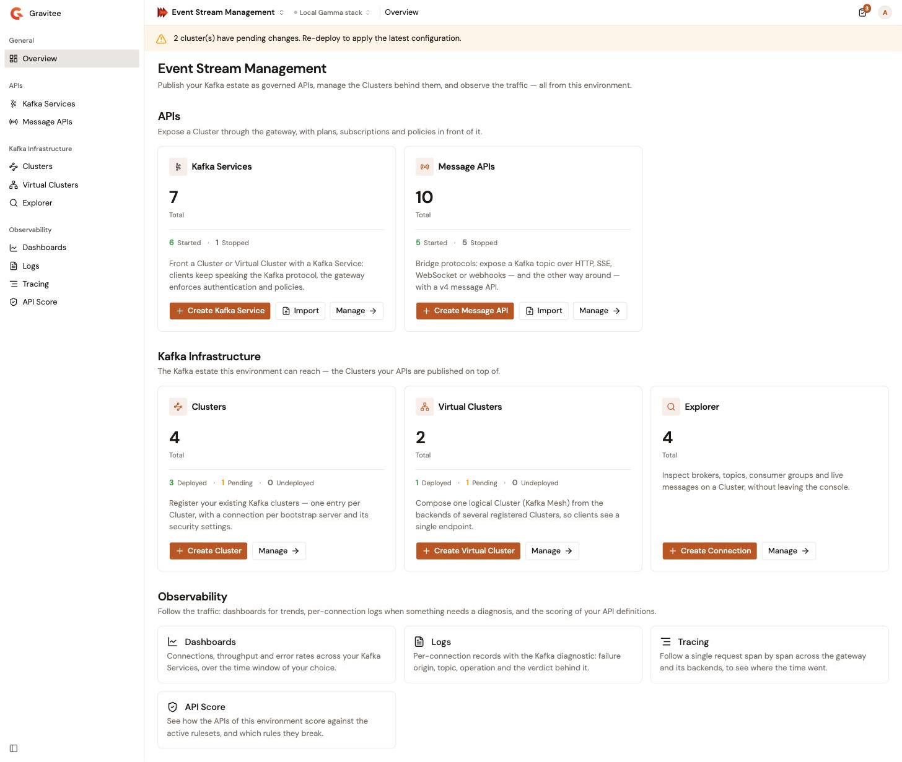

# Use the Overview page

The Overview page is the landing page of Event Stream Management. It counts what the environment holds, flags clusters with changes that are not deployed yet, and gives you one button to create, import, or open each kind of object.

<figure><figcaption>
The Overview page
</figcaption></figure>

## Open the Overview page

1. From the Gamma console sidebar, select **Event Stream Management**.

The module opens on the Overview page. To come back to it later, select **Overview** in the **General** group of the sidebar.

The page is titled **Event Stream Management** and has up to three sections, in the same order as the sidebar groups: **APIs**, **Kafka Infrastructure**, and **Observability**.

## Read the area cards

The **APIs** and **Kafka Infrastructure** sections hold one card per area. Each card shows the **Total** number of objects in the environment, and a breakdown of that total by state.

| Section | Card | Breakdown | Create button |
| --- | --- | --- | --- |
| **APIs** | **Kafka Services** | **Started**, **Stopped** | **Create Kafka Service** |
| **APIs** | **Message APIs** | **Started**, **Stopped** | **Create Message API** |
| **Kafka Infrastructure** | **Clusters** | **Deployed**, **Pending**, **Undeployed** | **Create Cluster** |
| **Kafka Infrastructure** | **Virtual Clusters** | **Deployed**, **Pending**, **Undeployed** | **Create Virtual Cluster** |
| **Kafka Infrastructure** | **Explorer** | None. A Kafka Explorer connection is never deployed. | **Create Connection** |

The cards count as follows:

* **Clusters** counts the registered clusters only. Virtual Clusters have their own card.
* **Explorer** counts your saved Kafka Explorer connections.
* While the counts load, the total reads **—** and the breakdown is hidden. The **Explorer** card also reads **—** when its count can't be read, while the other cards keep their numbers.

## Act from a card

Each card carries up to three buttons:

* **Create** _object_. Opens the creation wizard of that area, for example **Create Cluster** opens the cluster wizard.
* **Import**. Only on the **Kafka Services** and **Message APIs** cards. Opens the list page of that area with the **Import API Definition** panel open, to create an API from a Gravitee API definition. See [Import a Message API](../apis/message-apis/create-a-message-api.md#import-a-message-api).
* **Manage**. Opens the list page of that area.

The buttons follow your environment role:

* **Create** and **Import** appear only when your role can create objects of that area: APIs for the **Kafka Services** and **Message APIs** cards, clusters for the **Clusters** and **Virtual Clusters** cards, and Kafka Explorer connections for the **Explorer** card.
* When an area holds no object yet and you can create one, the card hides its breakdown and its **Manage** button, and leads with **Create**. Otherwise, **Manage** is always shown, so every card has a way in.

## Redeploy pending clusters

When a cluster or a Virtual Cluster has changes that are not deployed to the gateway, a banner pinned above the page reads **N cluster(s) have pending changes. Re-deploy to apply the latest configuration.** The count covers both registered clusters and Virtual Clusters.

To clear the banner, deploy the pending changes:

1. On the **Clusters** or **Virtual Clusters** card, select **Manage**.
2. To show only the clusters that wait for a deployment, open the **Lifecycle** filter and select **Pending changes**.
3. Open the row menu (**⋯**) of a pending cluster, and then select **Deploy changes**.

## Open an observability screen

The **Observability** section holds one tile per screen. Selecting a tile opens that screen.

| Tile | Shown when |
| --- | --- |
| **Dashboards** | Your role can read the environment's dashboards or APIs. |
| **Logs** | Your role can read the environment's dashboards or APIs. |
| **Tracing** | Your role can read the environment's APIs. |
| **API Score** | The environment enables API Score. See [Manage API Score](../../platform-management/manage-api-score.md). |

The section is hidden when none of its tiles applies. These are the same rules as the **Observability** group of the sidebar. See [Observability](../observability/README.md).

## Next steps

* [**Register your first cluster**](../get-started/register-your-first-cluster.md). Start from an empty environment.
* [**Create your first Kafka Service**](../get-started/create-your-first-kafka-service.md). Put a governed Kafka endpoint in front of a Kafka cluster.
* [**Create a Kafka Explorer connection**](../kafka-infrastructure/kafka-explorer/create-a-kafka-explorer-connection.md). Read the brokers, topics, and messages of a Kafka target.
