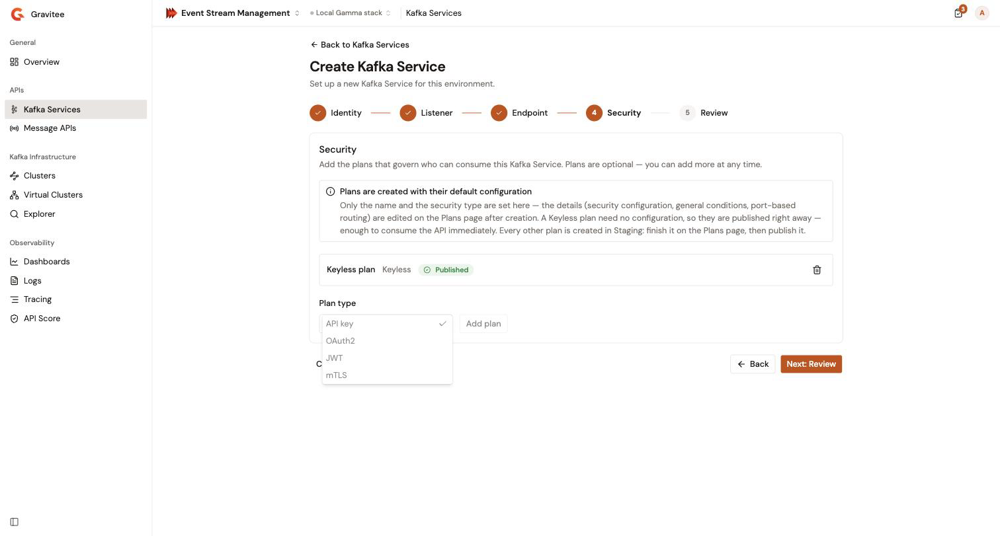

# Create your first Kafka Service

This quickstart walks you through creating a governed Kafka Service in the Gamma console and starting it on the Event Gateway. You'll use the simplest configuration, a standalone endpoint with the default Keyless plan, to get a working Kafka Service in a few minutes.


For a complete reference on all configuration options, see [Create a Kafka Service with a registered cluster](../apis/kafka-services/create-a-kafka-service-with-a-registered-cluster.md).


## Prerequisites

* Access to a running Gamma console instance, with an environment role that can create APIs
* A running Kafka cluster that the Event Gateway can reach, for example on `kafka.example.com:9092`

## Step 1: Open the Kafka Service wizard

1. From the Gamma console sidebar, select **Event Stream Management**.
2. In the **APIs** group of the sidebar, select **Kafka Services**.
3. Select **Create Kafka Service**.

You can also select **Create Kafka Service** on the **Kafka Services** card of the [Overview page](../general/use-the-overview-page.md).

The console opens the Kafka Service creation wizard. The wizard has five steps: **Identity**, **Listener**, **Endpoint**, **Security**, and **Review**. The button that moves forward names the next step, for example **Next: Listener**, and stays disabled until the current step is complete.

## Step 2: Configure the Kafka Service

### Identity

| Field            | Value                     | Notes                                                        |
| ---------------- | ------------------------- | ------------------------------------------------------------ |
| **Name**         | `My First Kafka Service`  | Required. Shown in the Kafka Service list and detail views. Max 255 characters. |
| **Version**      | Keep `1.0`                | Required. Pre-filled with `1.0`.                             |
| **Description**  | Leave blank               | Optional.                                                    |

Select **Next: Listener**.

### Listener

The listener is the address that Kafka clients use to connect to your Kafka Service.

| Field           | Value     | Notes |
| --------------- | --------- | ----- |
| **Host prefix** | `orders`  | Required. Enter only the prefix. The Event Gateway builds the full bootstrap host name by appending its configured domain, and clients connect on the gateway's SNI port, for example `orders.<gateway-domain>:<sni-port>`. |

The host prefix follows these rules:

* It uses lowercase letters, digits, hyphens, and underscores, with dots to separate labels. Each label starts and ends with a letter or a digit.
* Its first label has at most 49 characters, and the whole prefix has at most 241 characters.
* No other API in the environment uses it. The console checks this while you type and shows **Checking host availability…**, then an error if the host is taken.

Select **Next: Endpoint**.

### Endpoint

The endpoint tells the Event Gateway how to reach your Kafka cluster.

1. For the binding mode, select **Standalone**.
2. In the **Bootstrap servers** field, enter your Kafka broker address, for example `kafka.example.com:9092`. To list several brokers, separate them with commas. A broker without a port uses `9092`.
3. Under **Security**, keep the default **Security protocol**, `PLAINTEXT`, if your cluster accepts plaintext connections. Otherwise, pick `SASL_PLAINTEXT`, `SASL_SSL`, or `SSL`, and fill in the SASL or SSL settings that appear.

Select **Next: Security**.


If you deployed a cluster in [Register your first cluster](register-your-first-cluster.md), you can select **Managed Cluster** instead, and then pick your cluster in **Cluster** and one of its connections in **Connection**. Only deployed clusters are listed.


### Security

The Security step lists the plans that the Kafka Service gets at creation. On your first visit, the wizard adds a **Keyless plan**, with the **Published** badge: it is published as soon as the Kafka Service is created, so clients can connect without credentials.

1. Keep the **Keyless plan**.
2. Select **Next: Review**.


Keyless plans are intended for testing and internal use. For production Kafka Services, publish a plan with an API key, OAuth2, JWT, or mTLS security type from the Kafka Service's **Plans** page. A Kafka Service can't keep a Keyless plan live next to a secured plan, so publishing the secured plan opens a **Close current plan and publish?** dialog that closes the Keyless plan.


<figure><figcaption>
The <strong>Security</strong> step adds a Keyless plan on your first visit
</figcaption></figure>

### Review

1. Review the name, version, listener, binding, and plans.
2. Select **Deploy now** to start the Kafka Service on the gateway right after creation. The checkbox is cleared by default.
3. Select **Create Kafka Service**.

The console confirms with **Kafka Service created** and opens the Kafka Service's **Overview** page.


When the environment uses the API review workflow, the Review step shows **Ask for review** instead of **Deploy now**. Select it to submit the Kafka Service for review. It is deployed once the review is accepted.


## Step 3: Verify your Kafka Service

On the Kafka Service's **Overview** page:

* The **State** card reads **Started**.
* The **Bootstrap server** card shows the address that the gateway resolved for your listener, for example `orders.<gateway-domain>:<sni-port>`.

Configure your Kafka clients with that bootstrap server to produce and consume through the Event Gateway.

If you didn't select **Deploy now**, the Kafka Service is created but not started, and the **Bootstrap server** card reads **Available once the Kafka Service is deployed**. To start it, select **Settings** in the Kafka Service's sidebar, and then select **Start Kafka Service**.

## Next steps

* **Put a Virtual Cluster behind a Kafka Service**. Compose the connections of your registered clusters behind one endpoint, and then select **Virtual Cluster** as the binding mode. See [Create your first Virtual Cluster](create-your-first-virtual-cluster.md).
* **Explore all configuration options**. Binding modes, plans, and policies. See [Create a Kafka Service with a registered cluster](../apis/kafka-services/create-a-kafka-service-with-a-registered-cluster.md).
* **Read your topics**. Browse the brokers, topics, and messages behind your Kafka Service. See [Create a Kafka Explorer connection](../kafka-infrastructure/kafka-explorer/create-a-kafka-explorer-connection.md).
