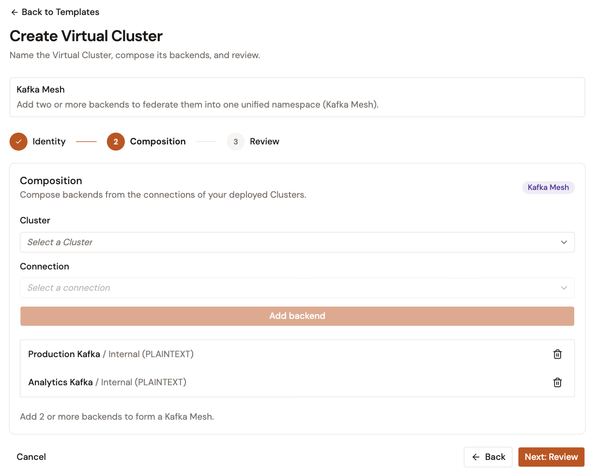

# Create your first Virtual Cluster

This quickstart walks you through creating a Virtual Cluster from the connection of a registered cluster, and deploying it so a Kafka Service can bind to it. A Virtual Cluster puts one or more cluster connections, called backends, behind a single endpoint. The gateway runs every Virtual Cluster as a Kafka Mesh. With two or more backends, clients reach the topics of every backend through one connection.


For a complete reference on all Virtual Cluster options, see [Establish a Virtual Cluster](../kafka-infrastructure/virtual-clusters/establish-a-virtual-cluster.md).


## Prerequisites

* Access to a running Gamma console instance, with an environment role that can create and update clusters
* At least one deployed registered cluster. See [Register your first cluster](register-your-first-cluster.md).

## Step 1: Open the Virtual Cluster wizard

1. From the Gamma console sidebar, select **Event Stream Management**.
2. In the **Kafka Infrastructure** group of the sidebar, select **Virtual Clusters**.
3. Select **Create Virtual Cluster**.

You can also select **Create Virtual Cluster** on the **Virtual Clusters** card of the [Overview page](../general/use-the-overview-page.md).

## Step 2: Choose a topology

The **Create Virtual Cluster** page offers **Start from scratch** and two topology templates. Every choice opens the same wizard. A template only adds a hint above the wizard.

* **Single Cluster Proxy**. Fronts one Kafka cluster with one backend.
* **Kafka Mesh**. Federates two or more backends into one namespace behind a single endpoint.

Select **Single Cluster Proxy**.

To read how a Virtual Cluster works, select the info button (**ⓘ**) next to **Topology templates**. It opens the **What is a Virtual Cluster?** panel.

The wizard has three steps: **Identity**, **Composition**, and **Review**.

## Step 3: Identity

| Field           | Value                          | Notes                                                    |
| --------------- | ------------------------------ | -------------------------------------------------------- |
| **Name**        | `My First Virtual Cluster`     | Required. Identifies the Virtual Cluster in the console. |
| **Description** | Leave blank                    | Optional.                                                |

Select **Next: Composition**.

## Step 4: Compose backends

The **Composition** step lists the connections of your deployed clusters. When no cluster is deployed, the step shows **No deployed Clusters** instead.

1. In the **Cluster** list, select the cluster that you deployed.
2. In the **Connection** list, select one of its connections.
3. Select **Add backend**.

One backend is enough. To reach the topics of a second cluster through the same endpoint, repeat these steps for a second connection: the **Kafka Mesh** badge appears once the Virtual Cluster has two backends. A connection that is already a backend of this Virtual Cluster can't be picked again.

Select **Next: Review**.

<figure><figcaption>
Two backends composed into one Virtual Cluster
</figcaption></figure>

## Step 5: Review and create

1. Review the Virtual Cluster details and composed backends.
2. Select **Create Virtual Cluster**.

The console creates the Virtual Cluster and opens its overview page. A newly created Virtual Cluster is **Undeployed**.

## Step 6: Deploy your Virtual Cluster

Kafka Services can bind only to a deployed Virtual Cluster.

1. At the top of the Virtual Cluster's page, select **Deploy**.

When the Virtual Cluster's status reads **Deployed**, it is available to Kafka Services.

You can also deploy from the **Virtual Clusters** list: open the row menu (**⋯**) of the Virtual Cluster, and then select **Deploy**.

## Next steps

* **Add a Kafka Service**. Apply plans and policies in front of the Virtual Cluster. In the Kafka Service wizard, select **Virtual Cluster** as the binding mode. See [Create a Kafka Service with a Virtual Cluster](../apis/kafka-services/create-a-kafka-service-with-a-virtual-cluster.md).
* **Understand the runtime behavior**. Learn how the Event Gateway routes topics and consumer groups across backends. See [Virtual Cluster runtime behavior reference](../kafka-infrastructure/virtual-clusters/kafka-virtual-cluster-runtime-behavior-reference.md).
