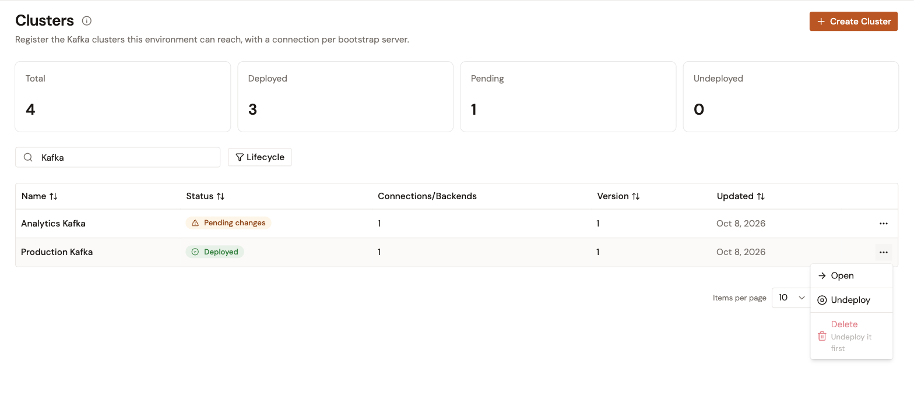

# Manage clusters

The **Clusters** page lists the Kafka clusters registered in the environment. Each Cluster opens on a detail page whose sidebar holds the following entries:

* **General**: **Overview**, **Settings**, **Configuration**, and **User Permissions**.
* **Usage**: **Used by Kafka Services**.

A Virtual Cluster has the same list layout and the same detail pages. Only its **Configuration** page differs. See [Manage a Virtual Cluster](../virtual-clusters/manage-a-virtual-cluster.md).

## Find a cluster

1. From the Gamma console sidebar, select **Event Stream Management**.
2. In the **Kafka Infrastructure** group, select **Clusters**.

The page opens with a stat strip that counts the **Total**, **Deployed**, **Pending**, and **Undeployed** Clusters of the environment. The counts cover every Cluster, whatever the search and the filter.

Below it, the list shows 10 Clusters per page, and you can change the page size. Each row shows the following columns:

| Column | Description |
| --- | --- |
| **Name** | The name of the Cluster. Select it to open the Cluster. |
| **Status** | **Deployed**, **Pending changes**, or **Undeployed**. See [Cluster lifecycle](#cluster-lifecycle). |
| **Connections/Backends** | The number of connections of the Cluster. |
| **Version** | The number of times the Cluster was deployed. |
| **Updated** | The date of the last change or lifecycle action. |

To narrow the list, use the following controls:

* Type in **Search Clusters…** to keep the Clusters whose name or description contains the text.
* Use the **Lifecycle** filter to keep one or more of **Deployed**, **Pending changes**, and **Undeployed**.

When nothing matches, the list names the search and the filters, and **Clear filters** resets both.

The row menu (**⋯**) of each Cluster offers **Open**, and the lifecycle actions that your environment role allows: **Deploy** or **Deploy changes**, **Undeploy**, and **Delete**. **Delete** is available only once the Cluster is undeployed: until then, it's disabled and reads **Undeploy it first**.

The ⓘ button next to the **Clusters** title opens the **Why register a Cluster?** explainer. Select the button again, or dismiss the panel, to close it.

<figure><figcaption>
The <strong>Clusters</strong> page
</figcaption></figure>

## Cluster lifecycle

A Cluster is in one of three states:

| Status | Meaning | Lifecycle actions |
| --- | --- | --- |
| **Undeployed** | The gateway doesn't know the Cluster. Kafka Services and Virtual Clusters can't use it. A new Cluster starts in this state. | **Deploy**, and **Delete** |
| **Deployed** | The gateway runs the saved configuration of the Cluster. | **Undeploy** |
| **Pending changes** | The Cluster was edited after its last deployment. The gateway keeps running the previously deployed configuration until you deploy the changes. | **Deploy changes**, **Undeploy** |

Every saved change to a deployed Cluster, on its **Settings** page or its **Configuration** page, moves it to **Pending changes**.

The lifecycle actions are above every page of the Cluster, and in the row menu of the **Clusters** list. They require the `CLUSTER` **Update** permission of your environment role.

### Deploy a cluster or its changes

1. Open the Cluster.
2. Select **Deploy**, or **Deploy changes** when the Cluster has pending changes.

The console confirms with **Cluster deployed**, and the status changes to **Deployed**. If the deployment fails, the console shows the reason in a notification.

When you deploy changes to a Cluster that backs Virtual Clusters, the gateway rebuilds the Virtual Clusters that use it.

### Undeploy a cluster

1. Open the Cluster.
2. Select **Undeploy**.
3. In the **Undeploy Cluster?** dialog, select **Undeploy Cluster**.

The console confirms with **Cluster undeployed**, and the status changes to **Undeployed**. The dialog warns that traffic to the Cluster stops until you deploy it again. Unlike the dialog of a Virtual Cluster, it doesn't list Kafka Services. If the undeployment fails, the dialog shows **Undeploy failed** with the reason and stays open.

## Read the overview

The **Overview** page of a Cluster shows its **Type**, its **Lifecycle** status, and its number of **Connections**. Below them, the **Summary** card lists the **Name**, the **Description**, the **Cross ID**, the **Version**, and the **Deployed at** date.

A registered Cluster has the **Multi-connection** type.

## Edit the settings

1. Open the Cluster.
2. In the **General** group of the sidebar, select **Settings**.
3. Change the **Name** or the **Description**. The name is required.
4. At the bottom of the page, select **Save changes**, or **Discard** to restore the saved values.

The console confirms with **Cluster updated**. The **Settings** page also shows, read-only, the **Cross ID**, the **Type**, the **Lifecycle state**, the **Version**, the **Groups**, and the **Created at** and **Updated at** dates. The **Groups** row shows the names of the groups, or the ID of a group that the environment no longer lists.

Without the `CLUSTER` **Update** permission of your environment role, or without the **Definition** update permission of your role on the Cluster, the name and the description are read-only too. See [Manage cluster permissions](manage-cluster-permissions.md).

## Edit the connections

1. Open the Cluster.
2. In the **General** group of the sidebar, select **Configuration**.
3. Add, change, or remove connections in the **Kafka Cluster Connections** list. The fields are the same as at registration. See [Connection fields](register-your-kafka-clusters.md#connection-fields).
4. At the bottom of the page, select **Save changes**, or **Discard** to restore the saved values.
5. Deploy the changes. See [Deploy a cluster or its changes](#deploy-a-cluster-or-its-changes).

The save bar appears only while the page holds an unsaved change. When a value is invalid, **Save changes** shows the field errors and doesn't save.

You can edit the connections only with the `CLUSTER` **Update** permission of your environment role and the **Configuration** update permission of your role on the Cluster. See [Manage cluster permissions](manage-cluster-permissions.md). Otherwise, the **Configuration** card reads **Your role can't change this configuration.** and shows the connections read-only, as a table with their **Name**, **Cross ID**, **Bootstrap servers**, and **Security protocol**. The Management API returns the credentials of the connections only to users whose role on the Cluster can update its configuration.

A role without the **Configuration** read permission on the Cluster, such as the built-in **User** role, gets no configuration from the Management API. For that role, the page reads **No connections configured.**, and the **Clusters** list and the **Overview** page count 0 connections.


Kafka Services and Virtual Clusters reference a connection by its cross ID. Before you remove a connection or change its cross ID, check the **Used by Kafka Services** page of the Cluster, and the **Configuration** page of your Virtual Clusters.


## See which Kafka Services use a cluster

1. Open the Cluster.
2. In the **Usage** group of the sidebar, select **Used by Kafka Services**.

The page lists the Kafka Services whose endpoint references the Cluster, with their **Name**, **Version**, **State**, and **Binding**. Select a name to open the Kafka Service. When no Kafka Service references the Cluster, the page reads **No Kafka Services reference this Cluster yet.**

The list covers the Kafka Services bound to the Cluster directly, with the **Managed Cluster** binding mode. A Kafka Service that reaches the Cluster through a Virtual Cluster is listed on the Virtual Cluster's own **Used by Kafka Services** page. The console builds the list in the browser from every Kafka Service of the environment.

## Delete a cluster

Deleting a Cluster removes its registration from Gamma. The Kafka cluster itself isn't affected.

1. Undeploy the Cluster. The Management API refuses to delete a Cluster that is **Deployed** or has **Pending changes**, so the console disables **Delete Cluster** until then, with the tooltip **Undeploy this Cluster before deleting it.** See [Undeploy a cluster](#undeploy-a-cluster).
2. Select **Delete Cluster** above the Cluster's pages. Alternatively, select **Delete** in the row menu of the **Clusters** list.
3. In the **Delete Cluster \<name\>?** dialog, type the name of the Cluster.
4. Select **Delete Cluster**.

The console confirms with **Cluster deleted**. If the deletion fails, the dialog shows **Delete failed** with the reason and stays open.

The delete actions require the `CLUSTER` **Delete** permission of your environment role.


Kafka Services and Virtual Clusters that reference a deleted Cluster stop working. Check the **Used by Kafka Services** page before you delete a Cluster.


## Verification

To verify the state of your Clusters, follow these steps:

1. In the **Kafka Infrastructure** group, select **Clusters**.
2. In the **Lifecycle** filter, select **Pending changes**.

The list shows the Clusters with changes that the gateway doesn't run yet. An empty list means that the gateway runs the saved configuration of every Cluster.

## Next steps

* **Decide who can manage a Cluster**. See [Manage cluster permissions](manage-cluster-permissions.md).
* **Compose a Virtual Cluster** from the connections of your Clusters. See [Establish a Virtual Cluster](../virtual-clusters/establish-a-virtual-cluster.md).
