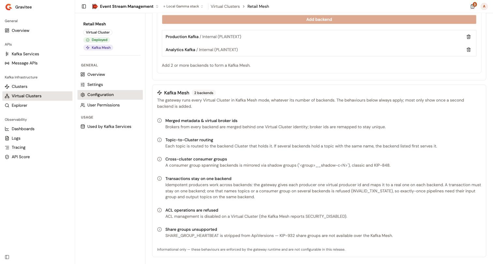

# Manage a Virtual Cluster

The **Virtual Clusters** page lists the Virtual Clusters of the environment, separately from the **Clusters** page. A Virtual Cluster opens on the same detail pages as a Cluster: **Overview**, **Settings**, **Configuration**, and **User Permissions** in the **General** group, and **Used by Kafka Services** in the **Usage** group.

This page covers what differs for a Virtual Cluster. For the settings, the lifecycle actions, and the deletion, see [Manage clusters](../clusters/manage-a-cluster.md). For the members, see [Manage cluster permissions](../clusters/manage-cluster-permissions.md).

## Find a Virtual Cluster

1. From the Gamma console sidebar, select **Event Stream Management**.
2. In the **Kafka Infrastructure** group, select **Virtual Clusters**.

The page works like the **Clusters** page: a stat strip with the **Total**, **Deployed**, **Pending**, and **Undeployed** counts, **Search Virtual Clusters…**, the **Lifecycle** filter, and a row menu (**⋯**) on each row. The **Connections/Backends** column shows the number of backends, and a Virtual Cluster with two or more backends shows the **Kafka Mesh** badge next to its name.

In the row menu, **Deploy** is disabled with **Add a backend first** while the Virtual Cluster has no backend.

The ⓘ button next to the **Virtual Clusters** title opens the Virtual Cluster explainer.

## Read the overview

The **Overview** page of a Virtual Cluster shows its **Type**, **Virtual Cluster**, with the **Kafka Mesh** badge when it has two or more backends, its **Lifecycle** status, and its number of **Backends**. Below them, the **Summary** card lists the **Name**, the **Description**, the **Cross ID**, the **Version**, and the **Deployed at** date.

## Change the backends

With the `CLUSTER` **Update** permission of your environment role and the **Configuration** update permission of your role on the Virtual Cluster, you edit the backends of a Virtual Cluster in place, with the same composer as in the creation wizard.

1. Open the Virtual Cluster.
2. In the **General** group of the sidebar, select **Configuration**.
3. To add a backend, select a **Cluster** and one of its **Connection**s, then select **Add backend**. Only the deployed Clusters are listed.
4. To remove a backend, select the delete icon of its row.
5. At the bottom of the page, select **Save changes**, or **Discard** to restore the saved backends.
6. Select **Deploy changes** above the page.

The console confirms the save with **Cluster updated**. A deployed Virtual Cluster moves to **Pending changes**, and the gateway keeps running the previously deployed backends until you deploy the changes.

New backends go to the end of the list. The order of the backends is the configuration order, which decides which backend wins when two of them hold a topic with the same name. See [Topic routing](kafka-virtual-cluster-runtime-behavior-reference.md#topic-routing).

Without either permission, the **Configuration** card reads **Your role can't change this configuration.** and lists the backends read-only, with their **Cluster cross ID** and **Connection cross ID**. A role without the **Configuration** read permission, such as the built-in **User** role, sees **No backends configured.**


Removing a backend from a deployed Virtual Cluster affects the clients that use topics on that backend once you deploy the change. Check the **Used by Kafka Services** page first, and confirm the impact before you change a Virtual Cluster in production.


### Remove every backend

When you save a **Deployed** Virtual Cluster, or one with **Pending changes**, with no backend left, the console asks you to confirm in the **Remove all backends?** dialog. The dialog says that the gateway keeps serving the current backends, and that a Virtual Cluster with no backends can't be deployed.

1. Select **Remove backends**.

The Management API saves the empty configuration. The Virtual Cluster moves to **Pending changes**, the gateway keeps serving the previously deployed backends, and **Deploy changes** stays disabled until you add a backend. To stop the traffic, stop the Kafka Services bound to the Virtual Cluster, then select **Undeploy**.

## Read the Kafka Mesh constraints

Below the backends, the **Configuration** page shows a **Kafka Mesh** card with the runtime constraints of the gateway. Its badge shows the number of backends, such as **1 backend** or **2 backends**.

The card is informational: the constraints can't be configured. The gateway runs every Virtual Cluster in Kafka Mesh mode, including one with a single backend, but most constraints only show once a second backend is added. The card lists the following constraints:

* **Merged metadata & virtual broker ids**
* **Topic-to-Cluster routing**
* **Cross-cluster consumer groups**
* **Transactions stay on one backend**
* **ACL operations are refused**
* **Share groups unsupported**

For the details of each behavior, see [Virtual Cluster runtime behavior reference](kafka-virtual-cluster-runtime-behavior-reference.md).

<figure><figcaption>
The Kafka Mesh card of a Virtual Cluster
</figcaption></figure>

## Deploy and undeploy

The lifecycle actions of a Virtual Cluster are the same as for a Cluster. See [Cluster lifecycle](../clusters/manage-a-cluster.md#cluster-lifecycle). The following rules are specific to a Virtual Cluster:

* **Deploy** requires at least one backend. The button is disabled, and its tooltip reads **A Virtual Cluster needs at least one backend before it can be deployed.**
* **Undeploy** is refused while a started Kafka Service is bound to the Virtual Cluster. The **Undeploy Virtual Cluster?** dialog names these Kafka Services, each with a link. To confirm, select **Undeploy Virtual Cluster**. Stop them first.
* A Kafka Service bound to the Virtual Cluster can start only while the Virtual Cluster is **Deployed** or has **Pending changes**.

## Delete a Virtual Cluster

You delete a Virtual Cluster like a Cluster. See [Delete a cluster](../clusters/manage-a-cluster.md#delete-a-cluster). The labels name the Virtual Cluster:

* **Delete Virtual Cluster** above the pages is disabled until the Virtual Cluster is undeployed, with the tooltip **Undeploy this Virtual Cluster before deleting it.**
* The dialog reads **Delete Virtual Cluster \<name\>?**, and warns that the Kafka Services that reference the Virtual Cluster stop working.
* To confirm, type the name of the Virtual Cluster, then select **Delete Virtual Cluster**.

## See which Kafka Services use a Virtual Cluster

1. Open the Virtual Cluster.
2. In the **Usage** group of the sidebar, select **Used by Kafka Services**.

The page lists the Kafka Services bound to the Virtual Cluster, with their **Name**, **Version**, **State**, and **Binding**. Select a name to open the Kafka Service.

## Verification

To verify that the gateway runs your latest backends, follow these steps:

1. In the **Kafka Infrastructure** group, select **Virtual Clusters**.
2. Check that the row of your Virtual Cluster shows the **Deployed** status, not **Pending changes**, and the number of backends that you expect.

## Next steps

* [Virtual Cluster runtime behavior reference](kafka-virtual-cluster-runtime-behavior-reference.md). How the gateway routes requests across the backends.
* [Virtual Cluster broker addressing](https://documentation.gravitee.io/apim/4.13/kafka-gateway/virtual-cluster-broker-addressing). How the gateway rewrites the broker IDs of the backends.
