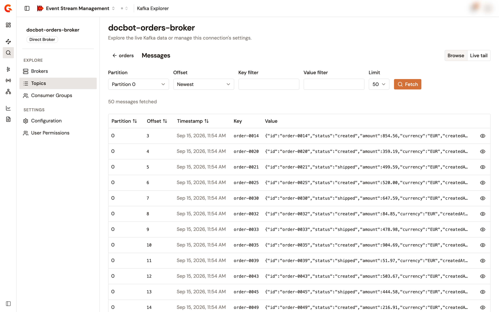
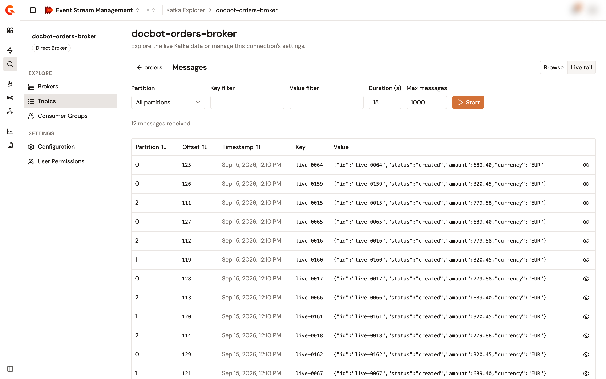

# Browse and tail topic messages

The **Messages** page of a topic reads messages in two modes. **Browse** fetches one batch from a position that you choose. **Live tail** streams the messages produced after you start it, for a bounded time and count. Both modes read the topic and never write to it.

## Open the messages page

1. From the Gamma console sidebar, select **Event Stream Management**.
2. In the **Manage** group, select **Kafka Explorer**.
3. Select the name of the connection.
4. In the context sidebar, select **Topics**.
5. Select the name of the topic.
6. Select **Browse messages**.

The **Messages** page opens in **Browse** mode.

## Browse messages

1. In **Partition**, keep **All partitions** or select one partition.
2. In **Offset**, select where the read starts. See [Offset modes](#offset-modes).
3. Optional: enter a **Key filter**, a **Value filter**, or both. The explorer keeps the fetched messages whose key, or value, contains the text, without regard to case.
4. In **Limit**, select **25**, **50**, **100**, or **200** messages.
5. Select **Fetch**.

    <figure><figcaption>
The <strong>Messages</strong> page in <strong>Browse</strong> mode, after a fetch.
</figcaption></figure>

The explorer reads up to the limit from each selected partition in a single read of at most five seconds, applies the filters, and keeps at most the limit. The line above the table reads the number of messages fetched, or **Showing X of Y fetched messages** when the filters or the limit narrowed the result. Each row shows the **Partition**, **Offset**, **Timestamp**, **Key**, and **Value** of a message.

Select the offset or the value of a row, or **View details**, to open the **Message detail** panel. The panel shows the **Partition**, **Offset**, **Timestamp**, and **Key** of the message, its **Payload**, pretty-printed when it's JSON, and its **Headers**.

### Offset modes

| Offset | Where the read starts |
| --- | --- |
| **Newest** | The last messages of each selected partition, up to the limit per partition. |
| **Oldest** | The beginning of each selected partition. |
| **From timestamp** | The first message at or after the **Timestamp** that you pick, on each selected partition. A partition with no message after the timestamp returns nothing. |
| **Specific offset** | The **Offset value** that you enter, on each selected partition. |

## Tail messages live

1. Select **Live tail**.
2. Optional: select a **Partition**, and enter a **Key filter**, a **Value filter**, or both.
3. In `Duration (s)`, enter how long the tail runs, from 1 to 300 seconds. The default is 30.
4. In **Max messages**, enter how many messages the tail delivers at most, from 1 to 5000. The default is 1000.
5. Select **Start**.

    <figure><figcaption>
The <strong>Messages</strong> page in <strong>Live tail</strong> mode after a tail ended. The counter shows the messages received, and the table lists them.
</figcaption></figure>

The tail streams the messages produced on the selected partitions after it starts, newest last, shows the **Live** badge, and counts the messages received. The table keeps the newest 500 messages. The tail stops when the duration elapses, when the count reaches **Max messages**, or when you select **Stop**. Switching back to **Browse** or leaving the page stops it too. A tail that fails shows **Tail stream failed** with the reason.

Each Management API instance serves at most 256 tails at a time. A tail started beyond that limit fails with **Too many active tail streams**.

## Verification

To verify that the explorer reads the topic as expected, follow these steps:

1. In **Offset**, select **Oldest**.
2. Select **Fetch**.

The table lists the first messages of the topic, and the line above it reads the number of messages fetched.

## Next steps

* **Check the consumers of the topic**. Filter the consumer groups by the topic they consume. See [Explore brokers, topics, and consumer groups](explore-brokers-topics-and-consumer-groups.md).
