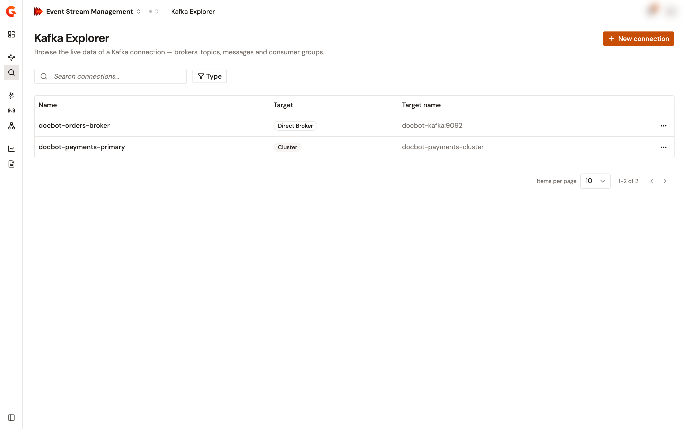
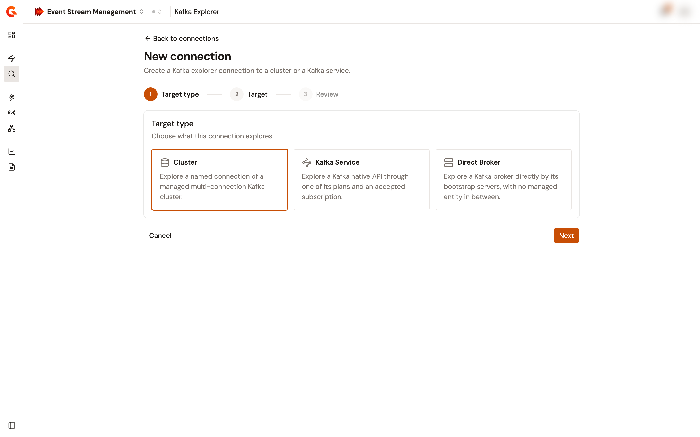
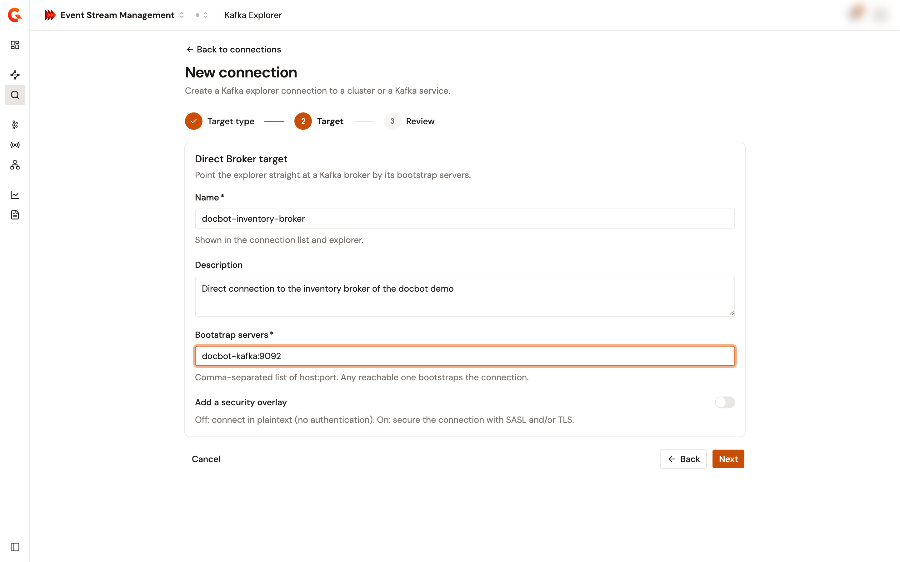
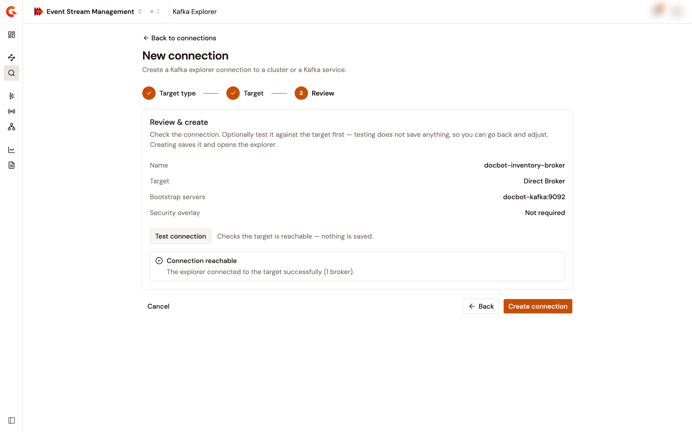
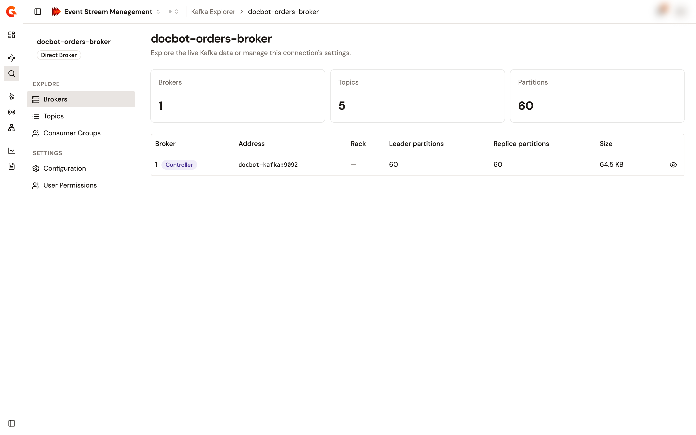

# Create a Kafka Explorer connection

A Kafka Explorer connection is a saved reference to a Kafka target, with an optional client-side security overlay. The explorer resolves the target's bootstrap servers and base security every time you open the connection, so a connection never copies the target's settings.

## Target types

A connection points at one of the following targets:

| Target | What it points at | Security |
| --- | --- | --- |
| **Cluster** | A multi-connection cluster registered in Event Stream Management, and one of its named connections. | The explorer uses the named connection's own security. Optional: override it with an overlay, which then fully replaces it. |
| **Kafka Service** | A Kafka Service, one of its published plans, and an accepted subscription to that plan. A Keyless plan needs no subscription. | The plan decides the authentication. An overlay is required for a JWT, OAuth2, or mTLS plan, and optional for an API key or Keyless plan. |
| **Direct Broker** | One or more `host:port` bootstrap addresses, with no registered cluster or Kafka Service between the explorer and the broker. | No authentication, in plaintext, unless you add an overlay. The overlay then defines the whole connection security. |

A Virtual Cluster can't be explored.

## Prerequisites

* An enterprise license that includes the Kafka Explorer feature, `apim-native-kafka-explorer`.
* Permission to create Kafka Explorer connections in the environment. The **New connection** button appears only when you have it.
* A MongoDB management database. The module version that this page documents stores Kafka Explorer connections in MongoDB only.
* For a **Cluster** target, a cluster registered in Event Stream Management with at least one named connection. See [Register your Kafka clusters](../../import/register-your-kafka-clusters.md).
* For a **Kafka Service** target, a Kafka Service that you're allowed to read, with a published plan and, for every plan type except Keyless, an accepted subscription to that plan.

## Create the connection

1. From the Gamma console sidebar, select **Event Stream Management**.
2. In the **Manage** group, select **Kafka Explorer**.
3. Select **New connection**.

    <figure><figcaption>
The Kafka Explorer page lists the connections that you can see, with a <strong>Target</strong> badge on each row.
</figcaption></figure>

4. In the **Target type** step, select **Cluster**, **Kafka Service**, or **Direct Broker**.

    <figure><figcaption>
The <strong>Target type</strong> step offers the three kinds of target.
</figcaption></figure>

5. Select **Next**.
6. In the **Target** step, enter a **Name** and an optional **Description**, then complete the fields of your target type. See [Target fields](#target-fields).

    <figure><figcaption>
The <strong>Target</strong> step for a <strong>Direct Broker</strong> target.
</figcaption></figure>

7. Select **Next**.
8. Optional: in the **Security** step, complete the security overlay form, then select **Next**. The step appears only when the target requires an overlay, or when you turned on the overlay toggle in the previous step. See [Security overlay](#security-overlay).
9. In the **Review** step, check the summary of the connection.
10. Optional: select **Test connection**. The explorer resolves the target and connects to it without saving anything. A reachable target shows **Connection reachable** with its broker count. An unreachable target shows **Connection test failed** with the reason, and doesn't block the creation.

    <figure><figcaption>
The <strong>Review</strong> step, after a successful <strong>Test connection</strong>.
</figcaption></figure>

11. Select **Create connection**.

The console saves the connection, makes you its primary owner, and opens the connection on its **Brokers** page.

The name is required and holds up to 255 characters. Gamma derives the connection's identifier from the name, and refuses a second connection whose name yields the same identifier in the environment. The wizard then reports **Create failed** with the reason.

## Target fields

The **Target** step shows the fields of the target type that you selected.

### Cluster target

| Field | Description |
| --- | --- |
| **Cluster** | Required. A multi-connection cluster registered in Event Stream Management. When the environment has none, the field reads **No managed Kafka cluster is available in this environment.** |
| **Named connection** | Required when the cluster defines named connections. The connection whose broker the explorer reads. |
| **Override the cluster security** | Off: the explorer uses the cluster's own security. On: the **Security** step appears, and its overlay fully replaces the cluster security. |

### Kafka Service target

| Field | Description |
| --- | --- |
| **Kafka Service** | Required. The Kafka Service to explore. When the environment has none, the field reads **No Kafka Service is available in this environment.** |
| **Plan** | Required. One of the service's published plans, listed with its type: **Keyless**, **API key**, **JWT**, **OAuth2**, or **mTLS**. When the service has no published plan, the field reads **This API has no usable plan.** |
| **Subscription** | Required for every plan type except Keyless. An accepted subscription to the selected plan, listed by application name. When the plan has none, the field reads **This plan has no accepted subscription**. |
| **Add a security overlay** | Shown for an API key or Keyless plan. Off: the explorer connects with the plan security over TLS. On: the **Security** step appears, to add a truststore for a private or self-signed Kafka gateway certificate, or to override the security. For a JWT, OAuth2, or mTLS plan, the **Security** step always appears. |

### Direct Broker target

| Field | Description |
| --- | --- |
| **Bootstrap servers** | Required. A comma-separated list of `host:port` entries. Any reachable entry bootstraps the connection. Each host is a hostname, an IPv4 address, or a bracketed IPv6 address, and each port is between 1 and 65535. |
| **Add a security overlay** | Off: the explorer connects in plaintext, with no authentication. On: the **Security** step appears, to secure the connection with SASL, TLS, or both. |

## Security overlay

The **Security** step renders the overlay form of the target type. The form carries the following fields:

| Field | Description |
| --- | --- |
| **Security protocol** | Required. `PLAINTEXT` (the default), `SASL_PLAINTEXT`, `SASL_SSL`, or `SSL`. |
| **SASL Configuration** | Shown for `SASL_PLAINTEXT` and `SASL_SSL`. **Select SASL mechanism** offers `NONE` (the default), `OAUTHBEARER`, `OAUTHBEARER_TOKEN`, `PLAIN`, `SCRAM-SHA-256`, and `SCRAM-SHA-512` for a Cluster or Direct Broker target. For a Kafka Service target it offers `NONE`, `OAUTHBEARER`, and `OAUTHBEARER_TOKEN`, because the plan imposes the mechanism. |
| **SSL Options** | Shown for `SASL_SSL` and `SSL`. **Verify Host** (on by default), **Trust all** (off by default), a **Truststore**, and a **Key store**. Each store is **None**, **JKS with path**, **JKS with content**, **PKCS#12 / PFX with path**, **PKCS#12 / PFX with content**, **PEM with path**, or **PEM with content**. |

Each SASL mechanism takes its own fields:

* `PLAIN`, `SCRAM-SHA-256`, and `SCRAM-SHA-512` take a **Username** and a **Password**.
* `OAUTHBEARER` takes an **OAuth token url**, a **Client id**, a **Client secret**, optional comma-separated **Scopes**, and optional **OAUTHBEARER SASL extensions**, each with an **Extension key** and an **Extension value**. The explorer's Kafka client obtains the token from the token URL with these client credentials.
* `OAUTHBEARER_TOKEN` takes a **Token value**. The token isn't refreshed, so an expired token drops the connection.

For a Cluster or Direct Broker target, the overlay is the whole connection security: a SASL protocol needs a mechanism other than `NONE`, and `PLAINTEXT` or `SSL` needs the mechanism left at `NONE`. A credential can't contain a control character, such as a pasted line break.

### How the plan type shapes a Kafka Service connection

For a Kafka Service target, the explorer connects to the gateway addresses that the service exposes, and applies the following rules when it connects. A mismatch fails the connection test, and the explorer pages, with the reason.

| Plan type | Authentication | Protocol | Overlay |
| --- | --- | --- | --- |
| Keyless | None. | `SSL` by default, or `PLAINTEXT`. A SASL protocol is refused. | Optional, for a truststore. A SASL mechanism is refused. |
| API key | SASL `PLAIN`, with a credential that the explorer derives from the subscription's active API key. A subscription without an active key is refused. | `SASL_SSL` by default, or `SASL_PLAINTEXT`. `PLAINTEXT` and `SSL` are refused. | Optional, for a truststore. A SASL mechanism is refused. |
| JWT or OAuth2 | SASL `OAUTHBEARER` or `OAUTHBEARER_TOKEN`, from the overlay. | `SASL_SSL` by default, or `SASL_PLAINTEXT`. | Required, with one of the two mechanisms. |
| mTLS | The key store of the overlay. | `SSL` only. | Required, with a key store. |

## Verification

To verify that the connection works as expected, follow these steps:

1. In the **Manage** group, select **Kafka Explorer**.
2. Confirm that the connection appears in the list with its **Target** badge.
3. Select the connection's name.

The connection opens on its **Brokers** page, which lists the brokers of the target.

<figure><figcaption>
The <strong>Brokers</strong> page of a connection.
</figcaption></figure>

## Next steps

* **Explore the target**. Inspect its brokers, topics, and consumer groups. See [Explore brokers, topics, and consumer groups](explore-brokers-topics-and-consumer-groups.md).
* **Share the connection**. Add members and groups to the connection. See [Manage Kafka Explorer connections](manage-kafka-explorer-connections.md).
