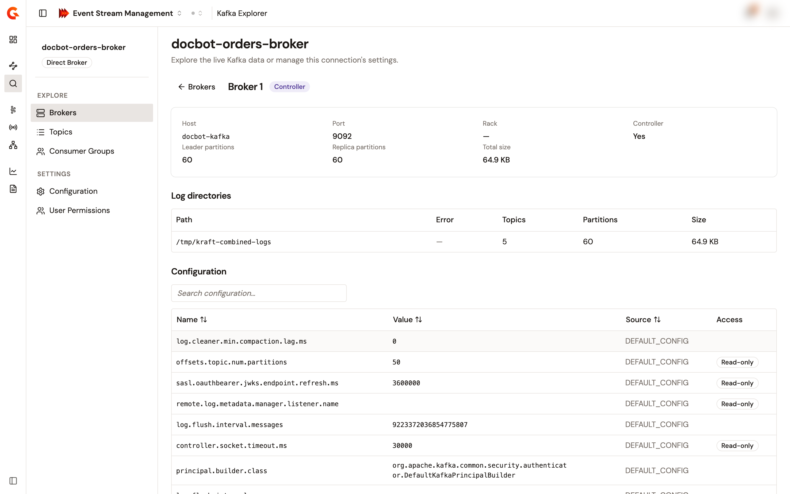
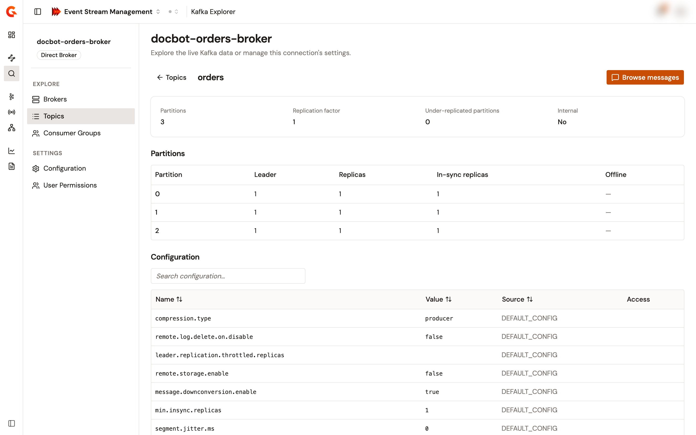
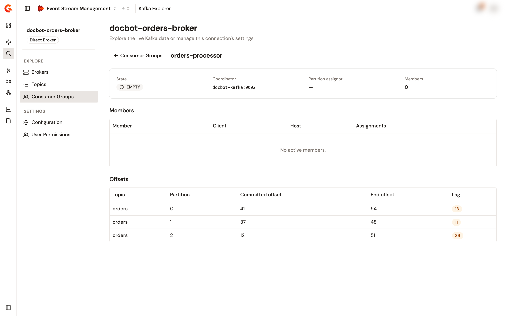

# Explore brokers, topics, and consumer groups

When you open a Kafka Explorer connection, the console reads the live data of its target. It shows the brokers of the cluster, the topics with their partitions and configuration, and the consumer groups with their members and lag. Every page reads the target when it loads, and nothing is written to the target.

## Open a connection

1. From the Gamma console sidebar, select **Event Stream Management**.
2. In the **Manage** group, select **Kafka Explorer**.
3. Select the name of the connection, or select **Explore** in its row menu.

The connection opens on its **Brokers** page. The context sidebar lists the **Explore** pages, **Brokers**, **Topics**, and **Consumer Groups**, and the **Settings** pages, **Configuration** and **User Permissions**.

<figure><figcaption>
The <strong>Brokers</strong> page of a connection, with the <strong>Explore</strong> and <strong>Settings</strong> groups of the context sidebar.
</figcaption></figure>

## Brokers

The **Brokers** page shows the number of **Brokers**, **Topics**, and **Partitions** of the cluster, including Kafka's internal topics. The table has one row per broker with its **Broker** ID, **Address**, **Rack**, **Leader partitions**, and **Replica partitions**. The **Size** column is the total size of the broker's log directories, and the **Controller** badge marks the controller broker.

Select a broker ID, or **View details** in its row, to open the broker. The broker page shows its **Host**, **Port**, **Rack**, whether it's the **Controller**, its **Leader partitions**, **Replica partitions**, and **Total size**. Below them, a **Log directories** table lists the **Path**, **Error**, **Topics**, **Partitions**, and **Size** of each directory, followed by the broker **Configuration**. When the broker doesn't report its log directories, the table reads **Log dir data not available.**

<figure><figcaption>
The detail page of a broker.
</figcaption></figure>

## Topics

The **Topics** page lists the topics of the cluster, including internal topics, ten per page. Type in **Search topics…** to keep the topics whose name contains the text, without regard to case. Each row shows the topic **Name**, its **Partitions**, its **Replication** factor, its **Size** across all replicas, and its **Messages**. The message count is computed from the end offset of each partition. An **under-replicated** badge appears next to the replication factor when partitions lack in-sync replicas, and an **Internal** badge marks a Kafka internal topic. Sort by any column.

Select a topic name, or **View details** in its row, to open the topic. The topic page shows its **Partitions**, **Replication factor**, **Under-replicated partitions**, and whether it's **Internal**. Below them, a **Partitions** table lists the **Leader**, **Replicas**, **In-sync replicas**, and **Offline** replicas of each partition, followed by the topic **Configuration**. A partition whose replicas aren't all in sync carries the **Under-replicated** badge. Select **Browse messages** to read the topic's messages. See [Browse and tail topic messages](browse-and-tail-topic-messages.md).

<figure><figcaption>
The detail page of a topic.
</figcaption></figure>

### Configuration tables

The **Configuration** table of a broker or a topic lists each entry's **Name**, **Value**, **Source**, and **Access**. A sensitive entry shows **••••** in place of its value. The **Read-only** badge marks an entry that can't be changed. Type in **Search configuration…** to keep the entries whose name or value contains the text, sort by any column, and page through the entries.

## Consumer groups

The **Consumer Groups** page lists the groups of the cluster, 25 per page, with each group's **Group** ID, **State**, **Members**, **Topics**, **Total lag**, and **Coordinator**. Filter by **Group ID** to keep the groups whose ID contains the text. Filter by **Consumes topic** to keep the groups with committed offsets on a topic whose name contains the text. Column sorting reorders the current page only, because the groups are paginated by ID.

The **Topics** count and the **Total lag** cover the topics the group has committed offsets on. The lag of a partition is its end offset minus the committed offset, and the total lag adds up the lag of every committed partition. When a **Consumes topic** filter is set, both values cover the matching topics only.

Select a group ID, or **View details** in its row, to open the group. The group page shows its **State**, **Coordinator**, **Partition assignor**, and number of **Members**. Below them, a **Members** table lists the **Member** ID, **Client** ID, **Host**, and partition **Assignments** of each active member. An **Offsets** table lists the **Committed offset**, **End offset**, and **Lag** of each topic partition the group has committed, and a partition with lag shows it as a badge.

<figure><figcaption>
The detail page of a consumer group.
</figcaption></figure>

## Verification

To verify that the explorer reads the target as expected, follow these steps:

1. Open the connection.
2. In the context sidebar, select **Topics**.
3. Select a topic.

The topic page lists the partitions of the topic with their leader and replicas, and the topic configuration.

## Next steps

* **Read the messages of a topic**. Fetch a batch, or stream new messages live. See [Browse and tail topic messages](browse-and-tail-topic-messages.md).
