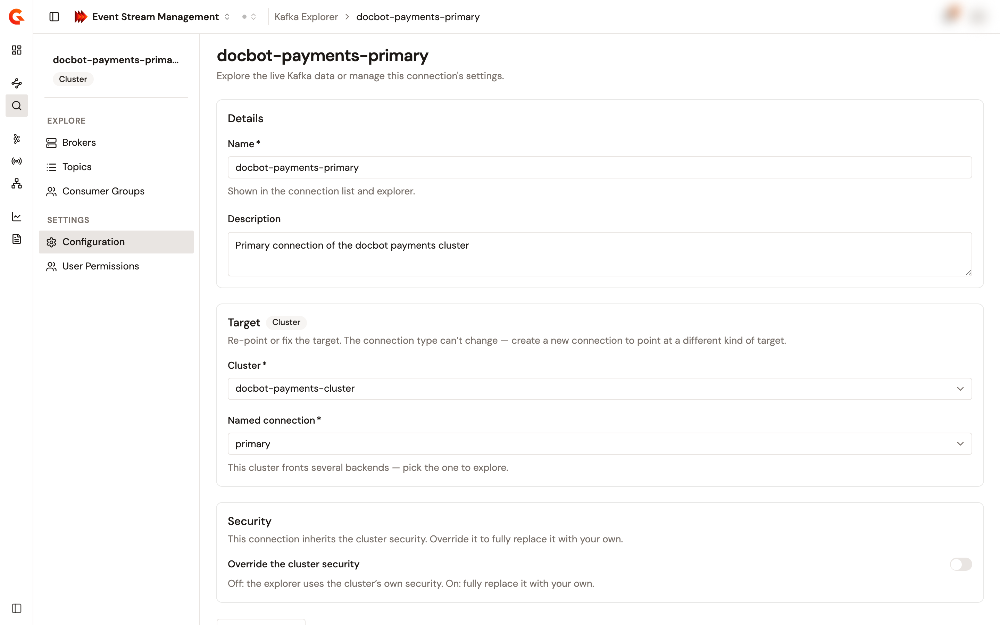

# Manage Kafka Explorer connections

The **Kafka Explorer** page lists the connections that you can see. Each connection carries a **Configuration** page and a **User Permissions** page under the **Settings** group of its context sidebar. A connection is a stored reference, so editing or deleting it never changes the Kafka cluster or service that it points at.

## Find a connection

1. From the Gamma console sidebar, select **Event Stream Management**.
2. In the **Manage** group, select **Kafka Explorer**.

The page lists the connections ten per page, with the **Name**, the **Target** badge, **Cluster**, **Kafka Service**, or **Direct Broker**, and the **Target name** of each one. When the target no longer exists, or isn't visible to you, the **Target name** column shows its identifier instead. Type in **Search connections…** to keep the connections whose name or description contains the text, and use the **Type** filter to keep one or more target types. The row menu offers **Explore**, **Configuration**, and **Delete**.

An organization administrator sees every connection of the environment. Any other user sees the connections that they're a member of, directly or through one of their groups.

## Edit a connection

1. Select the name of the connection, or select **Configuration** in its row menu.
2. In the context sidebar, select **Configuration**.
3. In **Details**, change the **Name** or the **Description**.
4. In **Target**, re-select the fields of the target when a saved value no longer exists. A field whose saved value is gone is marked, and the page refuses to save until you pick another value. The target type can't change.
5. In **Security**, turn on **Add a security overlay**, or **Override the cluster security** for a Cluster target, to add an overlay to a connection that has none. Turn on **Remove security overlay** to drop the stored overlay and fall back to the security of the cluster or of the plan, or to plaintext for a Direct Broker target.
6. Optional: select **Test connection**. The test uses the values on the page, and a masked secret isn't re-sent, so re-enter the secret to test authentication. Nothing is saved.
7. Select **Save changes**.

    <figure><figcaption>
The <strong>Configuration</strong> page of a connection.
</figcaption></figure>

The page reads **Saved** when the connection is updated. A password, client secret, or token is never shown again after you save it: the field comes back blank, and a blank secret field keeps the stored value.

When your role on the connection doesn't allow editing it, the page shows the details, the target, and a summary of the security in read-only form.

## Share a connection

1. Select the name of the connection.
2. In the context sidebar, select **User Permissions**.

The **User Permissions** page shows **Your permissions**, the **Configuration** and **Members** access that you hold on the connection, from **No access** through **Read** to **Full access**. Below it, the **Direct Members** table lists the **Display name** and **Roles** of each member. The **Add members**, **Manage groups**, and **Transfer ownership** buttons appear when your role allows the action.

* To add members, select **Add members**, search the users by name or email, pick the **Role for new members**, and add them.
* To change a member's role, pick another role in the **Roles** list of the member's row. To remove a member, select **Remove member** in the row menu, then confirm in the **Remove member?** dialog. The primary owner's role can't be changed, and the primary owner can't be removed: transfer the ownership first.
* To share the connection with groups, select **Manage groups** and select the groups that get access. Each member of an attached group gets the **USER** role on the connection.
* To hand the connection to someone else, select **Transfer ownership**, pick the **New primary owner**, and optionally the role that you keep.

A connection carries the following roles:

| Role | What it allows |
| --- | --- |
| **PRIMARY_OWNER** | Everything. The creator of the connection holds this role, and only a transfer moves it to another user. |
| **OWNER** | Explore the target, edit the configuration, delete the connection, and manage its members and groups. |
| **USER** | Explore the target, and read the configuration and the members. |

Exploring a target through a connection also requires the environment-level permission to read Kafka Explorer connections. An organization administrator holds every role on every connection.

## Delete a connection

1. In the **Kafka Explorer** list, select **Delete** in the row menu of the connection. Alternatively, open the connection's **Configuration** page and select **Delete connection**.
2. In the **Delete connection?** dialog, select **Delete connection**.

The connection disappears from the list. The Kafka cluster or service that it pointed at isn't affected. An owner of the connection, or an organization administrator, can delete it.

## Verification

To verify that a shared connection works as expected, follow these steps:

1. Log in as a user that you added as a member.
2. In the **Manage** group, select **Kafka Explorer**.
3. Select the name of the connection.

The connection opens on its **Brokers** page, and its **User Permissions** page lists the user under **Direct Members**.

## Next steps

* **Explore the target**. See [Explore brokers, topics, and consumer groups](explore-brokers-topics-and-consumer-groups.md).
