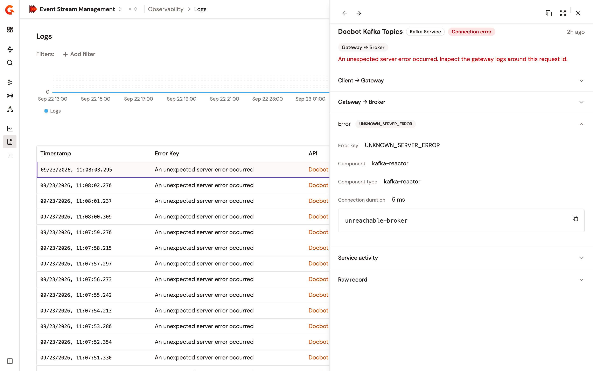

# Diagnose a failed Kafka connection

Open a failed Kafka connection from the logs to see what broke, where it broke, and, for an error the gateway recognizes, what to do next.

<figure><figcaption>
A failed connection opens on the verdict rather than on raw fields
</figcaption></figure>

## Open a connection

1. From the Gamma console sidebar, select **Event Stream Management**.
2. Open **Observability**.
3. Click **Logs**.
4. Click the row you want to inspect.

## Read the verdict

The detail opens on a one-line verdict that says what failed, with a badge that says where. The sections below it split the evidence between the client-to-gateway hop and the gateway-to-broker hop.

A connection counts as failed when its status is **Connection error**, **Session error**, or **Internal error**, or when it carries an error key. A connection that reads **Connected** but carries an error key is still a failure.

## What each error key means

An error the gateway recognizes gets a next step. An error it doesn't recognize shows its key as plain words, with no next step.

### Client to gateway

These fail before the gateway reaches a broker. Fix them on the client or the plan.

<table>
    <thead>
        <tr>
            <th width="290">Error key</th>
            <th width="330">What happened</th>
            <th>What to do</th>
        </tr>
    </thead>
    <tbody>
        <tr>
            <td><code>SASL_AUTHENTICATION_FAILED</code></td>
            <td>SASL authentication failed.</td>
            <td>Check the application's subscription credentials.</td>
        </tr>
        <tr>
            <td><code>UNSUPPORTED_SASL_MECHANISM</code></td>
            <td>The client requested an unsupported SASL mechanism.</td>
            <td>Align the client's security protocol and SASL mechanism with what the plan enables.</td>
        </tr>
        <tr>
            <td><code>ILLEGAL_SASL_STATE</code></td>
            <td>The SASL handshake reached an illegal state.</td>
            <td>Review the client's security configuration, because SASL frames were sent out of order.</td>
        </tr>
        <tr>
            <td><code>SECURITY_DISABLED</code></td>
            <td>The client attempted SASL but security is disabled.</td>
            <td>Use a keyless client, or a secured plan.</td>
        </tr>
    </tbody>
</table>

### Gateway to broker

These fail between the gateway and the broker.

<table>
    <thead>
        <tr>
            <th width="290">Error key</th>
            <th width="330">What happened</th>
            <th>What to do</th>
        </tr>
    </thead>
    <tbody>
        <tr>
            <td><code>BROKER_NOT_AVAILABLE</code></td>
            <td>The Kafka broker wasn't reachable.</td>
            <td>Check the cluster endpoint and broker health, and that the gateway can reach the bootstrap servers.</td>
        </tr>
        <tr>
            <td><code>UNKNOWN_TOPIC_OR_PARTITION</code></td>
            <td>The requested topic or partition was unknown.</td>
            <td>Check the topic mapping, and that the topic exists on the target cluster.</td>
        </tr>
        <tr>
            <td><code>TOPIC_AUTHORIZATION_FAILED</code></td>
            <td>Access to the topic wasn't authorized.</td>
            <td>Check the broker-side ACLs granting this principal access to the topic.</td>
        </tr>
        <tr>
            <td><code>GROUP_AUTHORIZATION_FAILED</code></td>
            <td>Access to the consumer group wasn't authorized.</td>
            <td>Check the broker-side ACLs granting this principal access to the consumer group.</td>
        </tr>
        <tr>
            <td><code>CLUSTER_AUTHORIZATION_FAILED</code></td>
            <td>Access to the cluster wasn't authorized.</td>
            <td>Check the broker-side cluster ACLs for this principal.</td>
        </tr>
        <tr>
            <td><code>COORDINATOR_NOT_AVAILABLE</code></td>
            <td>The group coordinator wasn't available.</td>
            <td>Check broker health, then retry.</td>
        </tr>
        <tr>
            <td><code>NOT_COORDINATOR</code></td>
            <td>The broker isn't the coordinator for this group.</td>
            <td>Transient. The client refreshes coordinator metadata and retries.</td>
        </tr>
        <tr>
            <td><code>COORDINATOR_LOAD_IN_PROGRESS</code></td>
            <td>The group coordinator is still loading.</td>
            <td>Transient. The client retries shortly.</td>
        </tr>
    </tbody>
</table>

### Consumer group and producer state

These are usually transient, and they resolve without intervention.

<table>
    <thead>
        <tr>
            <th width="290">Error key</th>
            <th width="330">What happened</th>
            <th>What to do</th>
        </tr>
    </thead>
    <tbody>
        <tr>
            <td><code>REBALANCE_IN_PROGRESS</code></td>
            <td>The consumer group is redistributing its partitions.</td>
            <td>Transient. It resolves once the group settles.</td>
        </tr>
        <tr>
            <td><code>ILLEGAL_GENERATION</code></td>
            <td>The consumer sent an illegal generation id.</td>
            <td>Transient. The consumer rejoins with a fresh generation.</td>
        </tr>
        <tr>
            <td><code>MEMBER_ID_REQUIRED</code></td>
            <td>The consumer must rejoin the group with a member id.</td>
            <td>Transient. The consumer rejoins with the assigned member id.</td>
        </tr>
        <tr>
            <td><code>INVALID_TXN_STATE</code></td>
            <td>The producer transaction was in an invalid state.</td>
            <td>Review the producer's transactional workflow.</td>
        </tr>
        <tr>
            <td><code>UNKNOWN_SERVER_ERROR</code></td>
            <td>An unexpected server error occurred.</td>
            <td>Inspect the gateway logs around this request id.</td>
        </tr>
    </tbody>
</table>
