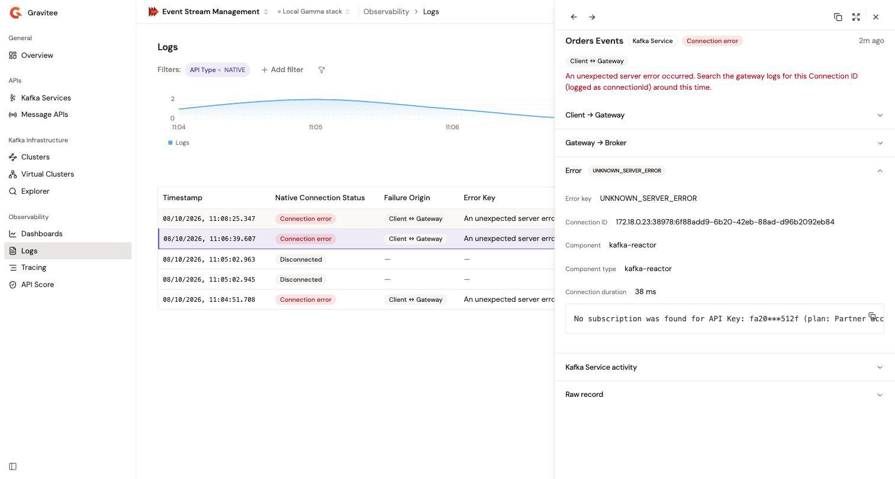

# Diagnose a failed Kafka connection

Open a failed Kafka connection from the logs to see what broke, where it broke, and, for an error the gateway recognizes, what to do next.

<figure><figcaption>
A failed connection opens on what went wrong, before the raw fields
</figcaption></figure>

## Open a connection

1. From the Gamma console sidebar, select **Event Stream Management**.
2. Open **Observability**.
3. Click **Logs**.
4. Click the row you want to inspect.

## Read what went wrong

The row opens in a panel headed by the Kafka Service name, a **Kafka Service** badge, the row's status, and how long ago it was recorded.

Each row is one event of a connection. When the panel finds the connection's opening record and the record that ended it, a line under the header places the row in that connection: when it opened, when it closed or failed, and how long it lasted. **(this record)** marks the row you opened when it's one of the two. The line needs both records, so it shows only when the Kafka Service reports **Connected** events, and **Disconnected** events for a connection that closed normally. See [Configure reporter settings](configure-reporter-settings.md#choose-which-connection-events-are-reported).

For a failed connection, a badge then says where the connection failed, when the gateway could tell, and a short message says what went wrong.

A connection counts as failed when its status is **Connection error**, **Session error**, or **Internal error**, or when it carries an error key.

## Read the sections

<table>
    <thead>
        <tr>
            <th width="230">Section</th>
            <th>What it shows</th>
        </tr>
    </thead>
    <tbody>
        <tr>
            <td><strong>Client → Gateway</strong></td>
            <td>The client side: the remote address, the Kafka <code>client.id</code>, the client library, the application, the plan, the subscription, and the credential.</td>
        </tr>
        <tr>
            <td><strong>Gateway → Broker</strong></td>
            <td>The broker side: the broker id, the target host, and the gateway that handled the connection.</td>
        </tr>
        <tr>
            <td><strong>Error</strong></td>
            <td>The error key, the <strong>Connection ID</strong>, the component that failed, the connection duration, and the error message. The gateway writes the Connection ID on its own log lines, so you can copy it to search the gateway logs. Shown for a failed connection only.</td>
        </tr>
        <tr>
            <td><strong>This connection</strong></td>
            <td>How many requests the connection had served when the row was written, in total and per Kafka operation. Hover an operation to see its Kafka protocol name, such as <code>FETCH</code>. Shown on <strong>Disconnected</strong> and error rows, once the connection has served at least one request.</td>
        </tr>
        <tr>
            <td><strong>Kafka Service activity</strong></td>
            <td>Two charts, <strong>Kafka requests by operation</strong> and <strong>Broker round-trip by operation</strong>, across every client of the Kafka Service over the 15 minutes either side of this row. They show what the Kafka Service was handling at the time, not this connection alone.</td>
        </tr>
        <tr>
            <td><strong>Raw record</strong></td>
            <td>The stored record behind the panel.</td>
        </tr>
    </tbody>
</table>

A section opens on **Error** for a failed connection, and on **Client → Gateway** otherwise. Rows with no value are left out.

## What each error key means

An error the gateway recognizes gets a next step. An error it doesn't recognize shows its key as plain words, with no next step.

### Client to gateway

These fail before the gateway reaches a broker. Fix them on the client or the plan.

<table>
    <thead>
        <tr>
            <th width="290">Error key</th>
            <th width="330">What happened</th>
            <th>What to do</th>
        </tr>
    </thead>
    <tbody>
        <tr>
            <td><code>SASL_AUTHENTICATION_FAILED</code></td>
            <td>SASL authentication failed.</td>
            <td>Check the application's subscription credentials.</td>
        </tr>
        <tr>
            <td><code>UNSUPPORTED_SASL_MECHANISM</code></td>
            <td>The client requested an unsupported SASL mechanism.</td>
            <td>Align the client's security protocol and SASL mechanism with what the plan enables.</td>
        </tr>
        <tr>
            <td><code>ILLEGAL_SASL_STATE</code></td>
            <td>The SASL handshake reached an illegal state.</td>
            <td>Review the client's security configuration, because SASL frames were sent out of order.</td>
        </tr>
        <tr>
            <td><code>SECURITY_DISABLED</code></td>
            <td>The client attempted SASL but security is disabled.</td>
            <td>Use a keyless client, or a secured plan.</td>
        </tr>
    </tbody>
</table>

### Gateway to broker

These fail between the gateway and the broker.

<table>
    <thead>
        <tr>
            <th width="290">Error key</th>
            <th width="330">What happened</th>
            <th>What to do</th>
        </tr>
    </thead>
    <tbody>
        <tr>
            <td><code>BROKER_NOT_AVAILABLE</code></td>
            <td>The Kafka broker wasn't reachable.</td>
            <td>Check the cluster endpoint and broker health, and that the gateway can reach the bootstrap servers.</td>
        </tr>
        <tr>
            <td><code>UNKNOWN_TOPIC_OR_PARTITION</code></td>
            <td>The requested topic or partition was unknown.</td>
            <td>Check the topic mapping, and that the topic exists on the target cluster.</td>
        </tr>
        <tr>
            <td><code>TOPIC_AUTHORIZATION_FAILED</code></td>
            <td>Access to the topic wasn't authorized.</td>
            <td>Check the broker-side ACLs granting this principal access to the topic.</td>
        </tr>
        <tr>
            <td><code>GROUP_AUTHORIZATION_FAILED</code></td>
            <td>Access to the consumer group wasn't authorized.</td>
            <td>Check the broker-side ACLs granting this principal access to the consumer group.</td>
        </tr>
        <tr>
            <td><code>CLUSTER_AUTHORIZATION_FAILED</code></td>
            <td>Access to the cluster wasn't authorized.</td>
            <td>Check the broker-side cluster ACLs for this principal.</td>
        </tr>
        <tr>
            <td><code>COORDINATOR_NOT_AVAILABLE</code></td>
            <td>The group coordinator wasn't available.</td>
            <td>Check broker health, then retry.</td>
        </tr>
        <tr>
            <td><code>NOT_COORDINATOR</code></td>
            <td>The broker isn't the coordinator for this group.</td>
            <td>Transient. The client refreshes coordinator metadata and retries.</td>
        </tr>
        <tr>
            <td><code>COORDINATOR_LOAD_IN_PROGRESS</code></td>
            <td>The group coordinator is still loading.</td>
            <td>Transient. The client retries shortly.</td>
        </tr>
    </tbody>
</table>

### Consumer group and producer state

These are usually transient, and they resolve without intervention.

<table>
    <thead>
        <tr>
            <th width="290">Error key</th>
            <th width="330">What happened</th>
            <th>What to do</th>
        </tr>
    </thead>
    <tbody>
        <tr>
            <td><code>REBALANCE_IN_PROGRESS</code></td>
            <td>The consumer group is redistributing its partitions.</td>
            <td>Transient. It resolves once the group settles.</td>
        </tr>
        <tr>
            <td><code>ILLEGAL_GENERATION</code></td>
            <td>The consumer sent an illegal generation id.</td>
            <td>Transient. The consumer rejoins with a fresh generation.</td>
        </tr>
        <tr>
            <td><code>MEMBER_ID_REQUIRED</code></td>
            <td>The consumer must rejoin the group with a member id.</td>
            <td>Transient. The consumer rejoins with the assigned member id.</td>
        </tr>
        <tr>
            <td><code>INVALID_TXN_STATE</code></td>
            <td>The producer transaction was in an invalid state.</td>
            <td>Review the producer's transactional workflow.</td>
        </tr>
        <tr>
            <td><code>UNKNOWN_SERVER_ERROR</code></td>
            <td>An unexpected server error occurred.</td>
            <td>Search the gateway logs for this <strong>Connection ID</strong>, logged as <code>connectionId</code>, around this time.</td>
        </tr>
    </tbody>
</table>

## Verification

To verify the diagnosis is working as expected, follow these steps:

1. Open **Logs**.
2. Click a Kafka row that has an error key.
3. Confirm the panel shows a short message saying what went wrong, under the header.
