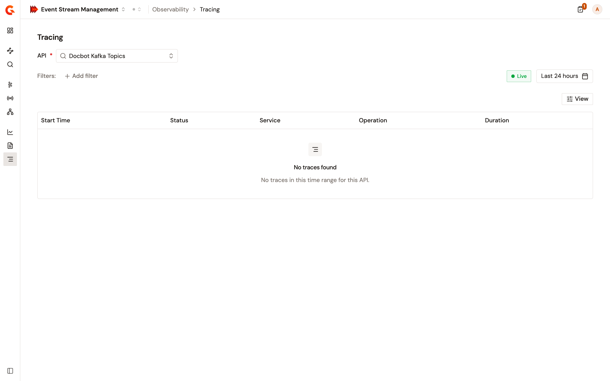

# Trace requests

The **Tracing** page of **Observability** follows one API's requests through the gateway. Where the logs answer what happened to a connection, a trace shows the steps the gateway took inside it.

<figure><figcaption>
Tracing follows one API at a time
</figcaption></figure>

## Open the traces for an API

1. From the Gamma console sidebar, select **Event Stream Management**.
2. Open **Observability**.
3. Click **Tracing**.
4. Select an API.

Unlike **Dashboards** and **Logs**, this page works on one API at a time, so the selector isn't optional. Nothing loads until you pick an API.

To arrive with the API already selected, open it from **Kafka Services** or **Message APIs** and click the traces link on its page. The traces open over the last 24 hours, the same window the logs and dashboard links use.

## Which APIs the selector offers

The selector lists the **started** Kafka Services and Message APIs of the environment, and labels each one with its family and version. An API that isn't started doesn't appear, and neither does an API of any other family.

Search narrows the list, which pages 20 APIs at a time.

## Narrow the traces

Two filters are specific to Kafka and are offered once you select an API.

<table>
    <thead>
        <tr>
            <th width="220">Filter</th>
            <th>Narrows to</th>
        </tr>
    </thead>
    <tbody>
        <tr>
            <td><strong>Kafka operation</strong></td>
            <td>One Kafka operation, picked from a list.</td>
        </tr>
        <tr>
            <td><strong>Kafka client id</strong></td>
            <td>One client id, typed in full.</td>
        </tr>
    </tbody>
</table>

Both match on an exact value rather than a range or a partial string.

The rest of the palette is the cross-module set shared with the other Gamma modules. Every trace filter is listed under **Common**, whichever API family you selected, because the traces palette doesn't group its filters by family the way the logs and dashboards do. That grouping applies to the other two screens only.

## What you can't filter a trace by

The consumer group, the failure origin, and the topic aren't offered as trace filters, even though the logs and the dashboards expose the same ideas.

Each is recorded on some spans of a trace rather than on all of them, and a trace search matches its filters against a single span. A search combining one of these with an operation would return nothing, even where a matching trace exists, so the filters aren't offered rather than answering wrongly.

To follow the failure origin or the consumer group, use the logs instead. See [View connection logs](view-connection-logs.md).

## Verification

To verify tracing is reaching an API, follow these steps:

1. Open **Observability**, then click **Tracing**.
2. Select a started Kafka Service that a client is using.
3. Set the time range to cover recent traffic.
4. Confirm traces are listed, and open one to see its spans.
