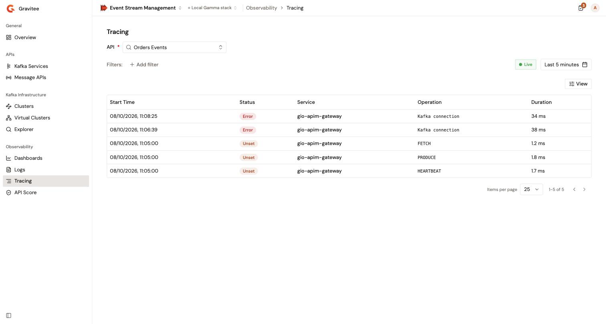

# Trace requests

The **Tracing** page follows one API's requests through the gateway. Where the logs tell you what happened to a connection, a trace shows the steps the gateway took inside it.

<figure><figcaption>
Tracing follows one API at a time
</figcaption></figure>

## Before you begin

Tracing is off until you turn it on for the API, and the change takes effect only after you deploy the API again.

1. Open the API from **Kafka Services** or **Message APIs**.
2. In the API's sidebar, under **Operations**, click **Reporter Settings**.
3. Select **OpenTelemetry tracing**. On a Kafka Service it needs **Aggregated metrics**, and on a Message API it needs **Enable analytics**.
4. Click **Save changes**.
5. Click **Deploy**.

An API that traces nothing lists no traces here, whatever time range you set. See [Configure reporter settings](configure-reporter-settings.md).

The spans also have to reach Gamma, which is a platform pipeline rather than an API setting. See [Configure OpenTelemetry tracing and logs](../../platform-management/configure-opentelemetry-tracing-and-logs.md).

## Open the traces for an API

1. From the Gamma console sidebar, select **Event Stream Management**.
2. Open **Observability**.
3. Click **Tracing**.
4. In the **API** selector, pick the API.

Nothing loads until you pick an API. The list offers the started Kafka Services and Message APIs of the environment.

To open the traces of one API from its own page, follow these steps:

1. Open the API from **Kafka Services** or **Message APIs**.
2. In the API's sidebar, under **Observability**, click **Tracing**.

The traces open in a new tab over the last 24 hours.

## Narrow the traces

Once you pick an API, two Kafka filters are available: **Kafka operation** and **Kafka client id**. Both match an exact value. They're offered whichever API you pick, so they stay available with a Message API selected, where they match nothing.

Consumer group, failure origin, and topic aren't trace filters. To narrow by failure origin, use the logs. To narrow by topic, use a dashboard.

## Read a trace

Each row is one trace. Click it to open the trace beside the list, with two views of the same spans.

* **Timeline** places the spans as a waterfall, each sized by how long it took. This is where a slow step stands out.
* **Lineage** shows the same spans as a graph of what called what.

On a Kafka Service, a trace is one client connection. The **Kafka connection** span sits at the root. Under it, an **Authentication** span covers the client's authentication, a **Broker connect** span covers the gateway's connection to the broker, and one span per Kafka protocol request is named after the request, such as `METADATA`, `PRODUCE`, or `FETCH`. The gateway configuration can limit which Kafka requests get a span, so a trace with no request spans can come from that setting.

## Read a span

Click any span, in either view, to open its panel.

<table>
    <thead>
        <tr>
            <th width="180">Section</th>
            <th>What it shows</th>
        </tr>
    </thead>
    <tbody>
        <tr>
            <td><strong>Overview</strong></td>
            <td>The service, the operation, the span and trace ids, the parent span, the kind, the start, and the duration.</td>
        </tr>
        <tr>
            <td><strong>Attributes</strong></td>
            <td>The attributes the gateway recorded on this span.</td>
        </tr>
        <tr>
            <td><strong>Policy Diff</strong></td>
            <td>What the policies of this step changed.</td>
        </tr>
        <tr>
            <td><strong>Events</strong></td>
            <td>The span events. A failure is usually recorded here.</td>
        </tr>
        <tr>
            <td><strong>Payload Logs</strong></td>
            <td>The payload records correlated to this span.</td>
        </tr>
    </tbody>
</table>

Every section but **Overview** shows its count, and a section with nothing to show is left out. **Verbose tracing** in **Reporter Settings** adds the detailed span events. It multiplies what a trace stores, so turn it on for an investigation rather than leaving it on.

## Verification

To verify tracing is working as expected, follow these steps:

1. Open **Tracing**.
2. In the **API** selector, pick a started Kafka Service that a client is using, with **OpenTelemetry tracing** selected in its **Reporter Settings**.
3. Set the time range to cover recent traffic.
4. Confirm traces are listed.
5. Click a trace.
6. Confirm its spans are shown.
