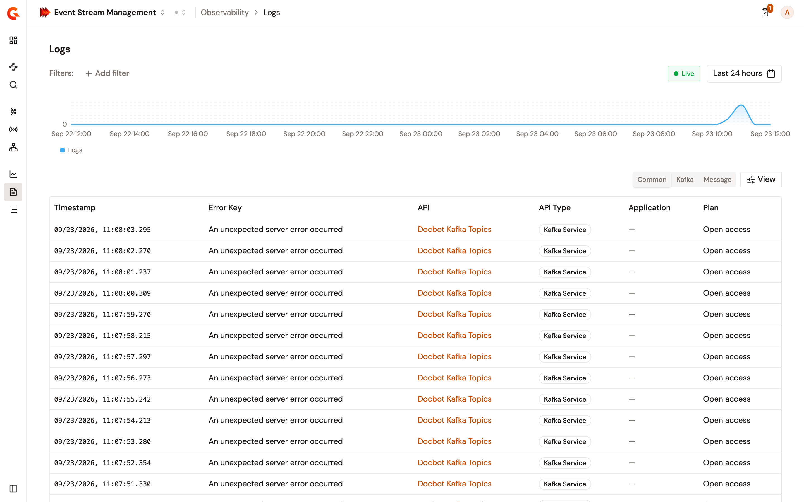
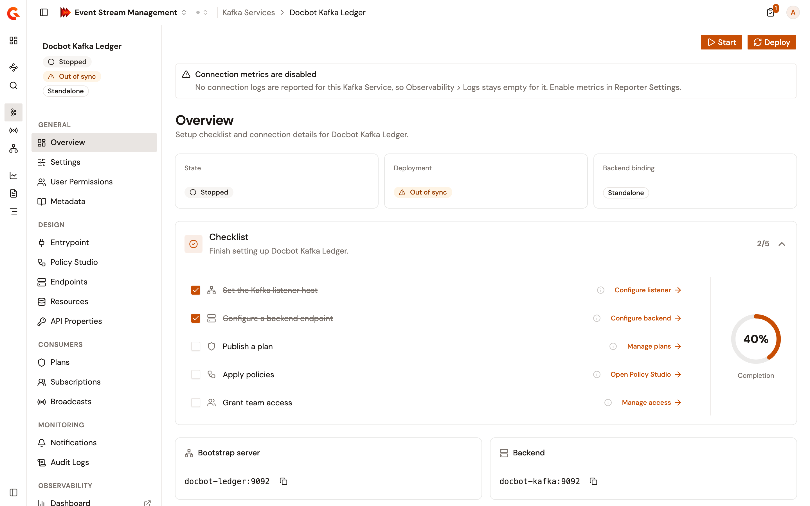

# View connection logs

The **Logs** page lists the connections and requests the gateway recorded for your Kafka Services and Message APIs, newest first. A Kafka row is one client connection, and a Message API row is one request that opened a stream. Your HTTP proxies, LLM proxies, and other APIs never appear here.

<figure><figcaption>
The Logs page lists connections and requests across the environment
</figcaption></figure>

## Open the logs

1. From the Gamma console sidebar, select **Event Stream Management**.
2. Open **Observability**.
3. Click **Logs**.

To open the logs of one API, follow these steps:

1. Open the API from **Kafka Services** or **Message APIs**.
2. In the API's sidebar, under **Observability**, click **Logs**.

The logs open in a new tab, filtered to that API over the last 24 hours.

## Find failed Kafka connections

The table opens on **Common**. Click **Kafka** to show each connection's status, failure origin, client ID, and duration. For Message APIs, **Message** shows the entrypoint, the HTTP status, the request URI, and the gateway response time.

**Failure Origin** says where the connection broke.

<table>
    <thead>
        <tr>
            <th width="210">Failure origin</th>
            <th>What it means</th>
        </tr>
    </thead>
    <tbody>
        <tr>
            <td><strong>Client ↔ Gateway</strong></td>
            <td>The connection broke between the Kafka client and the gateway, for example on the TLS or SASL handshake, or on the plan credentials.</td>
        </tr>
        <tr>
            <td><strong>Gateway ↔ Broker</strong></td>
            <td>The connection broke between the gateway and the broker, for example an unreachable broker, an unknown topic, or a broker ACL.</td>
        </tr>
        <tr>
            <td><strong>Gateway internal</strong></td>
            <td>The gateway itself failed.</td>
        </tr>
        <tr>
            <td><strong>Undetermined</strong></td>
            <td>Neither the gateway nor the error key placed the failure.</td>
        </tr>
    </tbody>
</table>

A row with an error key is a failure even when its status reads **Connected** or **Disconnected**.

Filter on **Failure Origin** to see one kind of failure only, such as **Gateway ↔ Broker**, or on **Kafka Client ID** to follow one client. Topic and Kafka operation filters are on the dashboards, not here.

Click a row to see why it failed. See [Diagnose a failed Kafka connection](diagnose-a-failed-kafka-connection.md).

## Why an API shows nothing

An API records nothing until reporting is on, and its **Overview** page shows a warning until then. The warning links to the API's **Reporter Settings**, where you turn reporting on.

* A Kafka Service shows **Connection metrics are disabled** until both **Enable event-metrics reporting** and **Enable connection-metrics reporting** are on.
* A Message API shows **Runtime reporting is disabled** until the switch on its **Settings** card is on. That switch alone is what puts its connections in this list.
* A Message API that reports but captures no **Logging mode** or no **Logging phase** shows **Message content is not recorded** instead. Its connections are listed here, and each row opens with an empty **Messages** section.

<figure><figcaption>
A Kafka Service that reports nothing says so on its own page
</figcaption></figure>

## Verification

To verify logs are working as expected, follow these steps:

1. Open a Kafka Service.
2. Confirm its **Overview** page doesn't show **Connection metrics are disabled**.
3. Connect a Kafka client to the Kafka Service.
4. Open **Logs**.
5. Set the time range to cover the connection.
6. Confirm a row appears for the connection.
