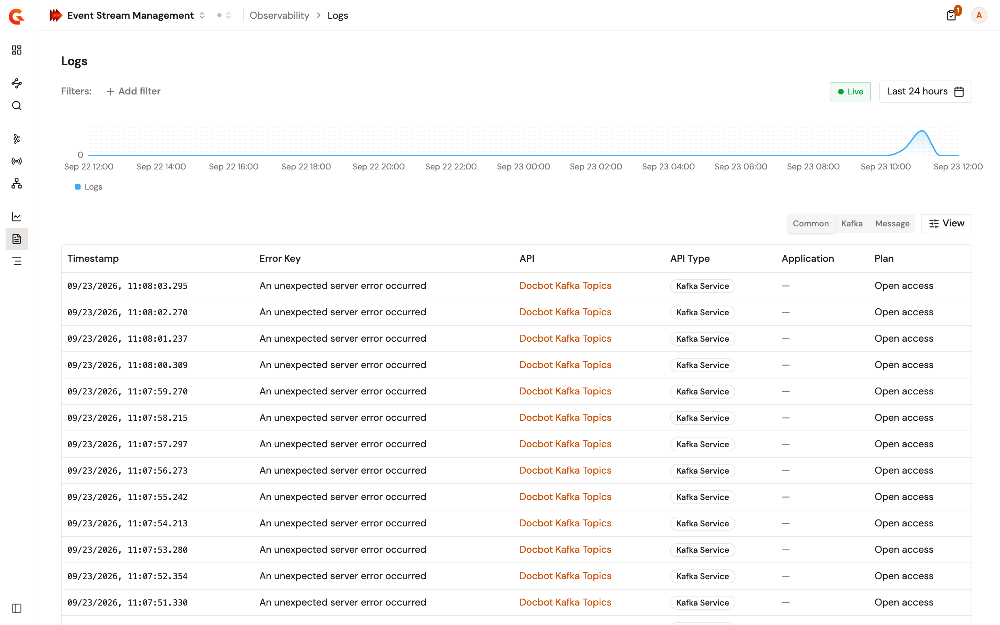
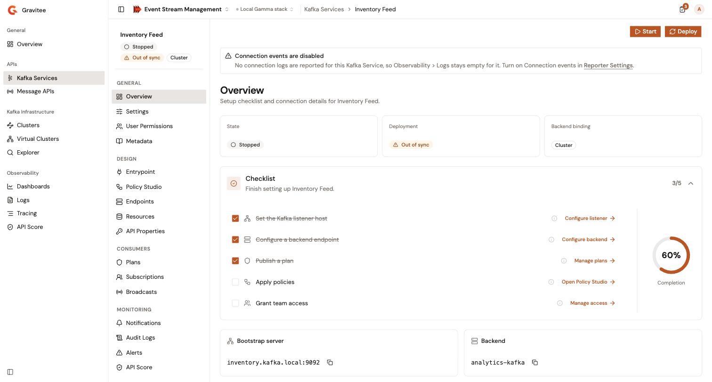

# View connection logs

The **Logs** page lists the connections and requests the gateway recorded for your Kafka Services and Message APIs, newest first. A Kafka row is one event of a client connection: its opening, a failure, or its clean close, so one connection can take several rows. A Message API row is one request that opened a stream. Your HTTP proxies, LLM proxies, and other APIs never appear here.

<figure><figcaption>
The Logs page lists connections and requests across the environment
</figcaption></figure>

## Open the logs

1. From the Gamma console sidebar, select **Event Stream Management**.
2. Open **Observability**.
3. Click **Logs**.

The logs open on the last 5 minutes. Widen the time range before concluding an API records nothing.

To open the logs of one API, follow these steps:

1. Open the API from **Kafka Services** or **Message APIs**.
2. In the API's sidebar, under **Observability**, click **Logs**.

The logs open in a new tab, filtered to that API over the last 24 hours.

## Find failed Kafka connections

The **Common**, **Kafka**, and **Message** buttons above the table, next to **View**, choose which columns it shows. It opens on **Common**. Click **Kafka** to show each row's status, failure origin, client ID, and duration. A **Connected** row has no duration, because it's written when the connection opens. Click **Message** to show the entrypoint, the HTTP status, the request URI, and the gateway response time.

**View** also lets you add the **Connection ID** column, which is hidden by default. The gateway writes this ID on its own log lines for the connection, so you can use it to search the gateway logs.

A Kafka row's status is **Connected**, **Disconnected**, **Connection error**, **Session error**, or **Internal error**. Which of these a Kafka Service writes follows its connection events in **Reporter Settings**: by default **Connected** and the three errors, and **Disconnected** only once you select it. See [Configure reporter settings](configure-reporter-settings.md#choose-which-connection-events-are-reported).

**Failure Origin** says where the connection broke.

<table>
    <thead>
        <tr>
            <th width="210">Failure origin</th>
            <th>What it means</th>
        </tr>
    </thead>
    <tbody>
        <tr>
            <td><strong>Client ↔ Gateway</strong></td>
            <td>The connection broke between the Kafka client and the gateway, for example on the TLS or SASL handshake, or on the plan credentials.</td>
        </tr>
        <tr>
            <td><strong>Gateway ↔ Broker</strong></td>
            <td>The connection broke between the gateway and the broker, for example an unreachable broker, an unknown topic, or a broker ACL.</td>
        </tr>
        <tr>
            <td><strong>Gateway internal</strong></td>
            <td>The gateway itself failed.</td>
        </tr>
        <tr>
            <td><strong>Undetermined</strong></td>
            <td>Neither the gateway nor the error key placed the failure.</td>
        </tr>
    </tbody>
</table>

Filter on **Native Connection Status** to keep one status, or on **Failure Origin** to keep one kind of failure, such as **Gateway ↔ Broker**. Filter on **Kafka Client ID** to follow one client. Topic and Kafka operation filters are on the dashboards, not here.

Click a row to see why it failed. See [Diagnose a failed Kafka connection](diagnose-a-failed-kafka-connection.md).

## Why an API shows nothing

First widen the time range, which opens on the last 5 minutes and hides anything older.

An API also records nothing until reporting is on, and its **Overview** page shows a warning until then. The warning links to the API's **Reporter Settings**, where you turn reporting on. See [Configure reporter settings](configure-reporter-settings.md).

* A Kafka Service shows **Connection events are disabled** while **Connection events** is cleared.
* A Message API shows **Runtime reporting is disabled** until **Enable analytics** is selected on its **Settings** card. That checkbox alone is what puts its connections in this list.
* A Message API that reports, and whose logging options were set without both a **Logging mode** and a **Logging phase**, shows **Message content is not recorded** instead. Its connections are listed here, and each row opens with an empty **Messages** section. A Message API whose logging options were never set shows no warning.

<figure><figcaption>
A Kafka Service that reports nothing says so on its own page
</figcaption></figure>

## Verification

To verify logs are working as expected, follow these steps:

1. Open a Kafka Service.
2. Confirm its **Overview** page doesn't show **Connection events are disabled**.
3. Connect a Kafka client to the Kafka Service.
4. Open **Logs**.
5. Set the time range to cover the connection.
6. Confirm a row appears for the connection.
