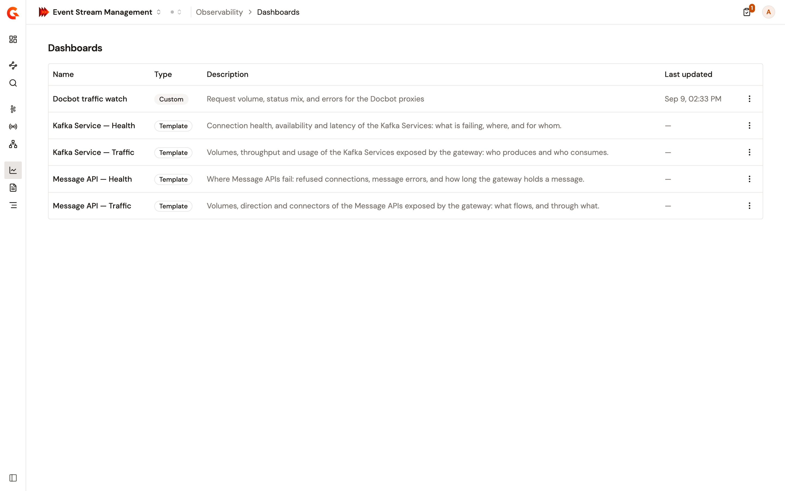

# View observability dashboards

Event Stream Management ships four dashboards: a health board and a traffic board for Kafka Services, and the same pair for Message APIs. Open a health board to see what's failing and where, or a traffic board to see volumes.

<figure><figcaption>
The Dashboards page lists the four templates and any custom dashboard saved in the environment
</figcaption></figure>

## Open a dashboard

1. From the Gamma console sidebar, select **Event Stream Management**.
2. Open **Observability**.
3. Click **Dashboards**.
4. Select the board you want.

To open the health board for one API, open the API from **Kafka Services** or **Message APIs** and click its dashboard link. The board opens filtered to that API over the last 24 hours.

## Narrow a board

Boards offer three Kafka filters that the logs don't: **Failure Side**, **Kafka Topic**, and **Kafka Operation**. **Failure Side** is the dashboard counterpart of the logs filter **Failure Origin**. **Kafka Topic** and **Kafka Operation** don't suggest values, so type the one you want.

## Custom dashboards

You can't create, edit, or delete a dashboard in Event Stream Management. Custom dashboards saved in the same environment still appear in the list, marked **Custom**, for a role that can read the environment's dashboards, and you can open them here. Agent Management and the Gamma API both save custom dashboards. See [Build a custom dashboard](../../agent-management/observe/dashboards/build-a-custom-dashboard.md) and [Save observability dashboards with the Gamma API](../../platform-management/save-observability-dashboards.md).

The four templates don't link back to the logs behind them. To see those rows, open **Logs** and apply the same filters.
