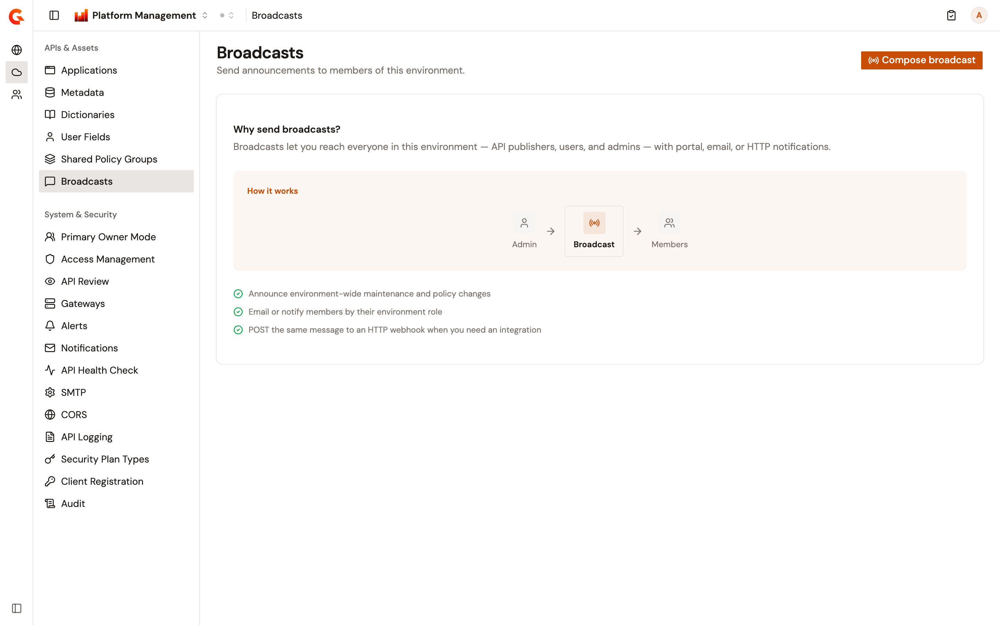
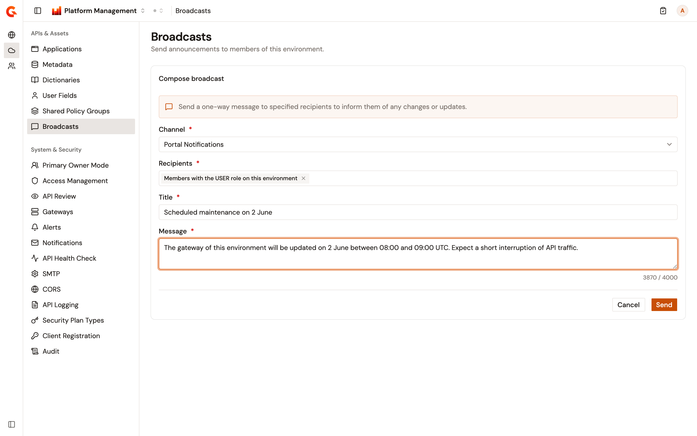
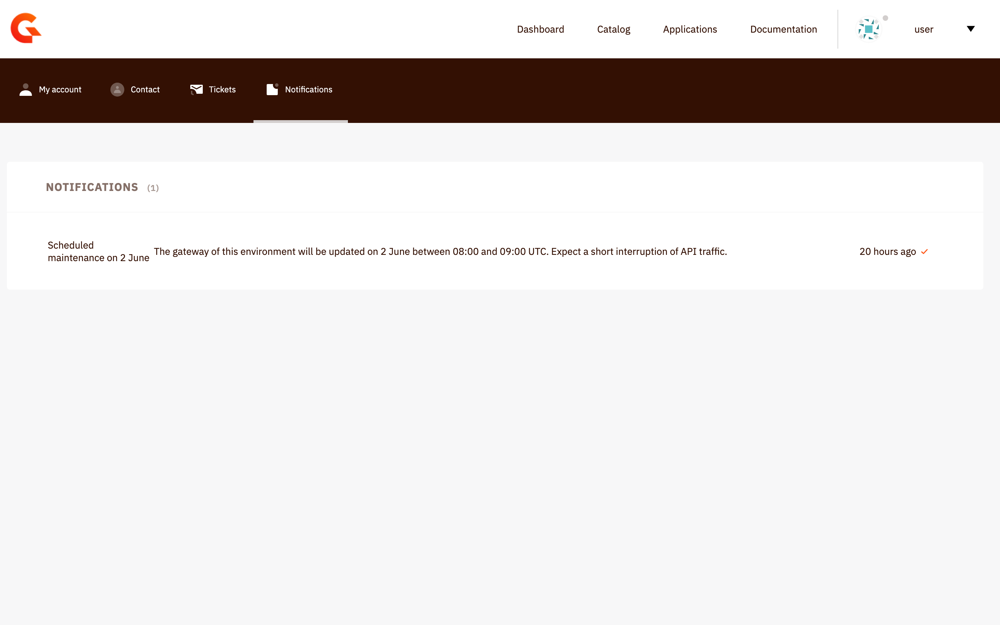

# Broadcast messages to environment members

A broadcast is a one-way message to the members of the environment selected in the console. It reaches the members who hold a chosen environment role, as a notification in the Developer Portal or as an email, or it posts the message to an HTTP endpoint. Broadcasts aren't kept: the page holds no history, and each broadcast is written and sent in one go.

The broadcasts of an API reach the consumers of that API instead, and are sent from the API. See [Broadcast messages to consumers](../api-management/build/configure-your-api-proxy/broadcast-messages-to-consumers.md).

## Open the Broadcasts page

The page sits in the **APIs & Assets** group of the **Environment** section. It appears only when your role can send broadcasts in the environment.

To open the page, complete the following steps:

1. From the Gamma console sidebar, select **Platform Management**.
2. Open the **Environment** section.
3. Under **APIs & Assets**, select **Broadcasts**.

<figure><figcaption>
The Broadcasts page of the <strong>Environment</strong> section
</figcaption></figure>

The recipient roles are read from the organization when the page opens. Reading them needs read access to the roles of the organization, on top of the permission to send broadcasts. When they can't be read, the page shows **Failed to load recipient options. Please refresh the page and try again.** and **Compose broadcast** stays disabled.

## Send a broadcast

To send a broadcast, complete the following steps:

1. Select **Compose broadcast**.
2. Select the **Channel**: **Portal Notifications**, **Email**, or **POST HTTP Message**. Changing the channel clears the title and the URL, and keeps the recipients and the message.
3. For **Portal Notifications** and **Email**, select one or more **Recipients** and enter a **Title**. Each option is an environment role, and the broadcast reaches every member who holds that role on the environment.
4. For **POST HTTP Message**, enter the **URL** to post to, as an `http` or `https` address. Add the **HTTP headers** the endpoint expects, as a name and a value per row, and turn on **Use system proxy** to send the request through the proxy configured for the Management API.
5. Enter the **Message**, up to 4,000 characters. The counter under the field shows how many characters remain.
6. Select **Send**.

**Send** stays disabled until the form is complete: recipients and a title for **Portal Notifications** and **Email**, a valid URL for **POST HTTP Message**, and a message in every case. If the send fails, the reason is shown in the form and your entries are kept. **Cancel** discards the broadcast and the error.

After the send, the page confirms **Broadcast sent** and tells you how many recipients the message was delivered to, or **Your message has been sent.** when the count is zero. Select **Compose another broadcast** to start a new one.

<figure><figcaption>
The <strong>Compose broadcast</strong> form on the <strong>Portal Notifications</strong> channel
</figcaption></figure>

What each channel sends, and what the count means:

* **Portal Notifications**: each member holding a selected role gets the title and message as a notification in the Developer Portal. The count is the number of those members.
* **Email**: each of those members who has an email address gets an email with the title as its subject and the message as its body, addressed in blind copy. The count is the number of members with an email address.
* **POST HTTP Message**: the message is posted, as is, as the body of one HTTP request to the URL, with the headers you added. The count is always 1.

HTTP broadcasts can be turned off for the Management API, and the URLs they may post to can be limited to an allowed list. When they're off, the send fails with **This notifier is disabled. Please, contact your administrator.** When the URL isn't allowed, it fails with **This url is forbidden. Please, contact your administrator**. Both settings are described in [Notifiers](https://documentation.gravitee.io/apim/prepare-a-production-environment/production-best-practices/general-recommendations/notifiers).

Every broadcast is recorded on the **Audit** page of the **Environment** section as a `MESSAGE_SENT` event, with the account that sent it. See [Review organization and environment audit logs](review-audit-logs.md).

## Verification

To verify a broadcast is working as expected, follow these steps:

1. Send a broadcast on the **Portal Notifications** channel to a role that a test user holds on the environment.
2. Sign in to the Developer Portal as that user and open **Notifications**. The notification carries the title and message you entered.

<figure><figcaption>
A broadcast received in the Developer Portal
</figcaption></figure>

## Next steps

* To announce a change to the consumers of one API, see [Broadcast messages to consumers](../api-management/build/configure-your-api-proxy/broadcast-messages-to-consumers.md).
* To see who sent a broadcast and when, see [Review organization and environment audit logs](review-audit-logs.md).
