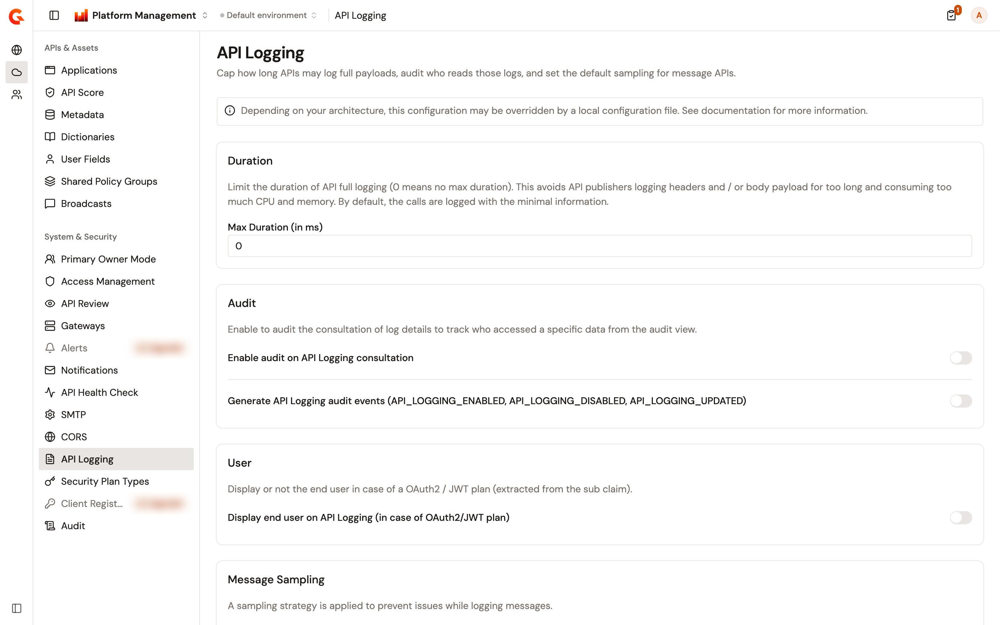
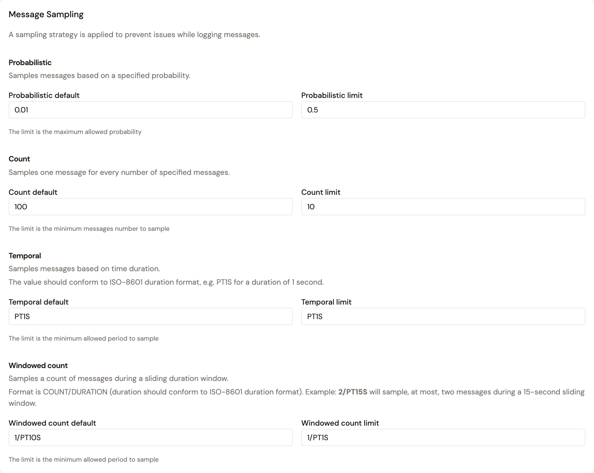

# Configure API logging

The **API Logging** page caps how long APIs may log full payloads, audits who reads those logs, and sets the default sampling for message APIs.

The page sits in the **Environment** section, but its values belong to the organization. The same values show whichever environment is selected, and they apply to every environment.

## Open the API Logging page

To open the page, complete the following steps:

1. At the top of the page, click **Home**, or the name of the product you're working in.
2. Select **Platform Management**.
3. Open the **Environment** section. The section names show when you hover over the icons on the left.
4. Under **System & Security**, click **API Logging**.

    <figure><figcaption>
The API Logging page, with the default values
</figcaption></figure>

The page appears only for a role that can read the organization's settings.

## Limit how long full logging lasts

**Max Duration (in ms)** caps how long an API logs once someone turns its logging on. When it's above `0`, an API logs only the requests it receives within that many milliseconds after its logging settings are saved. `0`, the default, sets no limit.

A value that isn't a number shows **Max duration must be a number**.

## Audit API logging

The **Audit** card has two switches, both off by default:

* **Enable audit on API Logging consultation**. Each time someone opens the details of an API log, the API's audit log records it.
* **Generate API Logging audit events (API_LOGGING_ENABLED, API_LOGGING_DISABLED, API_LOGGING_UPDATED)**. Each time someone turns an API's logging on, turns it off, or changes it, the API's audit log records it.

## Show the end user in exported logs

**Display end user on API Logging (in case of OAuth2/JWT plan)** is off by default. When it's on, API logs exported as a CSV file carry a **User** column.

## Set the message sampling defaults and limits

The **Message Sampling** card sets a default and a limit for each of the four sampling strategies of message APIs:

* When a message API has no sampling of its own, it samples one message out of every **Count default** messages.
* When a message API's sampling is saved, a value beyond the limit for its strategy is refused.

<figure><figcaption>
The Message Sampling card, with the default values
</figcaption></figure>

| Strategy | What it samples | Default | Limit |
| -------- | --------------- | ------- | ----- |
| **Probabilistic** | Messages, based on a probability from `0.01` to `1`. The limit is the maximum allowed probability. | `0.01` | `0.5` |
| **Count** | One message out of every given number of messages, a whole number of at least `1`. The limit is the minimum number of messages to sample. | `100` | `10` |
| **Temporal** | Messages, based on a time duration in ISO-8601 format, such as `PT1S` for one second. The limit is the minimum allowed period. | `PT1S` | `PT1S` |
| **Windowed count** | A count of messages during a sliding time window, written as a count and an ISO-8601 duration, such as `2/PT15S` for at most two messages every 15 seconds. The limit is the minimum allowed period. | `1/PT10S` | `1/PT1S` |

Each default has to stay within its limit. A default beyond its limit shows one of the following messages:

* **Default should be lower than Limit**, for a probabilistic default above its limit.
* **Default should be greater than Limit**, for a count or temporal default below its limit.
* **Default must be a lower rate than limit**, for a windowed count default with a higher rate than its limit.

## Save or discard your changes

To save your changes, complete the following steps:

1. Change the fields you need. **Discard** and **Save changes** appear as soon as a value differs from the saved one.
2. Click **Save changes**. **Configuration successfully saved!** confirms the save.

To go back to the saved values instead, click **Discard**. **Save changes** stays unavailable while a field shows an error.

A field that your installation's configuration sets is locked, and shows **Configuration provided by the system** when you point at it. Without permission to update the organization's settings, the page shows **You do not have permission to modify these settings. Contact your administrator for access.** and every field is read-only.

## Verification

To verify your changes, follow these steps:

1. Select another environment.
2. Open the **API Logging** page again, and check that it shows the values you saved.
