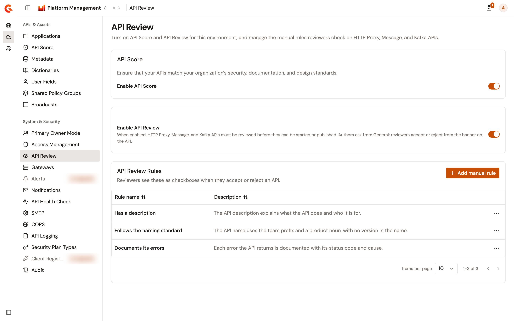
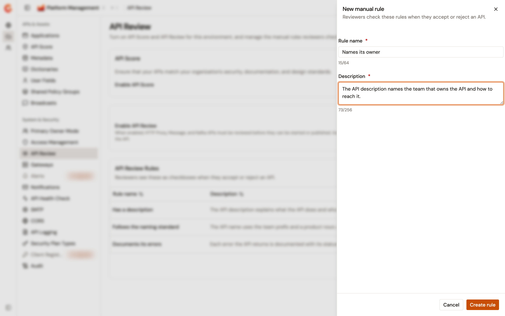

# Configure API Review

The **API Review** page holds two switches for the environment and its manual rules. **Enable API Score** shows the API Score pages. **Enable API Review** makes every HTTP Proxy, Message, and Kafka API of the environment wait for a reviewer before it can be started or published. Both switches are off until you turn them on.

## Prerequisites

Before you change the API Review settings, complete the following steps:

* Make sure your role can change the settings of the environment. A role that can only view them opens the page read-only, and a role that can't view them doesn't see **API Review** in the sidebar.
* Make sure your role can create, edit, and delete the manual rules of the environment. Without those rights, **Add manual rule** and the actions menu of each rule don't appear.

When your installation fixes one of the switches, the switch is locked and shows **Configuration provided by the system** when you point at it.

## Open the API Review page

To open the page, complete the following steps:

1. At the top of the page, click **Home**, or the name of the product you're working in.
2. Select **Platform Management**.
3. Open the **Environment** section. The section names show when you hover over the icons on the left.
4. Under **System & Security**, click **API Review**.

    <figure><figcaption>
The <strong>API Review</strong> page, with both switches on and three manual rules
</figcaption></figure>

## Turn on API Score

To turn on API Score, complete the following steps:

1. In the **API Score** card, turn on **Enable API Score**.
2. Click **Save changes**. The console confirms with **API Review settings saved successfully.**

While the switch is on, **API Score** appears under **APIs & Assets** in the **Environment** section, and under **General** in the sidebar of every API proxy. Turn the switch off to hide both again. To evaluate an API proxy, see [Review the API Score](../api-management/build/configure-your-api-proxy/review-the-api-score.md).

## Turn on API Review

To turn on API Review, complete the following steps:

1. Turn on **Enable API Review**.
2. Click **Save changes**.

With the switch on, an HTTP Proxy, Message, or Kafka API must be reviewed before it can be started or published. Its author asks for the review from the API, and a reviewer accepts or rejects it from the banner on the API. An API that exists when you turn the switch on isn't sent for review by itself, and one that is already running keeps running. A stopped API can't be started until a reviewer accepts it, so its author has to ask for a review first. For the whole workflow of an API proxy, see [Review an API proxy](../api-management/build/configure-your-api-proxy/review-an-api-proxy.md). For a Message API, see [Publish and review a Message API](../event-stream-management/build/message-apis/publish-and-review-a-message-api.md).

Turn the switch off to remove the review banners and the review tasks, and to let authors start and publish their APIs again without a reviewer.

## Add a manual rule

Manual rules are the checkboxes reviewers see when they accept or reject an API. To add one, complete the following steps:

1. In the **API Review Rules** card, click **Add manual rule**.
2. In the **New manual rule** panel, enter a **Rule name** of up to 64 characters and a **Description** of up to 256 characters. Both are required.

    <figure><figcaption>
The <strong>New manual rule</strong> panel
</figcaption></figure>

3. Click **Create rule**. The console confirms with **Manual rule created successfully**, and the rule appears in the table with its **Rule name** and **Description**.

## Edit a manual rule

To edit a manual rule, complete the following steps:

1. In the rule's row, open the actions menu.
2. Select **Edit**.
3. Change the **Rule name** or the **Description**.
4. Click **Save changes**. The console confirms with **Manual rule updated successfully**.

## Delete a manual rule

Deleting a manual rule removes it from the checklist of every review, and deletes the checks that reviewers recorded against it.

To delete a manual rule, complete the following steps:

1. In the rule's row, open the actions menu.
2. Select **Delete**.
3. In the **Delete manual rule** dialog, click **Delete**. The console confirms that the rule has been deleted.

## Verification

To verify your settings, complete the following steps:

1. At the top of the page, click **Platform Management**, then select **API Management**.
2. Click **API Proxies** in the module sidebar, and select an API proxy.
3. Check the **General** group of the API proxy sidebar. With **Enable API Score** on, it lists **API Score**.
4. Under **General**, click **Settings**. With **Enable API Review** on, and while the API proxy isn't under review, the **API Events** card offers **Ask for a review**.
