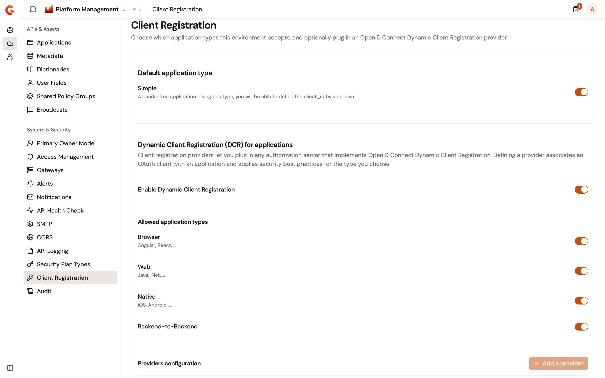
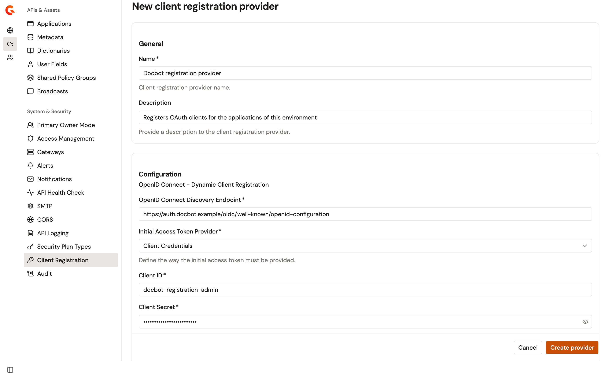
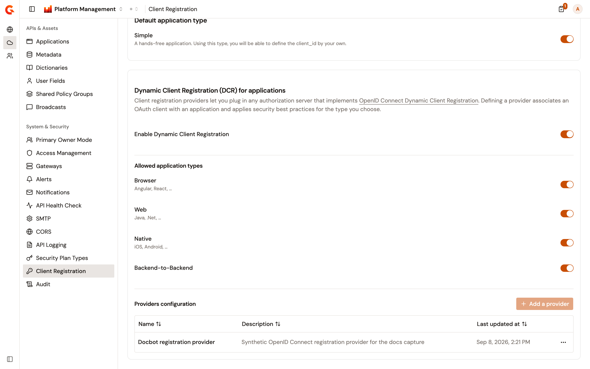

# Configure client registration

An environment decides which kinds of application its consumers can register, and whether Gravitee registers an OAuth client for each one against an authorization server. The **Client Registration** page of the Gamma console holds both decisions. It carries the application types the environment accepts, the Dynamic Client Registration (DCR) switch, and the single client registration provider that performs the registration.

Client registration settings belong to an environment, so the page changes with the environment selected in the console.

## Open the Client Registration page

The page sits in the **System & Security** group of the **Environment** section.

To open it, complete the following steps:

1. From the Gamma console sidebar, select **Platform Management**.
2. Open the **Environment** section.
3. Under **System & Security**, select **Client Registration**.

The page subtitle reads "Choose which application types this environment accepts, and optionally plug in an OpenID Connect Dynamic Client Registration provider."

<figure><figcaption>
The Client Registration page carries the application types the environment accepts and the provider that registers OAuth clients for them.
</figcaption></figure>

The page holds two cards. **Default application type** carries the **Simple** switch. **Dynamic Client Registration (DCR) for applications** carries the DCR switch, the four OAuth application types, and the providers.

Each switch saves on its own, as soon as you change it. The notification `Configuration has been saved.` confirms the save. On a failure, `Failed to save configuration` is shown and the switch returns to its previous value. If the page can't load its settings or its providers, it shows `Could not load client registration.` and a **Try again** button in place of both cards.

Changing a switch requires permission to change the environment's settings. Without it, every switch is read-only. A switch whose value is set in the Management API's own configuration is read-only whatever your permissions, and hovering it shows **Configuration provided by the system**.

## Allow simple applications

A simple application is a standalone client whose `client_id` the person registering it supplies. It's the one type the DCR switch never affects, so it stays available with or without a provider. **Simple** is on by default.

Turn **Simple** off to stop consumers of the environment registering that kind of application.

## Turn on Dynamic Client Registration

**Enable Dynamic Client Registration** decides whether the environment offers the four OAuth application types at all. It's off by default.

While it's off, **Browser**, **Web**, **Native**, and **Backend-to-Backend** aren't offered when an application is registered, whatever their own switches say. Turning it on offers each of the four whose own switch is on.

Turning **Simple** off while DCR is off leaves the environment with no application type at all. The **Register Application** form then reads `No application type available. Please check Client Registration configuration.` instead of a type list.

## Choose the allowed application types

**Allowed application types** holds one switch per OAuth application type. All four are on by default, and all four are shown whether DCR is on or off.

* **Browser**, described on the page as Angular, React, and the like.
* **Web**, described as Java, .Net, and the like.
* **Native**, described as iOS, Android, and the like.
* **Backend-to-Backend**, which carries no description.

## Add a client registration provider

A client registration provider is an authorization server that implements [OpenID Connect Dynamic Client Registration](https://openid.net/specs/openid-connect-registration-1_0.html). With one configured, registering a Browser, Web, Native, or Backend-to-Backend application creates an OAuth client on that server and stores the credentials it returns.

An environment holds at most one provider. Once one exists, **Add a provider** is disabled and its tooltip reads **Only one DCR provider is allowed.** To change the configuration, edit the provider you have.

Adding a provider requires an enterprise license that includes the `apim-dcr-registration` feature. Without it, the **Client Registration** entry stays in the sidebar and the page still opens. **Add a provider** then carries a lock icon, and selecting it opens the **Dynamic Client Registration** dialog with a **Start a free trial** link instead of the provider form. Opening an existing provider does the same, and entering a provider address directly returns you to the page.

Before you start, have the discovery endpoint of the authorization server and the credentials it issues you. The Management API contacts both when you save, so it needs network access to that server.

To add a provider, complete the following steps:

1. Under **Providers configuration**, select **Add a provider**.
2. In the **General** section, enter a **Name** of 3 to 50 characters.
3. Optional: enter a **Description**.
4. In the **Configuration** section, enter the **OpenID Connect Discovery Endpoint**. This is the address where the authorization server publishes its metadata, and Gravitee reads the registration endpoint from it.
5. Select an **Initial Access Token Provider**, either **Client Credentials** or **Initial Access Token**, and complete the fields it reveals. The following sections describe each one.
6. Optional: configure a trust store, a key store, client secret renewal, and claim mappings.
7. Select **Create provider**.

The form reports missing and invalid fields the first time you select **Create provider**. When the provider is saved, `Client registration provider <name> has been created.` is shown and the form reloads as the provider's own page.

If the Management API can't reach the discovery endpoint, or the credentials are refused, the save fails and `Failed to save provider` is shown.

<figure><figcaption>
The provider form collects the discovery endpoint and the credentials Gravitee authenticates with before it registers an OAuth client.
</figcaption></figure>

### Authenticate with client credentials

Select **Client Credentials** when the authorization server issues you a client ID and secret. Gravitee exchanges them for an initial access token at the token endpoint the discovery document names, authenticating with those two values.

* **Client ID**. Required.
* **Client Secret**. Required.
* **Scopes**. The scopes Gravitee asks for when it requests the initial access token. Type a scope and press Enter to add it, and select its remove control to drop it.
* **Client Template (`software_id`)**. The identifier of a template client on the authorization server. Every application registered through this provider inherits that template unless it carries its own value.

### Authenticate with an initial access token

Select **Initial Access Token** when the authorization server issues you the token directly instead. **Initial Access Token** is then required, and it's the only credential field the form shows.

### Secure the connection to the authorization server

**Trust Store Configuration** and **Key Store Configuration** hold the certificates Gravitee presents and trusts when it calls the authorization server. Both default to **None**.

To configure either one, complete the following steps:

1. Select a type. **Trust Store Type** offers **None**, **Java Trust Store (`.jks`)**, and **PKCS#12 (`.p12`) / PFX (`.pfx`)**. **Key Store Type** offers **None**, **Java Key Store (`.jks`)**, and **PKCS#12 (`.p12`) / PFX (`.pfx`)**.
2. Under **Input**, select **Path** to point at a store file the Management API can read, or **Content (Base64)** to paste the store itself.
3. Enter the store password, which is required once the type isn't **None**.
4. For **Path**, enter the path to the file. For **Content (Base64)**, paste the binary content as Base64.
5. For a key store, enter the **Alias** of the key to use. When the key carries its own password, enter it under **Key Password**.

### Renew the client secret

Some authorization servers let a registered client replace its own secret. That exchange sits outside the DCR specification, and it has its own section on the form, **Renew client_secret (outside DCR specification)**.

To configure it, complete the following steps:

1. Turn on **Enable renew client_secret support**.
2. Select an **HTTP Method**. **POST**, **PATCH**, and **PUT** are offered, and the Management API refuses any other value.
3. Enter the **Endpoint**. It has to start with `http://` or `https://`.

The endpoint is a Gravitee Expression Language template, resolved when a secret is renewed. Use `{#client_id}` for the client whose secret is being renewed. The values the authorization server publishes in its discovery document are available as variables too, under the names it uses for them. The field's placeholder shows the shape Gravitee Access Management expects, `https://[am_gateway]/[domain]/oidc/register/{#client_id}/renew_secret`.

### Map identity provider claims into the registration request

**Claim Mappings** copies claims Gravitee stored from the user's identity provider into the registration request, so the authorization server receives tenant or user context with each new client.

To add a mapping, complete the following steps:

1. Select **Add mapping**.
2. In the first field, enter the claim name.
3. In the second field, enter the registration request field to write it to. Use dot notation for a nested field, such as `metadata.organization`.

Only extension fields can be written. A path whose first segment is a standard registration field defined by the specification, `client_name` among them, is refused when you save. A claim name can be used once per provider, and a row needs both halves filled in. A claim the user doesn't have is skipped rather than sent empty.

## Review the configured provider

Once a provider exists, **Providers configuration** lists it in a table with the following columns:

* **Name**. The provider's name.
* **Description**. The provider's description, or an em dash when it has none.
* **Last updated at**. When the provider was last saved.
* A row menu. It offers **Edit** when your role can change the provider and **View** when it can't, and **Delete** when your role can delete it.

Until a provider exists, the section shows the **Why add a DCR provider?** panel in place of the table.

<figure><figcaption>
An environment holds one provider, so the Add a provider button is unavailable once the table has a row.
</figcaption></figure>

## Edit a provider

To edit a provider, complete the following steps:

1. Open the row menu of the provider.
2. Select **Edit**.
3. Change the fields you need.
4. Select **Save changes**.

The form opens on the saved values, including the credential. Gravitee contacts the discovery endpoint and checks the credentials again on every save. A provider whose authorization server has moved, or whose secret has been rotated, can't be saved until the new values work. When the save succeeds, `Client registration provider <name> has been updated.` is shown.

A role that can read the provider but not change it opens the same form with every field read-only, the credential shown as `********`, and no save controls.

## Delete a provider

Deleting the provider stops the environment registering OAuth clients. The delete removes the provider alone, so the applications already registered through it are left as they are.

To delete a provider, complete the following steps:

1. Open the row menu of the provider.
2. Select **Delete**.
3. In the **Delete client registration provider** dialog, confirm that you want to delete it.
4. Select **Delete**.

The notification `"<name>" has been deleted.` confirms the deletion, and the table returns to the **Why add a DCR provider?** panel. On a failure, `Failed to delete provider` is shown.

## Verification

To verify that client registration is working as expected, follow these steps:

1. From the Gamma console sidebar, select **Platform Management**, and open the **Environment** section.
2. Under **System & Security**, select **Client Registration**.
3. Turn on **Enable Dynamic Client Registration**.
4. Confirm that `Configuration has been saved.` is shown.
5. Under **Providers configuration**, select **Add a provider**, complete the form, and select **Create provider**.
6. Confirm that the provider appears in the table with the name you gave it.
7. Open **Applications**, select **Register Application**, and confirm that the **Security** section offers the application types you left on.

Creating, updating, and deleting a provider is recorded in the environment audit log.

## Next steps

* [Manage applications](manage-applications.md). Register the applications that consume this environment's APIs, and pick the type each one uses.
* [Review organization and environment audit logs](review-audit-logs.md). Follow the changes made to the providers of an environment.
