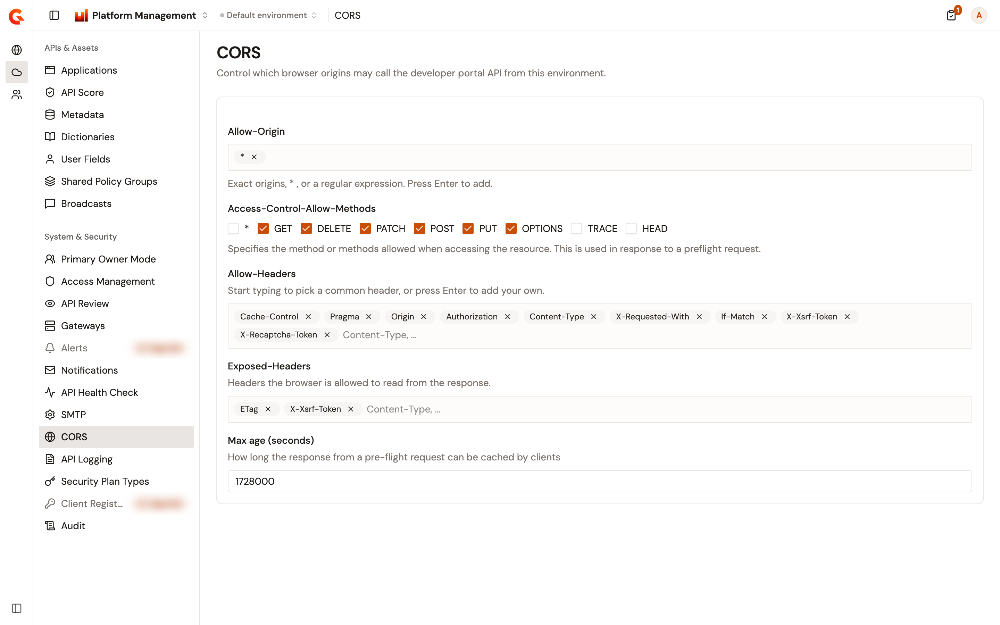

# Configure CORS for the Developer Portal API

Cross-origin resource sharing (CORS) decides whether a page served from one origin can call an API on another. The **CORS** page of the **Environment** section sets that policy for the Developer Portal API of the selected environment. For the Management API, see [Configure CORS for the Management API](configure-console-cors.md).

Changes take effect without restarting the Management API.

## Open the CORS page

To open the page, complete the following steps:

1. At the top of the page, click **Home**, or the name of the product you're working in.
2. Select **Platform Management**.
3. Open the **Environment** section. The section names show when you hover over the icons on the left.
4. Under **System & Security**, click **CORS**.

    <figure><figcaption>
The CORS page of an environment, with the default values
</figcaption></figure>

The page appears only for a role that can read the environment's settings.

## Fields

The page holds the following fields:

| Field | Description | Default |
| ----- | ----------- | ------- |
| **Allow-Origin** | The origins that may call the Developer Portal API. Enter an exact origin, `*`, or a regular expression, and press Enter to add it. | `*`, every origin |
| **Access-Control-Allow-Methods** | The HTTP methods a cross-origin request may use. Select `*` or any of `GET`, `DELETE`, `PATCH`, `POST`, `PUT`, `OPTIONS`, `TRACE`, and `HEAD`. | `GET`, `DELETE`, `PATCH`, `POST`, `PUT`, and `OPTIONS` |
| **Allow-Headers** | The request headers a cross-origin request may send. Start typing to pick a common header, or press Enter to add your own. | `Cache-Control`, `Pragma`, `Origin`, `Authorization`, `Content-Type`, `X-Requested-With`, `If-Match`, `X-Xsrf-Token`, and `X-Recaptcha-Token` |
| **Exposed-Headers** | The response headers the browser is allowed to read. | `ETag` and `X-Xsrf-Token` |
| **Max age (seconds)** | How long a browser can cache the response to a preflight request. Enter a whole number of seconds. | `1728000`, 20 days |

A browser on an origin that isn't allowed can't call the Developer Portal API.

## Change the CORS settings

To change the CORS settings, complete the following steps:

1. Change the fields you need. **Discard** and **Save changes** appear as soon as a value differs from the saved one.
2. Click **Save changes**. **CORS settings saved successfully.** confirms the save.

To go back to the saved values instead, click **Discard**.

**Save changes** stays unavailable while **Max age (seconds)** isn't a whole number, or while an **Allow-Origin** entry is an invalid regular expression. An invalid entry shows `"<entry>" Regex is invalid` under the field.

A field that your installation's configuration sets is locked, and shows **Configuration provided by the system** when you point at it. Without permission to update the environment's settings, the page shows **You do not have permission to modify these settings. Contact your administrator for access.** and every field is read-only.

## Verification

To verify your changes, follow these steps:

1. Reload the page.
2. Check that each field shows the value you saved.
