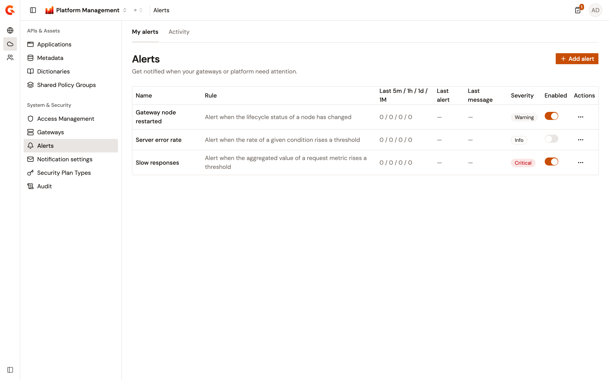
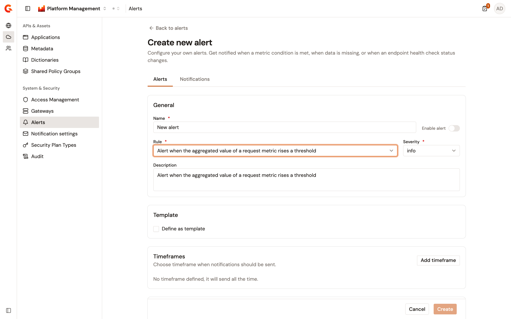
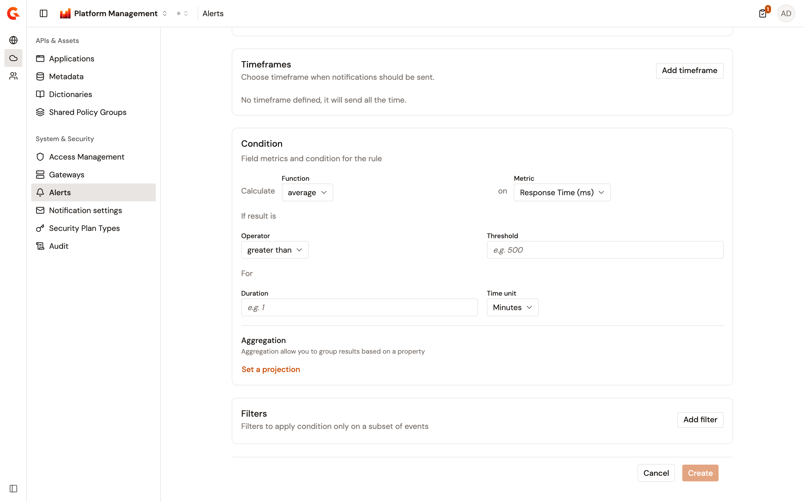
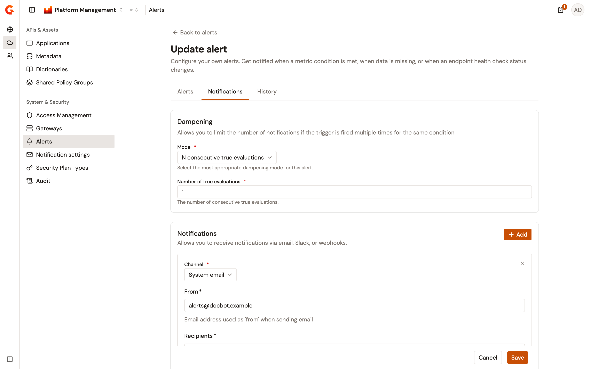
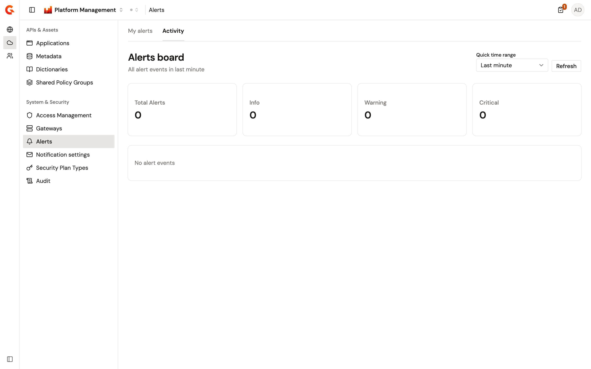

# Configure environment alerts

An environment alert watches the events that the gateways of an environment report, and notifies you when its rule matches. The events cover request metrics, endpoint health-check changes, node heartbeats, and node lifecycle changes. The Alerts page of the Environment section lists the alerts of the environment selected in the console, creates and edits them, and sums up how often each one fired.

Alerts are evaluated by [Gravitee Alert Engine](https://documentation.gravitee.io/apim/alert-engine), and each alert sends its notifications by email, Slack, or webhook.


The Alerts page requires an enterprise license that includes the Alert Engine feature. Without it, the **Alerts** entry stays in the sidebar but is locked, and opening the page redirects you to the first page your role can open in Platform Management.


Saving an alert fails with **Failed to save alert.** when alerting is disabled for the organization, or when no alert trigger provider is installed on the Management API.

## Open the Alerts page

To open the page, complete the following steps:

1. From the Gamma console sidebar, select **Platform Management**.
2. Open the **Environment** section.
3. Navigate to **Alerts**.

The page opens on the **My alerts** tab, which lists the alerts of the selected environment. The **Activity** tab sums up the alert events of the environment, as described in [Track alert activity](#track-alert-activity).

<figure><figcaption>
The My alerts tab of the Alerts page.
</figcaption></figure>

Until the environment has an alert, the **My alerts** tab shows an introduction to alerts in place of the table. The introduction lists the rules available in the environment, the notification channels, and the capabilities of an alert.

## Read the alert list

The table lists one row per alert, sorted by name, with the following columns:

| Column                     | Description                                                                                                                                                   |
| -------------------------- | ------------------------------------------------------------------------------------------------------------------------------------------------------------- |
| **Name**                   | The name of the alert. A template alert is prefixed with **\[Template]**.                                                                                     |
| **Last 5m / 1h / 1d / 1M** | How many times the alert fired in the last 5 minutes, the last hour, the last day, and the last 30 days. Hover over the counts to read them in full.          |
| **Rule**                   | The rule the alert evaluates.                                                                                                                                 |
| **Last alert**             | When the alert last fired, or **&#x2014;** when it never fired.                                                                                               |
| **Last message**           | The message of the last alert event, or **&#x2014;** when the alert never fired.                                                                              |
| **Severity**               | **Info**, **Warning**, or **Critical**.                                                                                                                       |
| **Enabled**                | A switch that enables or disables the alert in place.                                                                                                         |
| **Actions**                | A menu with **Edit** and **Delete alert**. The column appears when your role can update or delete alerts.                                                     |

Turning the **Enabled** switch on or off saves the alert at once, and a message confirms `Alert "<name>" enabled.` or `Alert "<name>" disabled.` A template alert can't be enabled, edited, or deleted from the list.

**Add alert** appears when your role can create alerts.

## Create an alert

To create an alert, complete the following steps:

1. Click **Add alert**. The **Create new alert** page opens on the **Alerts** tab.
2. Under **General**, enter a **Name** of 3 to 50 characters. Select a **Rule**, and select a **Severity** of **info**, **warning**, or **critical**. Add a **Description** of up to 256 characters if needed. Turn on **Enable alert** to evaluate the alert as soon as it's created. Selecting a rule fills the description with the wording of the rule. It also resets the condition to the default of the rule and clears the filters.
3. For an API metrics or health-check rule, under **Template**, decide whether to define the alert as a template. See [Define an alert template](#define-an-alert-template).
4. Under **Timeframes**, click **Add timeframe** to restrict when notifications are sent. See [Restrict notifications to a timeframe](#restrict-notifications-to-a-timeframe).
5. Under **Condition**, set the condition of the rule. See [Set the condition](#set-the-condition).
6. Under **Filters**, click **Add filter** to apply the condition to a subset of events. See [Filter the events](#filter-the-events).
7. Open the **Notifications** tab, select the dampening mode, and add the notification channels. See [Configure dampening and notifications](#configure-dampening-and-notifications).
8. Click **Create**.

**Create** stays disabled until every required field is filled, and a message next to the buttons names what's missing for a notification. Once the alert is created, the page returns to the list and confirms `Alert "<name>" created.`

<figure><figcaption>
The Create new alert page with an aggregation rule selected.
</figcaption></figure>

### Rules

The rule decides which events the alert evaluates and which condition it takes. The **Rule** list groups the rules under **NODE**, **API METRICS**, and **HEALTH-CHECK**.

| Group            | Rule                                                                              | Condition                                                                              |
| ---------------- | --------------------------------------------------------------------------------- | -------------------------------------------------------------------------------------- |
| **NODE**         | Alert when the lifecycle status of a node has changed                             | None. The alert fires when a node starts or stops.                                     |
| **NODE**         | Alert when a metric of the node validates a condition                             | A simple condition on a node metric.                                                   |
| **NODE**         | Alert when the aggregated value of a node metric rises a threshold                | An aggregation on a node metric.                                                       |
| **NODE**         | Alert when the rate of a given condition rises a threshold                        | A rate of node events that match a condition.                                          |
| **NODE**         | Alert on the health status of the node                                            | None. The alert fires on the health status events of a node.                           |
| **API METRICS**  | Alert when a metric of the request validates a condition                          | A simple condition on a request metric.                                                |
| **API METRICS**  | Alert when there is no request matching filters received for a period of time     | A duration without a matching request.                                                 |
| **API METRICS**  | Alert when the aggregated value of a request metric rises a threshold             | An aggregation on a request metric.                                                    |
| **API METRICS**  | Alert when the rate of a given condition rises a threshold                        | A rate of requests that match a condition.                                             |
| **HEALTH-CHECK** | Alert when the health status of an endpoint has changed                           | None. The alert fires when the health-check status of an endpoint changes.             |

Two rules share the wording **Alert when the rate of a given condition rises a threshold**. The group tells them apart: the **NODE** one evaluates node heartbeats, and the **API METRICS** one evaluates requests.

When the platform is cloud hosted, the **NODE** group isn't offered, and the Management API rejects a node alert.

### Set the condition

The **Condition** card follows the rule:

* **Simple condition**, for the metric rules of the request and of the node. **When** a **Metric** meets a **Type** of condition. The types offered depend on the metric. A **threshold** takes an **Operator** and a **Threshold**. A **threshold range** takes a **Low threshold** and a **High threshold**. A **compare** takes an **Operator**, a **Multiplier**, and the **Property** to compare with. A **string** takes an **Operator** and a **Value** or a **Pattern**.
* **Missing data**. **No event for** a **Duration** and a **Time unit**.
* **Aggregation**, for the aggregated metric rules. **Calculate** a **Function** **on** a **Metric**, then **If result is** an **Operator** and a **Threshold**, **For** a **Duration** and a **Time unit**. The **count** function needs no metric.
* **Rate**, for the rate rules. A simple condition under **When**, then **If rate is** an **Operator** and a **Threshold (%)** from 1 to 99, **For** a **Duration** and a **Time unit**.
* No condition, for the endpoint health-check, node lifecycle, and node health rules. The card explains that the alert triggers automatically.

The numeric operators are **less than**, **less than or equals to**, **greater than or equals to**, and **greater than**. The string operators are **equals to**, **not equals to**, **starts with**, **ends with**, **contains**, and **matches**. The aggregation functions are **count**, **average**, **min**, **max**, **50th percentile**, **90th percentile**, **95th percentile**, and **99th percentile**. The time units are **Seconds**, **Minutes**, and **Hours**. Thresholds, multipliers, and durations take values of 1 or more, and a high threshold must be greater than or equal to the low one.

<figure><figcaption>
The Condition card of an aggregation rule.
</figcaption></figure>

For the aggregation rules, the rate rules, and the endpoint health-check rule, the card ends with an **Aggregation** section. **Set a projection** groups the results by a **Property**, and **Remove** clears the projection. The request rules offer **Status Code**, **Error Key**, **Tenant**, **API**, **Application**, and **Plan**, the node rules offer **Hostname** and **Type**, and the endpoint health-check rule offers **Endpoint name**.

The metrics offered depend on the rule:

| Rule                                                                 | Metrics                                                                                                                                                                                   |
| -------------------------------------------------------------------- | ----------------------------------------------------------------------------------------------------------------------------------------------------------------------------------------- |
| Metric of the request, rate of requests                              | **Response Time (ms)**, **Upstream Response Time (ms)**, **Status Code**, **Request Content-Length**, **Response Content-Length**, **Error Key**, **Tenant**, **API**, **Application**, **Plan** |
| Aggregated request metric                                            | **Response Time (ms)**, **Upstream Response Time (ms)**, **Request Content-Length**, **Response Content-Length**                                                                         |
| Metric of the node, aggregated node metric, rate of node events      | **Hostname**, **Type**, **OS CPU (%)**, **Process CPU (%)**, **Process CPU (total)**, **JVM Heap used**, **JVM Heap max**, **JVM Heap (%)**                                               |

The numeric metrics offer the threshold, threshold range, and compare types, except **Status Code**, which offers threshold and threshold range. **Error Key**, **Tenant**, **API**, **Application**, **Plan**, **Hostname**, and **Type** are string metrics. With the **equals to** or **not equals to** operator, four string metrics offer a **Value** list instead of a pattern. **Error Key** lists the error keys of the gateway. **Tenant** lists the tenants of the organization. **API** lists the APIs of the environment. **Type** lists **API Gateway** and **Management API**. The other operators take a **Pattern**.

### Filter the events

**Add filter** adds a **Filter** card that narrows the events the condition applies to. Each filter takes a **Metric**, a **Type**, and the fields of that type, like a simple condition. Remove a filter with its bin icon. The metrics follow the source of the rule:

| Rule source                    | Filter metrics                                                                        |
| ------------------------------ | ------------------------------------------------------------------------------------- |
| Request rules                  | The request metrics listed for the simple condition.                                  |
| Node metric rules              | The node metrics listed for the simple condition.                                     |
| Endpoint health-check rule     | **Old Status**, **New Status**, **Endpoint name**, **Response Time (ms)**, **Tenant** |
| Node lifecycle rule            | **Hostname**, **Type**, **Event**                                                     |
| Node health rule               | **Hostname**, **Type**, **Status**                                                    |

**Old Status** and **New Status** offer **Down**, **Transitionally down**, **Transitionally up**, and **Up**. **Event** offers **Start** and **Stop**, and **Status** offers **Healthy** and **Unhealthy**.

### Restrict notifications to a timeframe

Without a timeframe, the **Timeframes** card reads **No timeframe defined, it will send all the time.** **Add timeframe** adds a **Configure timeframe** card set to Monday through Friday, from 09:00:00 to 18:00:00. Select the days of the week, and set the start and end time under **Time range**. The **Office hours** switch sets the range to 9:00 AM to 6:00 PM, and the **Business day** switch selects every day except the weekend. Remove a timeframe with its X. The timeframe is saved in the time zone of your browser.

### Define an alert template

For the **API METRICS** and **HEALTH-CHECK** rules, the **Template** card offers **Define as template**. Decide at creation: the choice can't be changed afterward. A template isn't evaluated itself. It's saved disabled and appears in the list with the **\[Template]** prefix, where it can't be enabled, edited, or deleted. Select **Automatically create this alert for every new API** to have a copy of the template created, and enabled, on each API created in the environment.

### Configure dampening and notifications

The **Notifications** tab holds the **Dampening** and **Notifications** cards.

**Dampening** limits the number of notifications when the trigger fires several times for the same condition. Select a **Mode**:

| Mode                                                | Fields                                                                                                       |
| --------------------------------------------------- | ------------------------------------------------------------------------------------------------------------ |
| **N consecutive true evaluations**                  | **Number of true evaluations**                                                                               |
| **N true evaluations out of M total evaluations**   | **Number of true evaluations** and **Number of total evaluations**, which must be at least as high           |
| **N true evaluations in T time**                    | **Number of true evaluations**, **Duration**, and **Time unit**                                              |
| **Only true evaluations for at least T time**       | **Duration** and **Time unit**                                                                               |

The default is **N consecutive true evaluations** with one evaluation. The counts and durations take values from 1 to 100.

**Notifications** sends the alert to one or more channels. Click **Add**, select a **Channel**, and fill in the fields of the channel. The channels are the notifier plugins installed on the platform, and their fields come from the plugin:

| Channel          | Fields                                                                                                                                                                                                             |
| ---------------- | ------------------------------------------------------------------------------------------------------------------------------------------------------------------------------------------------------------------ |
| **Email**        | **Host**, **Port**, **From**, **Recipients**, **Subject**, and **Body** are required. **Username**, **Password**, **Allowed authentication methods**, **Start TLS enabled**, **SSL trust all**, **SSL key store**, and **SSL key store password** are optional. |
| **Slack**        | **Slack channel**, **Slack token**, and **Message** are required. **Use system proxy** is optional.                                                                                                                 |
| **System email** | **From**, **Recipients**, and **Subject** are required, and **Body** is optional. The email goes through the mail server of the Management API configuration when one is set, and through the SMTP settings of the organization otherwise. |
| **Webhook**      | **HTTP Method** and **URL** are required. **Request Headers**, **Request body**, and **Use system proxy** are optional.                                                                                            |

Remove a notification with its X. **Create** or **Save** stays disabled until every notification has a channel and its required fields, and the message next to the buttons reads **Select a channel for each notification.** or **Fill in the required fields for each notification.**

<figure><figcaption>
The Notifications tab of an alert with a System email notification.
</figcaption></figure>

## Edit an alert

To edit an alert, complete the following steps:

1. In the actions menu of the row, click **Edit**. The **Update alert** page opens with the **Alerts**, **Notifications**, and **History** tabs.
2. Change the fields. The **Rule** can't be changed.
3. Click **Save**. The **Save** and **Cancel** buttons appear once a field changed.

A message confirms `Alert "<name>" updated.`, and the page stays open on the **Alerts** tab. **Back to alerts** and **Cancel** return to the list without saving.

## Delete an alert

To delete an alert, complete the following steps:

1. In the actions menu of the row, click **Delete alert**.
2. In the **Delete alert** dialog, click **Delete**.

A message confirms `Alert "<name>" deleted.`

## Track alert activity

The **Activity** tab shows the **Alerts board**, which counts the alert events of the environment over a quick time range.

Select the **Quick time range**: **Last minute**, **Last hour**, **Last day**, **Last week**, or **Last month**. The board opens on **Last minute**, and **Refresh** reloads it. Four cards show the **Total Alerts**, **Info**, **Warning**, and **Critical** counts of events in the range. Below the cards, a table lists each alert that fired in the range with its **Alert Name**, **Severity**, and **Total Alerts Triggered**. Its **View history** link opens the **History** tab of the alert. The alerts are sorted by severity, then by decreasing number of events. Without an event in the range, the board reads **No alert events**.

<figure><figcaption>
The Alerts board.
</figcaption></figure>

## Review the history of an alert

The **History** tab of the **Update alert** page lists the events of the alert with their **Date** and **Message**. A date younger than a week is shown relative to now, and hovering over it shows the absolute date and time. **Refresh** reloads the list. The table paginates 10 events at a time by default, and offers 25, 50, 75, and 100. Without an event, the tab reads **No data to display.**

## Next steps

* [Monitor gateway instances](monitor-gateway-instances.md). Check the status and health metrics of the gateway nodes that a node alert reports on.
* [Configure the SMTP mail server](configure-smtp.md). Set up the mail server behind the **System email** channel.
