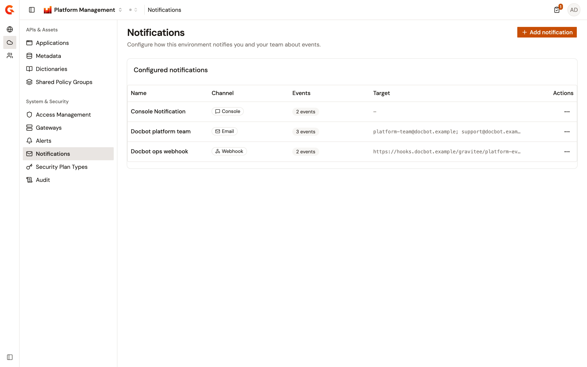
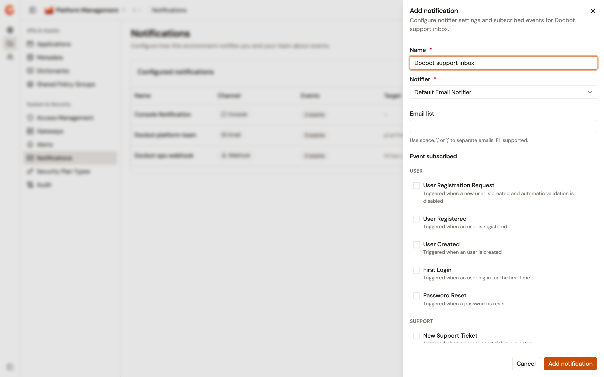

# Configure environment notifications

An environment raises an event when a user registers or signs in for the first time, and when a password is reset. It raises one when a support ticket is opened, when a federated ingestion completes, and when someone is invited to a group. The **Notifications** page of the Gamma console decides who hears about those events, and how. It holds your own console notification, which lists the events you want to see in your notification list, and the email and webhook notifications that reach your team.

Notifications belong to an environment, so the list changes with the environment selected in the console.

## Open the Notifications page

The page sits in the **System & Security** group of the **Environment** section.

To open it, complete the following steps:

1. From the Gamma console sidebar, select **Platform Management**.
2. Open the **Environment** section.
3. Under **System & Security**, select **Notifications**.

The page subtitle reads "Configure how this environment notifies you and your team about events."

<figure><figcaption>
The Notifications page of the <strong>Environment</strong> section, with the console notification and two notifications that reach the team by email and by webhook
</figcaption></figure>

The **Configured notifications** card lists one row per notification, with the following columns:

* **Name**. The name of the notification. Your own console notification is named **Console Notification**.
* **Channel**. **Console**, **Email**, or **Webhook**.
* **Events**. How many events the notification subscribes to, or **None**.
* **Target**. The addresses an email notification sends to, or the URL a webhook notification posts to. The console notification shows a dash. A long value is cut off, and hovering it shows the whole value.
* **Actions**. **Edit** and **Delete**, on the rows you're allowed to change. The column is absent when no row offers an action.

Email and webhook notifications are listed only for users who can create, edit, or delete them. A user with read-only access to the page sees the console notification alone. That user can still change the events of their own **Console Notification** row, but can't add, edit, or delete an email or webhook notification.

## Choose the events you see in the console

Every user has one console notification on the page. It's personal: it records the events you want to be told about, and other users of the environment have their own. It can't be deleted.

To choose your events, complete the following steps:

1. On the **Console Notification** row, open the actions menu and select **Edit**.
2. Under **Event subscribed**, select the events. The following table lists them by category.
3. Select **Save**.

<table><thead><tr><th width="150">Category</th><th width="240">Event</th><th>Sent when</th></tr></thead><tbody>
<tr><td><strong>USER</strong></td><td><strong>User Registration Request</strong></td><td>A new user is created and automatic validation is disabled.</td></tr>
<tr><td><strong>USER</strong></td><td><strong>User Registered</strong></td><td>A user is registered.</td></tr>
<tr><td><strong>USER</strong></td><td><strong>User Created</strong></td><td>A user is created.</td></tr>
<tr><td><strong>USER</strong></td><td><strong>First Login</strong></td><td>A user logs in for the first time.</td></tr>
<tr><td><strong>USER</strong></td><td><strong>Password Reset</strong></td><td>A password is reset.</td></tr>
<tr><td><strong>SUPPORT</strong></td><td><strong>New Support Ticket</strong></td><td>A new support ticket is created.</td></tr>
<tr><td><strong>FEDERATION</strong></td><td><strong>Ingestion complete</strong></td><td>An ingestion has completed.</td></tr>
<tr><td><strong>GROUP</strong></td><td><strong>Group invitation</strong></td><td>A user is invited in a group.</td></tr>
</tbody></table>

Clearing every event and saving removes the subscription, and the row goes back to **None**.

Console notifications appear in the notification list of the APIM Console and in the Developer Portal. The Gamma console has no notification list of its own.

## Add an email or webhook notification

An email notification sends each selected event to a list of addresses. A webhook notification sends it as an HTTP POST request to a URL. The request carries an `X-Gravitee-Event` header naming the event, an `X-Gravitee-Event-Scope` header set to `PORTAL`, and a JSON body with the same event and scope. When the event concerns an API, an application, an owner, a plan, a subscription, or an API Product, the body also includes that object with its identifier.

To add one, complete the following steps:

1. Select **Add notification**.
2. In the **Add notification** panel, enter a **Name**.
3. Under **Notifier**, select **Default Email Notifier** or **Default Webhook Notifier**.
4. For an email notification, enter the recipients in **Email list**. Separate addresses with a space, a comma, or a semicolon. The field's hint reads `EL supported`: an entry written as a template expression is resolved against the event data when the notification is sent, and an entry that fails to resolve is skipped.
5. For a webhook notification, enter the URL in **Webhook**. Turn on **Use system proxy** to send the request through the system proxy of the Management API.
6. Under **Event subscribed**, select the events.
7. Select **Add notification**.

<figure><figcaption>
The Add notification panel, with the email notifier selected and the events grouped by category
</figcaption></figure>

The **Add notification** button stays disabled until the name and the notifier are set. The recipients and the URL aren't checked, and an email notification saved without an address sends nothing.

Gravitee creates the notification first, then saves its recipients or URL. If that second step fails, the notification exists without its target, and the page asks you to edit it to finish the setup.

## Edit or delete a notification

To change a notification, open its actions menu and select **Edit**. The name and the notifier can't be changed. Update the recipients or the URL, the proxy switch, and the events, then select **Save**.

To remove an email or webhook notification, open its actions menu, select **Delete**, and confirm. The console notification has no **Delete** action.
