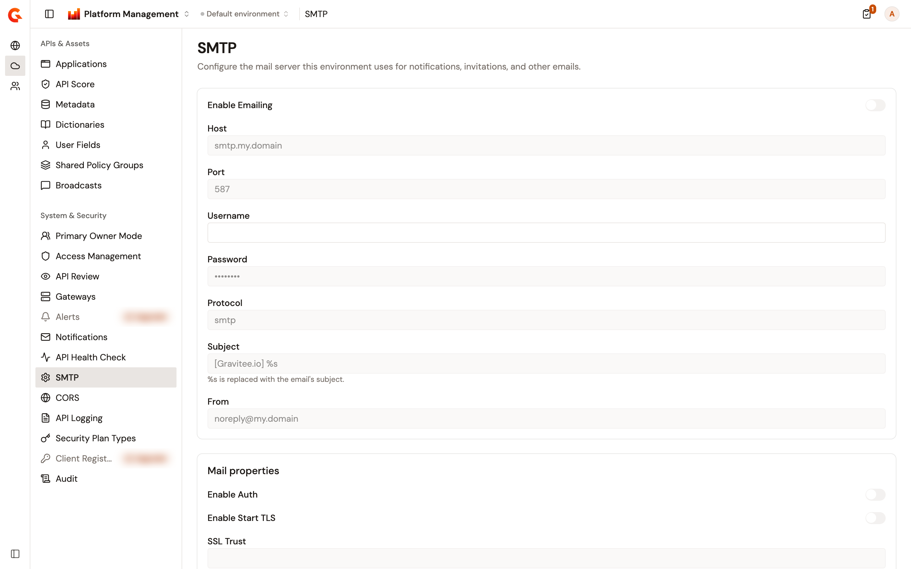

# Configure the SMTP mail server for an environment

The **SMTP** page of the **Environment** section sets the mail server that the selected environment uses for notifications, invitations, and other emails. It holds the same fields as the organization's **SMTP** page and saves them for this environment only. For each field, see [Configure the SMTP mail server](configure-smtp.md).

For mail sent in the context of this environment, a value saved here takes precedence over the organization's value. A value set by your installation's configuration takes precedence over both.

## Open the SMTP page

To open the page, complete the following steps:

1. At the top of the page, click **Home**, or the name of the product you're working in.
2. Select **Platform Management**.
3. Open the **Environment** section. The section names show when you hover over the icons on the left.
4. Under **System & Security**, click **SMTP**.

    <figure><figcaption>
The SMTP page of an environment
</figcaption></figure>

The page appears only for a role that can read the environment's settings.

## Change the environment's mail settings

To change the mail settings of the environment, complete the following steps:

1. Change the fields you need. **Discard** and **Save changes** appear as soon as a value differs from the saved one.
2. Click **Save changes**. **Configuration successfully saved!** confirms the save.

To go back to the saved values instead, click **Discard**.

A field that your installation's configuration sets is locked, and shows **Configuration provided by the system** when you point at it. Without permission to update the environment's settings, the page shows **You do not have permission to modify these settings. Contact your administrator for access.** and every field is read-only.

On a trial instance, the page shows **SMTP is not available on trial instances.** instead of the form.

## Reset the branded senders to the organization's

When the environment has branded notification email rules of its own, **Reset to Org settings** appears next to **Add configuration**. Resetting removes the environment's rules, so the organization's rules apply to this environment again.

**Reset to Org settings** appears only while **Enable Emailing** is on and you can change the environment's settings. It doesn't appear when your installation's configuration sets the rules.

To reset the branded senders, complete the following steps:

1. Click **Reset to Org settings**.
2. If the page has unsaved changes, the **Reset branded senders** dialog asks whether to discard them. Click **Reset**.

**Branded senders reset to the organization configuration.** confirms the reset.

## Verification

To verify your changes, follow these steps:

1. Reload the page.
2. Check that each field shows the value you saved.
