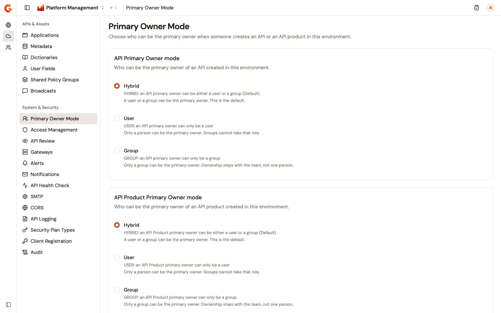
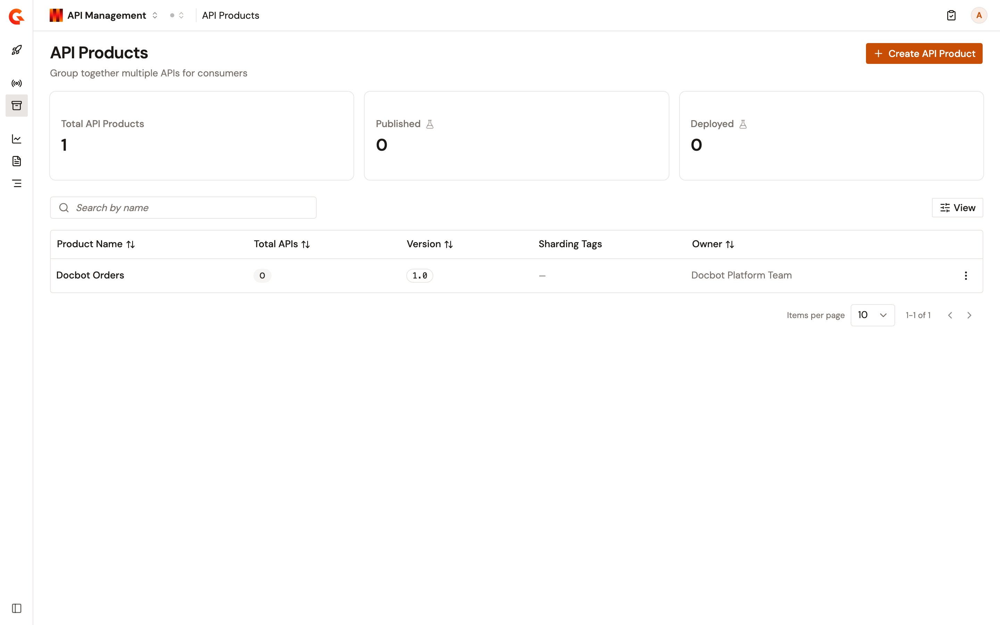

# Configure primary owner mode

The **Primary Owner Mode** page decides who can be the primary owner of an API or an API Product in an environment: a user, a group, or either. APIs and API Products each have their own setting.

Each environment keeps its own modes, and the page shows the modes of the environment selected at the top of the page. Changing a mode doesn't change the primary owner of an existing API or API Product.

## Primary owner modes

The **API Primary Owner mode** and **API Product Primary Owner mode** cards each offer three modes:

* **Hybrid**. A user or a group can be the primary owner. This is the default. The person who creates the API or API Product becomes its primary owner.
* **User**. Only a person can be the primary owner. Groups can't take that role. The person who creates the API or API Product becomes its primary owner. When you add or edit group members, the **PRIMARY_OWNER** role can't be selected for that kind of resource.
* **Group**. One of the creator's groups becomes the primary owner. Only a group in which a member holds the **PRIMARY_OWNER** role for that kind of resource qualifies. When several of the creator's groups qualify, the creator can't choose which one.

When someone imports an API, the mode applies to the primary owner named in the imported file, as if that person had created the API. When the file names no primary owner, or a user who doesn't exist, the mode applies to the person importing the API.

With **Group** selected for APIs, saving the settings of an API proxy that a person owns also needs a qualifying group: the owner's, or else one of yours. Without one, the save is refused. With one, that group is added to the groups of the API proxy.

## Prerequisites

Before you change the primary owner modes, complete the following steps:

* Make sure your role can change the settings of the environment. A role that can only view them opens the page read-only, and a role that can't view them doesn't see **Primary Owner Mode** in the sidebar.
* Before you select **Group**, make sure each person who creates APIs or API Products belongs to a group in which a member holds the **PRIMARY_OWNER** role in the **API** list, or in the **API product** list for API Products. To give a member that role, see [Manage groups](manage-groups.md). A person without such a group can't create the API or API Product, and sees a message saying that the user must belong to at least one group with a primary owner member.

## Set the primary owner modes

To set the primary owner modes, complete the following steps:

1. At the top of the page, click **Home**, or the name of the product you're working in.
2. Select **Platform Management**.
3. Open the **Environment** section. The section names show when you hover over the icons on the left.
4. Under **System & Security**, click **Primary Owner Mode**.

    <figure><figcaption>
The <strong>Primary Owner Mode</strong> page, with both cards on <strong>Hybrid</strong>
</figcaption></figure>

5. In the **API Primary Owner mode** card, select **Hybrid**, **User**, or **Group**.
6. In the **API Product Primary Owner mode** card, select **Hybrid**, **User**, or **Group**.
7. Click **Save changes**.

## Verification

To verify the primary owner modes are working as expected, follow these steps:

1. Check that `Primary owner mode saved successfully.` is shown after you click **Save changes**.
2. Reload the **Primary Owner Mode** page, and check that each card shows the mode you saved.
3. In the same environment, [create an API Product](../api-management/build/api-products.md#create-an-api-product).
4. In the API Management sidebar, click **API Products**.
5. Check the **Owner** column of the new API Product. With **Hybrid** or **User**, it shows your name. With **Group**, it shows the name of one of your groups.

    <figure><figcaption>
With <strong>Group</strong> selected for API Products, a new API Product is owned by one of your groups
</figcaption></figure>
