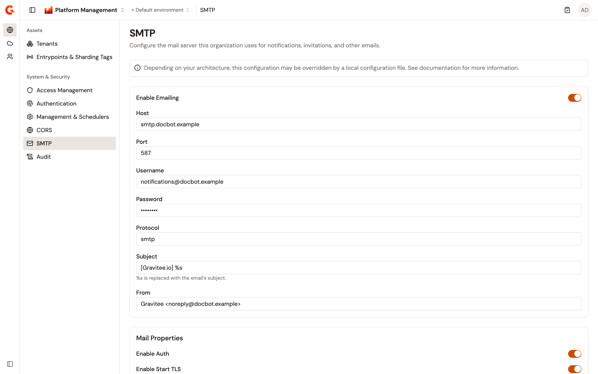
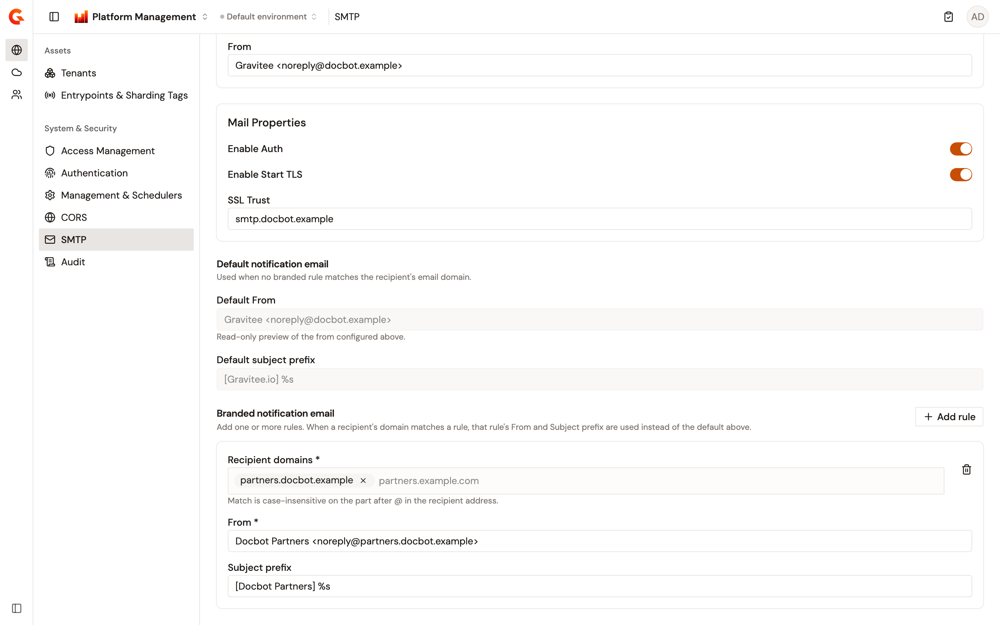

# Configure the SMTP mail server

Gravitee sends mail for a number of things: the link that lets a new user finish registering, a password reset, a subscription notification, a support ticket. It all goes through one mail server. The **SMTP** page is where you point the organization at yours.

Until emailing is configured and turned on, none of that mail is sent.

The values on this page are stored at organization scope and take effect without restarting the Management API.

## Open the SMTP page

The page sits in the **Organization** section, alongside the other settings that apply across environments.

To open it, complete the following steps:

1. From the Gamma console sidebar, select **Platform Management**.
2. Open the **Organization** section.
3. Navigate to **SMTP**.

The page subtitle reads "Configure the mail server this organization uses for notifications, invitations, and other emails."

<figure><figcaption>
The SMTP page with emailing enabled, showing the mail server fields
</figcaption></figure>

Whether you can edit these fields depends on your access and on your installation's configuration file, in the same way as the other organization settings pages. See [Understand which fields you can edit](configure-console-management-and-schedulers.md#understand-which-fields-you-can-edit).

The following table maps each field to the configuration setting that locks it:

<table><thead><tr><th width="330">Field</th><th>Configuration key</th></tr></thead><tbody>
<tr><td><strong>Enable Emailing</strong></td><td><code>email.enabled</code></td></tr>
<tr><td><strong>Host</strong></td><td><code>email.host</code></td></tr>
<tr><td><strong>Port</strong></td><td><code>email.port</code></td></tr>
<tr><td><strong>Username</strong></td><td><code>email.username</code></td></tr>
<tr><td><strong>Password</strong></td><td><code>email.password</code></td></tr>
<tr><td><strong>Protocol</strong></td><td><code>email.protocol</code></td></tr>
<tr><td><strong>Subject</strong></td><td><code>email.subject</code></td></tr>
<tr><td><strong>From</strong></td><td><code>email.from</code></td></tr>
<tr><td><strong>Enable Auth</strong></td><td><code>email.properties.auth</code></td></tr>
<tr><td><strong>Enable Start TLS</strong></td><td><code>email.properties.starttls.enable</code></td></tr>
<tr><td><strong>SSL Trust</strong></td><td><code>email.properties.ssl.trust</code></td></tr>
<tr><td>Branded notification email rules</td><td><code>email.branded_senders</code></td></tr>
</tbody></table>

### Which value wins

Unlike the other two organization settings pages, mail settings can also be stored per environment, so four sources can supply a value. Gravitee takes the first one it finds, in this order:

1. The Management API configuration file, or the matching environment variable.
2. The environment-level value, for mail sent in the context of an environment.
3. The organization-level value, which is what this page writes.
4. The built-in default.


The Management API distribution ships a `config/gravitee.yml` whose `email:` block already sets `email.enabled`, `email.host`, `email.subject`, `email.port`, and `email.from`. On a deployment that uses that file as it comes, those five fields arrive locked and **Enable Emailing** can't be turned on from the console at all. Comment the `email:` block out and restart the Management API to manage them here instead. The Helm chart renders the block only when you supply `smtp` values, so a chart install without them starts with the fields editable.



On a trial instance, the SMTP page shows "SMTP is not available on trial instances." instead of the form. The Management API leaves the mail settings out of its answer and ignores any mail settings sent back to it, so the page has nothing to edit.


## Turn emailing on

**Enable Emailing** is the switch that decides whether Gravitee sends mail at all for this organization, and it's off on a new installation. While it's off, the server fields are hidden and no mail is sent, whatever else is stored.

Turn it on to reveal the server fields described in the next section. Turning it off again hides them without clearing the stored values.

The branded-sender sections stay on the page while emailing is off, but nothing in them can be changed. The **Add rule** button and the per-rule delete buttons are hidden, and the fields are inert.

## Point the organization at your mail server

With emailing on, the first card holds the connection and identity fields. **Host**, **Port**, and **From** are the three the page insists on.

<table><thead><tr><th width="200">Field</th><th>Description</th></tr></thead><tbody>
<tr><td><strong>Host</strong></td><td>The hostname of your SMTP server. Required while emailing is on, and reported as "Host is required when emailing is enabled." while it's empty. The built-in default is <code>smtp.my.domain</code>, which is a placeholder rather than a working server.</td></tr>
<tr><td><strong>Port</strong></td><td>The port your SMTP server listens on. Accepts a whole number from <code>0</code> to <code>65535</code>, and reports "Enter a port between 0 and 65535." for anything else. The built-in default is <code>587</code>.</td></tr>
<tr><td><strong>Username</strong></td><td>The account Gravitee authenticates to the server with. Leave it empty for a relay that doesn't authenticate.</td></tr>
<tr><td><strong>Password</strong></td><td>The password for that account, masked as you type. See <a href="#how-the-password-field-behaves">How the password field behaves</a>.</td></tr>
<tr><td><strong>Protocol</strong></td><td>The mail transport protocol to use, entered as free text rather than chosen from a list. The built-in default is <code>smtp</code>.</td></tr>
<tr><td><strong>Subject</strong></td><td>The subject template applied to every email. The built-in default is <code>[Gravitee.io] %s</code>. See <a href="#the-subject-template">The subject template</a>.</td></tr>
<tr><td><strong>From</strong></td><td>The sender address every email is sent from, unless a branded rule replaces it. Required while emailing is on, and accepts either a bare address such as <code>noreply@example.com</code> or the display-name form <code>Gravitee &#x3C;noreply@example.com></code>. An empty value reports "From is required when emailing is enabled." and an unusable one reports "Enter a valid email address, optionally with a display name."</td></tr>
</tbody></table>

### How the password field behaves

The Management API never returns a stored password. It answers with `********` instead, and that's what the field shows when the page loads.

Leave the field as you found it and the stored password is kept. Type a new value and it replaces the stored one. Because of this, an empty password field is not a way to clear the password.

### The subject template

The **Subject** value is a template, not a fixed subject line. Each email supplies its own title, and the template decides what wraps it.

Write `%s` where the email's own title belongs. The default `[Gravitee.io] %s` turns a title of "New subscription" into a subject of `[Gravitee.io] New subscription`. The positional form `%1$s` works the same way.

Any other `%` in the template is kept as written rather than treated as a placeholder.

## Configure the mail properties

The **Mail Properties** card holds the three settings that govern how Gravitee talks to the server. It only appears while emailing is on.

<table><thead><tr><th width="200">Field</th><th>Description</th></tr></thead><tbody>
<tr><td><strong>Enable Auth</strong></td><td>Turn on to have Gravitee authenticate to the server with the <strong>Username</strong> and <strong>Password</strong> above.</td></tr>
<tr><td><strong>Enable Start TLS</strong></td><td>Turn on to have Gravitee upgrade the connection to TLS after connecting, for a server that expects <code>STARTTLS</code> rather than a TLS connection from the start.</td></tr>
<tr><td><strong>SSL Trust</strong></td><td>The host whose TLS certificate Gravitee trusts for this connection. Set it to your SMTP hostname when the server presents a certificate the platform doesn't otherwise trust.</td></tr>
</tbody></table>

## Brand the emails per recipient domain

By default every email leaves with the **From** address and **Subject** template configured above. Branded rules replace that pair for the people you send to at a given domain, so they see an address on their own domain rather than the platform default.

The **Default notification email** section previews what's in force when no rule matches. **Default From** and **Default subject prefix** are read-only echoes of the **From** and **Subject** fields above, and change as you edit those.

The **Branded notification email** section holds the rules. Click **Add rule** to add one, and use the delete button in the corner of a rule to remove it.

<figure><figcaption>
The mail properties, the read-only default sender preview, and one branded notification email rule
</figcaption></figure>

Each rule takes three values:

<table><thead><tr><th width="230">Field</th><th>Description</th></tr></thead><tbody>
<tr><td><strong>Recipient domains</strong></td><td>The recipient domains this rule applies to. Required. Type a domain and press Enter or type a comma to add it. A domain is a dot-separated hostname ending in a top-level domain of two or more letters, or in an <code>xn--</code> internationalized one. An example is <code>partners.example.com</code>.</td></tr>
<tr><td><strong>From</strong></td><td>The sender address to use for those recipients. Required, and accepts the same forms as the default <strong>From</strong> above.</td></tr>
<tr><td><strong>Subject prefix</strong></td><td>The subject template to use for those recipients, up to 255 characters.</td></tr>
</tbody></table>

A rule is matched on the part of the recipient's address after the `@`, compared without regard to case. The first rule that lists the recipient's domain is the one applied, and a recipient whose domain appears in no rule keeps the default **From** and **Subject**.


Rules match the recipient, not the API, the application, or the publisher. A rule applies to everyone you send mail to at the listed domains, across every kind of notification.


### What blocks a save

Each rule reports its own problems under the field, and the section reports two problems that span rules:

* A rule with no domain, or with a blank one, reports "At least one domain is required."
* A domain that isn't a usable hostname reports `Invalid domain(s):` followed by the entries at fault.
* A missing sender reports "From is required." An unusable one reports "Enter a valid email address, optionally with a display name."
* A subject prefix over 255 characters reports "Must be at most 255 characters."
* A domain listed in more than one rule reports "Each domain may only be used in one configuration. Used more than once:" followed by the domain.
* Too many rules or domains to store reports "These configurations are too large to save. Remove some domains or configurations and try again." The rules are stored together as a single value with a 4000-character limit, so it's the combined size that matters, not the count.


A branded rule changes the address Gravitee puts on the message. It doesn't arrange anything with your mail provider or your DNS, and whether a relay accepts mail claiming to come from a given domain is your provider's decision. Send a branded notification to yourself and confirm that it arrives before you apply a rule to real recipients.


## Save or discard your changes

Nothing is written until you save. As soon as a value differs from what's stored, a bar appears at the bottom of the page with **Discard** and **Save changes**.

To keep your changes, click **Save changes**. While emailing is on, the button stays disabled until **Host** holds a value, **Port** holds a number in range, **From** holds a usable address, and every branded rule is valid. A toast reading "Configuration successfully saved!" confirms the write.

To abandon your changes, click **Discard**. The form returns to the values last read from the Management API.


Saving is refused while the platform is in maintenance mode. The Management API answers with `503` and the message "The server is currently in maintenance mode. Please retry later or contact your administrator."


The Gamma console has no button that sends a test message. To confirm the configuration, trigger a real email, such as sending a password reset to yourself from the **Users** page, and check that it arrives. See [Manage users](manage-users.md).
