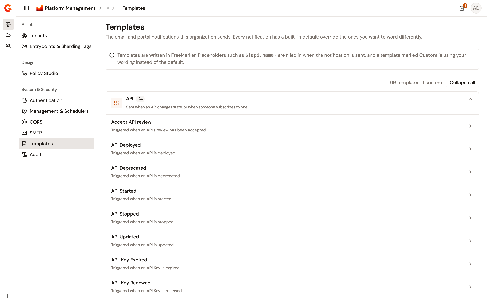
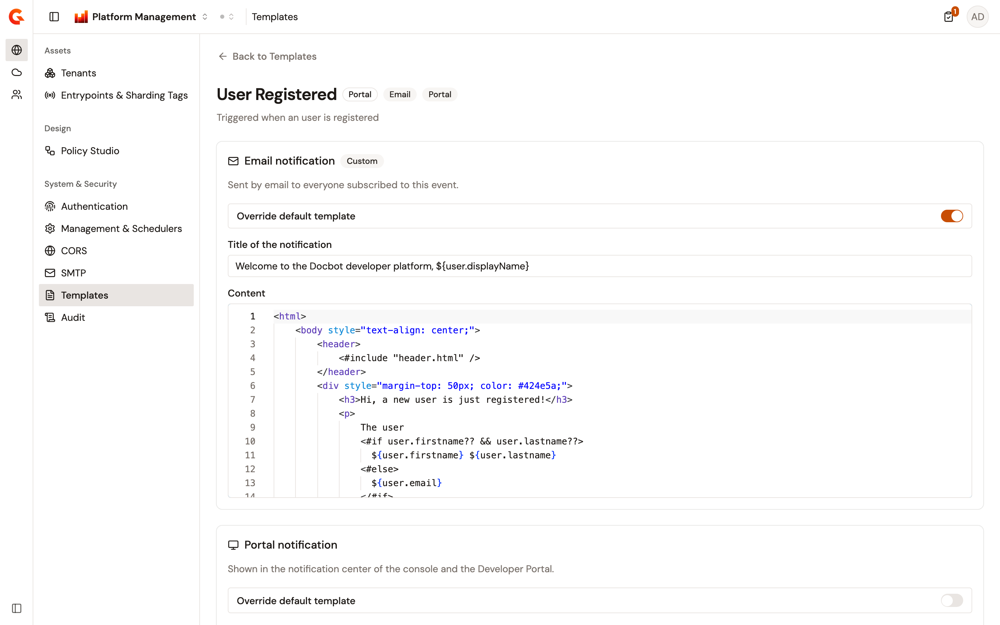

# Customize notification templates

Every notification Gravitee sends starts from a built-in template. The email that tells a subscriber their API key expired is one. So are the portal message that announces a new subscription and the email that invites someone to a group. The **Templates** page of the Gamma console lists those templates by category and lets you replace the wording of any of them with your own. A template is written in [FreeMarker](https://freemarker.apache.org/), and its placeholders, such as `${api.name}`, are filled in when the notification is sent.

Templates belong to the organization, so an override applies whichever environment is selected.

## Open the Templates page

The page sits in the **System & Security** group of the **Organization** section, with the other settings that apply across environments.

To open it, complete the following steps:

1. From the Gamma console sidebar, select **Platform Management**.
2. Open the **Organization** section.
3. Under **System & Security**, select **Templates**.

The page subtitle opens with "The email and portal notifications this organization sends."

<figure><figcaption>
The Templates page of the <strong>Organization</strong> section, with the templates grouped by category
</figcaption></figure>

The page groups the templates into the following categories, in this order:

<table><thead><tr><th width="230">Category</th><th>Holds the templates of</th></tr></thead><tbody>
<tr><td><strong>API</strong></td><td>The notifications sent when an API changes state, or when someone subscribes to one.</td></tr>
<tr><td><strong>API Product</strong></td><td>The notifications sent for API Product lifecycle and subscription events.</td></tr>
<tr><td><strong>Application</strong></td><td>The notifications sent to application members about their subscriptions and support tickets.</td></tr>
<tr><td><strong>Portal</strong></td><td>The notifications sent for user, group, and Developer Portal events.</td></tr>
<tr><td><strong>Templates for action</strong></td><td>The emails the platform sends directly to a person, outside the notification events.</td></tr>
<tr><td><strong>Templates for alert</strong></td><td>The emails sent when a consumer alert is triggered.</td></tr>
<tr><td><strong>Templates to include</strong></td><td>The fragments other templates pull in, rather than notifications of their own.</td></tr>
</tbody></table>

**Templates for alert** is listed only when alerting is enabled for the organization.

Each category shows how many templates it holds and, when some have been overridden, how many are custom. Within a category, templates are listed by name, and a **Custom** badge marks each template whose email or portal wording has been overridden. The counter above the list totals the templates and the custom ones. Every category starts open, and **Collapse all** and **Expand all** close and open them together.

## Override a template

A template has one card per channel it's sent through: **Email notification**, **Portal notification**, or both. Each card is overridden on its own.

To override a template, complete the following steps:

1. Select the template. Its page shows the name, the category, and a badge for each channel it's sent through.
2. In the card of the channel to reword, turn on **Override default template**. The **Title of the notification** and **Content** fields become editable, starting from the default wording.
3. Edit the title and the content. Both are required while the override is on.
4. Select **Save changes**.

<figure><figcaption>
A template with its email wording overridden and its portal wording left at the default
</figcaption></figure>

The page confirms with the message "Template has been successfully saved!" From then on, the notification is sent with your wording, and the template carries a **Custom** badge on the list and on the card.

The **Save changes** bar appears as soon as a field differs from the saved version, and **Discard** returns every card to that version. When both channels of a template are edited, they're saved together.

A user with read-only access sees every template and its current wording, with a notice that the template can't be changed.

## Return to the default wording

To send the built-in default again, turn **Override default template** off and select **Save changes**. Your wording stays on file, so turning the override back on restores it.

## Edit an included fragment

The **Templates to include** category holds fragments that other templates pull in, such as `header.html`. A fragment has content but no title, so its card holds the **Override default template** switch and the **Content** field alone. Its page shows the directive that includes it in another template, in the form `<#include "header.html" />`.
