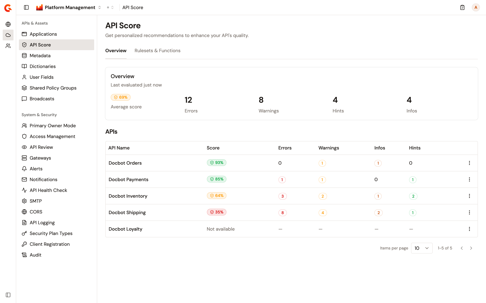
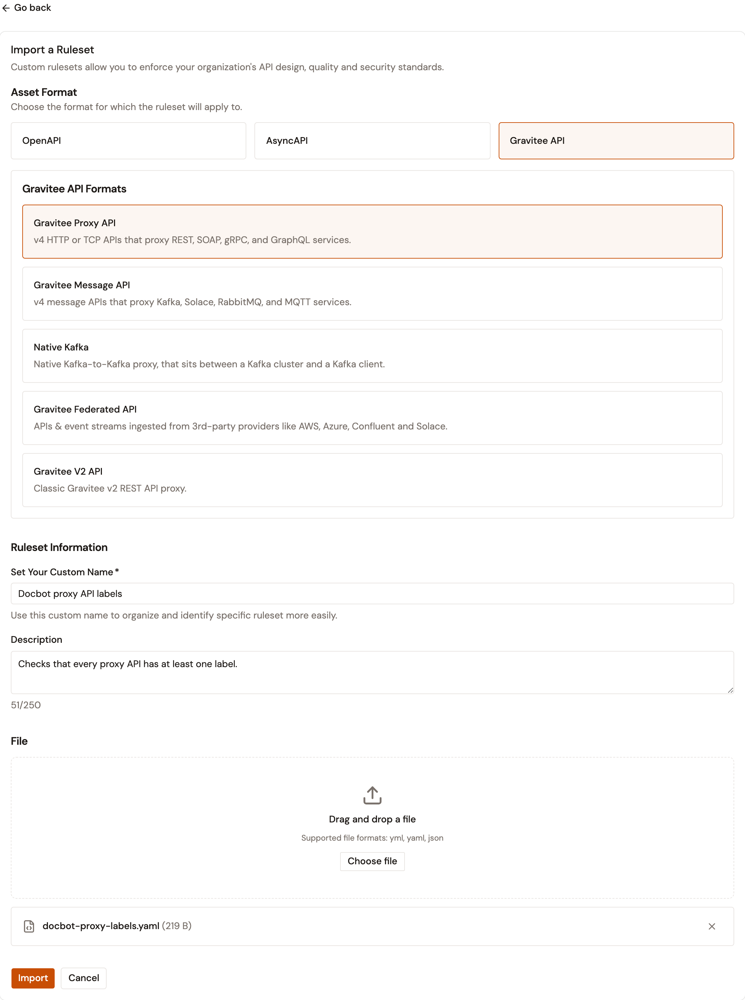
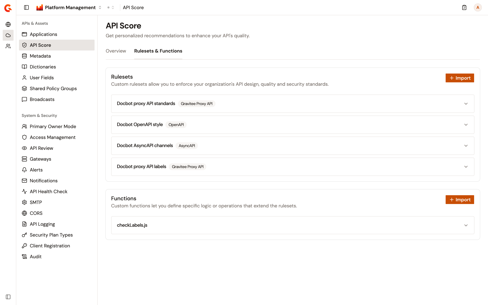

# Manage API Score

The **API Score** page of the **Environment** section lists every API in the environment with its latest score. It also holds the environment's custom rulesets and functions. Every evaluation of an API in the environment includes them.

You don't evaluate APIs from this page. Each API is evaluated from its own **API Score** page. For more information, see [Review the API Score](../api-management/build/configure-your-api-proxy/review-the-api-score.md).

## Prerequisites

* API Score turned on for the environment. Someone whose role can change the environment's settings turns on **Enable API Score** on the **API Review** page of the **Environment** section, then clicks **Save changes**. Until then, the **API Score** item doesn't appear in the sidebar. See [Configure API Review](configure-api-review.md).
* A role that can read the environment's integrations. Without it, the **API Score** item doesn't appear in the sidebar, even when API Score is turned on.

## Open API Score

To open **API Score**, complete the following steps:

1. At the top of the page, click **Home**, or the name of the product you're working in.
2. Select **Platform Management**.
3. Open the **Environment** section. The section names show when you hover over the icons on the left.
4. Under **APIs & Assets**, click **API Score**.

    <figure><figcaption>
The Overview tab lists every API in the environment with its latest score.
</figcaption></figure>

## Review the scores

The **Overview** tab brings together the latest evaluation of each API in the environment:

* **Average score** is the average of the latest score of each API that has one.
* The counts next to it add up the findings of those evaluations, by severity.
* The **APIs** table lists every API in the environment, highest score first. An API shows **Not available** when it hasn't been evaluated successfully yet, or when its latest evaluation returned no score.

A score is green from 80%, amber from 40%, and red below 40%.

To open the **API Score** page of one API, click the API's name, or select **View API-level Score Details** from the menu at the end of its row.

A score changes only when an evaluation of that API succeeds. A failed evaluation keeps the previous score. Changing the rulesets or the functions doesn't change any score until each API is evaluated again.

Until at least one API in the environment has been evaluated successfully, the tab shows **No score results yet** in place of the average and the counts.

## Import a ruleset

To import a ruleset, complete the following steps:

1. Open **API Score**.
2. Click the **Rulesets & Functions** tab.
3. In the **Rulesets** card, click **Import**.
4. Under **Asset Format**, select **OpenAPI**, **AsyncAPI**, or **Gravitee API**.
5. If you selected **Gravitee API**, select the type of API under **Gravitee API Formats**: **Gravitee Proxy API**, **Gravitee Message API**, **Native Kafka**, **Gravitee Federated API**, or **Gravitee V2 API**.
6. In **Set Your Custom Name**, enter a name of up to 50 characters.
7. Optional: In **Description**, enter a description of up to 250 characters.
8. Under **File**, drag the ruleset file onto the area that reads **Drag and drop a file**, or click **Choose file** and select it. The file is a YAML or JSON file with a `.yml`, `.yaml`, or `.json` extension. A file with another extension isn't added.

    <figure><figcaption>
A ruleset for Gravitee Proxy APIs, ready to import.
</figcaption></figure>

9. Click **Import**.

**Import** stays unavailable until the format, the name, and the file are set. An empty file isn't accepted, and the content of the file isn't checked when you import it. When an evaluation fails, the **API Score** page of that API shows the reason. For more information, see [Troubleshoot an evaluation](../api-management/build/configure-your-api-proxy/review-the-api-score.md#troubleshoot-an-evaluation).

After the import, you can change the ruleset's name and description, but not its rules. To change the rules, delete the ruleset and import the new version.

## Edit a ruleset

To change the name or the description of a ruleset, complete the following steps:

1. On the **Rulesets & Functions** tab, expand the ruleset.
2. Click **Edit**.
3. Change the **Name** or the **Description**.
4. Click **Save**.

## Delete a ruleset

To delete a ruleset, complete the following steps:

1. On the **Rulesets & Functions** tab, expand the ruleset.
2. Click **Delete**.
3. Click **Delete ruleset**.

A deleted ruleset can't be restored.

## Import a function

Functions extend the rulesets with your own logic. Each function is a JavaScript file, and it takes the name of that file.

To import a function, complete the following steps:

1. On the **Rulesets & Functions** tab, in the **Functions** card, click **Import**.
2. Drag the JavaScript file onto the area that reads **Drag and drop a file**, or click **Choose file** and select it. The file name ends in `.js` and has at most 50 characters.
3. Click **Import**.
4. If the **Overwrite Function?** dialog opens, a function with the same name already exists. Click **Overwrite** to replace it.

A function can't be edited. To change one, import the new version with the same file name.

## Delete a function

To delete a function, complete the following steps:

1. On the **Rulesets & Functions** tab, expand the function.
2. Click **Delete**.
3. Click **Delete function**.

A deleted function can't be restored.

## Verification

To verify API Score is working as expected, follow these steps:

1. Open **API Score**.
2. Click the **Rulesets & Functions** tab.

    Each ruleset you imported is listed in the **Rulesets** card with its format, and each function in the **Functions** card.

    <figure><figcaption>
Imported rulesets and functions on the Rulesets & Functions tab.
</figcaption></figure>

3. Evaluate an API from its own **API Score** page, and wait until **Evaluate** is available again. For more information, see [Review the API Score](../api-management/build/configure-your-api-proxy/review-the-api-score.md).
4. Return to **API Score** in the **Environment** section.

    The API shows its new score in the **APIs** table, and **Average score** includes it.
