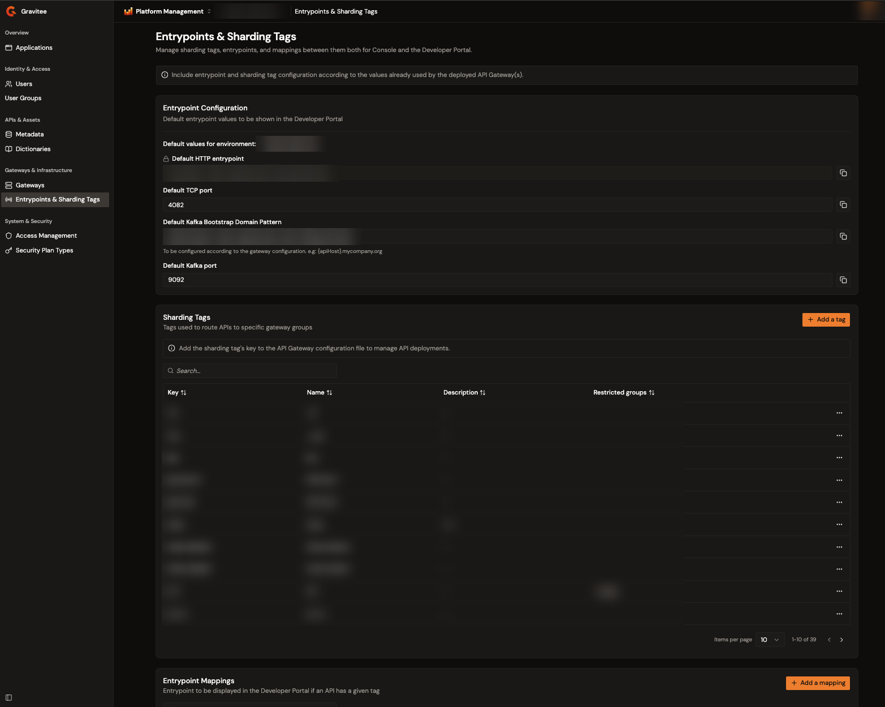

# Manage entrypoints and sharding tags

Sharding tags route APIs to specific gateway groups, and entrypoint mappings define the entrypoint that the Developer Portal displays for APIs that carry a given tag. The Entrypoints & Sharding Tags page in the Gamma console manages both, together with each environment's default entrypoint values.

This configuration is shared across the organization. Align it with the values that your deployed gateways already use: a sharding tag takes effect when you add its key to the gateway's configuration file.

## Open Entrypoints & Sharding Tags

From the Gamma console sidebar, select **Platform Management**, and then navigate to **Entrypoints & Sharding Tags**.

The page contains three sections:

* **Default values for environment**. One card per environment with that environment's default entrypoint values.
* **Sharding Tags**. The tags used to route APIs to specific gateway groups.
* **Entrypoint Mappings**. The entrypoint displayed in the Developer Portal when an API has a given tag.

<figure><figcaption>
The Entrypoints &#x26; Sharding Tags page with per-environment default values, the sharding tags list, and the entrypoint mappings list.
</figcaption></figure>

## Configure default entrypoint values

Each environment has its own card of default values:

| Field                                       | Description                                                                                                                                     |
| ------------------------------------------- | ----------------------------------------------------------------------------------------------------------------------------------------------- |
| **Default HTTP entrypoint**                 | The environment's default HTTP entrypoint URL.                                                                                                   |
| **Default TCP port**                        | A port between 1025 and 65535.                                                                                                                   |
| **Default Kafka Bootstrap Domain Pattern**  | A domain pattern that contains the `{apiHost}` placeholder, configured according to the gateway configuration, for example `{apiHost}.mycompany.org`. |
| **Default Kafka port**                      | A port between 1025 and 65535.                                                                                                                   |

Select **Save** to apply your changes, or **Discard** to revert them. A field whose value is enforced in the platform's configuration is read-only.

## Manage sharding tags

The **Sharding Tags** section lists each tag's key, name, description, and restricted groups. Use the search bar to filter the list.


Sharding tag management requires an enterprise license that includes the sharding tags feature. Without it, the tag actions open an upgrade dialog.


### Create a sharding tag

To create a sharding tag, complete the following steps:

1. In the **Sharding Tags** section, select **Add a tag**.
2. Enter the tag details described in the following table:

    | Field                 | Description                                                                                                                                  | Required |
    | --------------------- | --------------------------------------------------------------------------------------------------------------------------------------------- | -------- |
    | **Name**              | A human-readable name of up to 64 characters. A name that another tag already uses is rejected.                                              | Yes      |
    | **Key**               | The identifier to add to the gateway's configuration file. The key is limited to lowercase letters, digits, and hyphens, and is fixed after creation. | Yes      |
    | **Description**       | Freeform text describing the purpose of the tag.                                                                                              | No       |
    | **Restricted groups** | Limits the tag to selected groups, so only members of those groups use it.                                                                    | No       |

3. Select **Add Tag**.

### Edit a sharding tag

In the tag row, open the actions menu and select **Edit**. The name, the description, and the restricted groups are editable. The key is read-only. Select **Save** to apply the changes.

### Delete a sharding tag

In the tag row, open the actions menu, select **Delete**, and confirm with **Delete**. The confirmation dialog lists the impact on entrypoint mappings before you confirm:

* A mapping that carries other tags keeps them, and this tag is removed from it.
* A mapping that only uses this tag is deleted.

Deleting a tag also removes it from every API and API Product it was assigned to.

## Manage entrypoint mappings

For each mapping, the **Entrypoint Mappings** section lists the entrypoint value, the type, the sharding tags, and the environments. Use the search bar to filter the list by entrypoint value.

### Create an entrypoint mapping

To create an entrypoint mapping, complete the following steps:

1. In the **Entrypoint Mappings** section, select **Add a mapping**.
2. Select the mapping type: **HTTP**, **TCP**, or **Kafka**.
3. Enter the value for the selected type:

    | Type  | Field                                | Description                                                                                       |
    | ----- | ------------------------------------ | -------------------------------------------------------------------------------------------------- |
    | HTTP  | **Entrypoint URL**                   | An absolute `http` or `https` URL.                                                                 |
    | TCP   | **TCP Port**                         | A port between 1 and 65535.                                                                        |
    | Kafka | **Kafka Bootstrap Domain Pattern**   | A domain pattern that contains the `{apiHost}` placeholder.                                        |
    | Kafka | **Kafka Port**                       | A port between 1 and 65535.                                                                        |

4. In **Sharding Tags**, select at least one tag.
5. Optional: in **Environments**, select the environments the mapping applies to. Leave the field empty to apply the mapping to all environments.
6. Select **Add Mapping**.

A mapping with the same type and value as an existing mapping for an overlapping environment is rejected.

### Edit or delete an entrypoint mapping

In the mapping row, open the actions menu and select **Edit** or **Delete**. Editing offers the same fields as creation, and **Save Changes** applies them. Deleting asks for confirmation in the **Delete Entrypoint Mapping** dialog.

## Next steps

* [Configure product deployment](../api-management/build/configure-your-api-product/configure-product-deployment.md). Assign sharding tags to an API Product to control where it runs.
