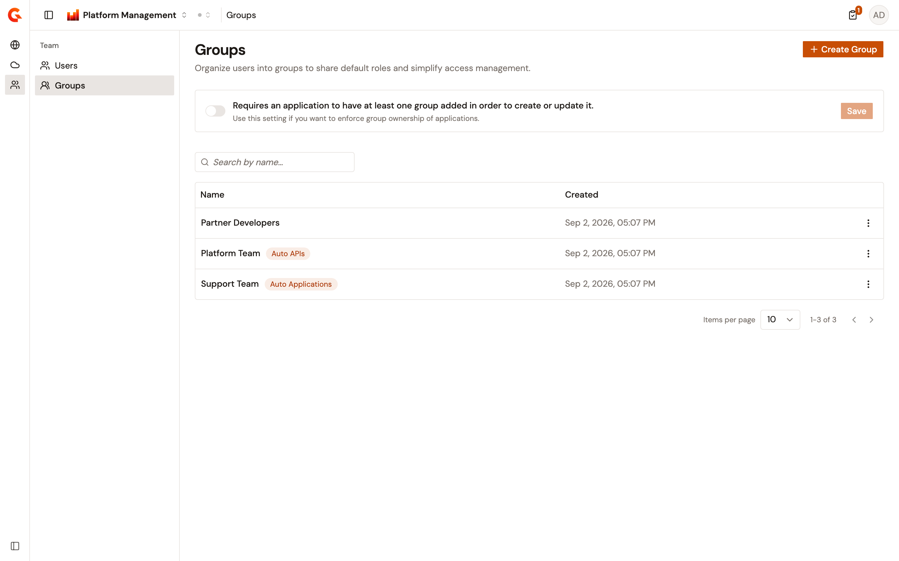
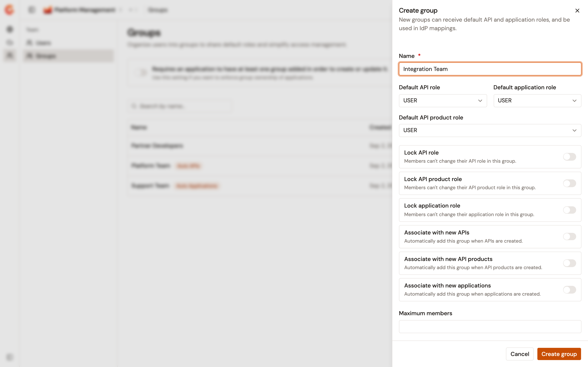
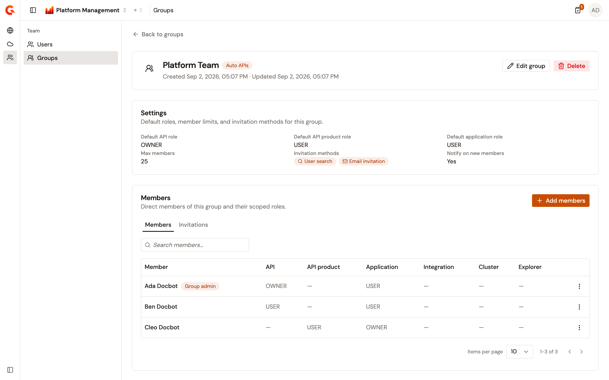
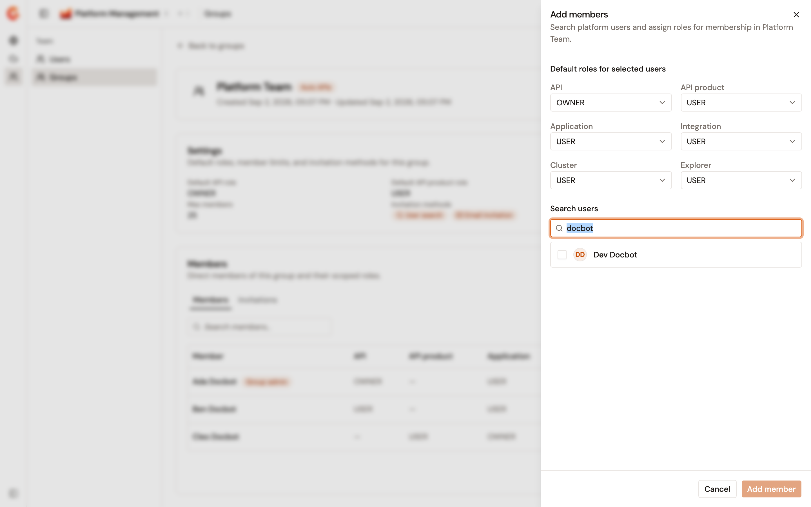
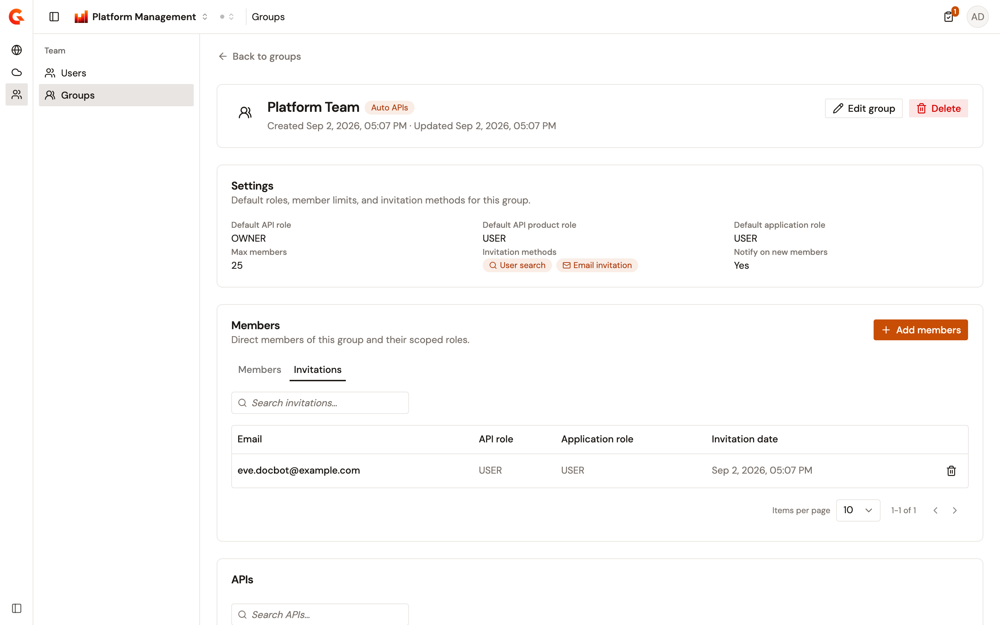

# Manage groups

A group collects users of an environment and gives each member a role on every API, API Product, and application the group is attached to. The role a member holds on those resources is the member's role in the group, which starts on the group's default. Instead of adding each person to each API, add the person to a group once and attach the group to the resources. The Groups page in the Gamma console creates, edits, and deletes the groups of the selected environment. It also manages their members and invitations, and shows the resources each group is attached to.

Groups belong to an environment, so the list changes with the environment selected in the console.

## Open Groups

From the Gamma console sidebar, select **Platform Management**, and open the **Team** section. Under **Team**, select **Groups**. The section column collapses to icons by default, and hovering an icon shows its name.

The groups table displays the following columns:

* **Name**. The group's name. Select the name to open the group's detail page. A **Primary owner** badge marks a group in which a member holds the API or API Product primary owner role. An **Auto APIs**, **Auto API Products**, or **Auto Applications** badge marks a group that new resources of that kind join automatically.
* **Created**. The date the group was created.

Use the search field to filter the list by name. The table paginates 10 rows at a time by default, and offers 25, 50, and 100.

When the environment has no groups yet, the table is replaced by a **No groups** card with a **Create Group** button.

<figure><figcaption>
The Groups page lists the groups of the selected environment. Badges mark the groups that new APIs or applications join automatically.
</figcaption></figure>

## Create a group

To create a group, complete the following steps:

1. From the groups list, select **Create Group**.
2. In the **Create group** panel, enter a **Name**. A name that another group of the environment already uses is rejected.
3. Select a **Default API role**, a **Default application role**, and a **Default API product role**. Each list starts on the organization's default role for that scope and offers **None**. System roles aren't offered.
4. Turn on the toggles you need. The following table describes them:

    | Toggle                               | Effect                                                                                                                                                                                       |
    | ------------------------------------ | -------------------------------------------------------------------------------------------------------------------------------------------------------------------------------------------- |
    | **Lock API role**                    | A group administrator who isn't an environment administrator can't change a member's API role. The role stays on the group's default.                                                        |
    | **Lock API product role**            | The same lock for the API Product role.                                                                                                                                                       |
    | **Lock application role**            | The same lock for the application role.                                                                                                                                                       |
    | **Associate with new APIs**          | Every API created in the environment joins the group.                                                                                                                                         |
    | **Associate with new API products**  | Every API Product created in the environment joins the group, unless the group already holds an API Product primary owner.                                                                     |
    | **Associate with new applications**  | Every application created in the environment joins the group.                                                                                                                                 |
    | **Allow invitation via user search** | Enables the **User search** option under **Add members**, and lets a member be made a group administrator.                                                                                   |
    | **Allow invitation via email**       | Enables the **Email invitation** option under **Add members**.                                                                                                                                |
    | **Notify members when added**        | A user receives an email the first time they're added to the group, provided the organization's mail server is enabled. On by default.                                                        |

5. Optional: enter a **Maximum members** value. Leave the field blank for no limit. A value below 1 is rejected.
6. Select **Create group**.

The console opens the new group's detail page.

<figure><figcaption>
The Create group panel. The default roles and the toggles below the name decide what members hold and how they join.
</figcaption></figure>

## Review a group

Select a group's name in the table to open its detail page. The header shows the name, the **Auto** badges, and the creation date, with the **Edit group** and **Delete** actions.

The **Settings** card shows the following values:

* **Default API role**, **Default API product role**, and **Default application role**. A lock icon marks a locked role, and **&#x2014;** marks a scope with no default role.
* **Max members**. The member limit, or **Unlimited**.
* **Invitation methods**. **User search**, **Email invitation**, both, or **None**.
* **Notify on new members**. **Yes** or **No**.

The **Members** card holds a **Members** tab and an **Invitations** tab. Under it, three cards named **APIs**, **API Products**, and **Applications** list the resources the group is attached to. Each card has its own search field and pagination. A **Private** badge marks a private resource, and the **APIs** and **API Products** cards also show a **Version** column.

Select **Back to groups** to return to the list.

<figure><figcaption>
A group's detail page. The Settings card summarizes the group, and the Members table lists each member with their role in every scope.
</figcaption></figure>

## Edit a group

To edit a group, complete the following steps:

1. From the group's detail page, select **Edit group**. From the list, the same action sits under the row's actions menu as **Edit**.
2. In the **Edit group** panel, change the name, the default roles, the toggles, or the member limit.
3. Select **Save**. The button stays disabled until something changed.

### Attach the group to existing resources

Turning on **Associate with new APIs** covers the APIs created from then on. To attach the group to the APIs, API Products, or applications that already exist, complete the following steps:

1. From the group's detail page, select **Edit group**.
2. Next to the **Associate with new** toggle for the resource kind, select its action: **Add group to existing APIs**, **Add group to existing API Products**, or **Add group to existing applications**.
3. In the confirmation dialog, select **Continue**.

The group is attached to every resource of that kind in the environment. The three actions appear only in the panel opened from the detail page, not in the panel opened from the list.

## Delete a group

To delete a group, complete the following steps:

1. From the group's detail page, select **Delete**. From the list, the same action sits under the row's actions menu.
2. In the **Delete group** dialog, select **Delete**.

Deleting removes the group's members and detaches the group from every API, API Product, and application. It also removes the group from the plans of those APIs and from the documentation pages that restricted access to it. Members lose the access they held through the group.

For a group in which a member holds the API or API Product primary owner role, the **Delete group** dialog offers no **Delete** button. It explains that the group can't be deleted while it still has a primary owner membership. Deleting is also refused while the group is the primary owner of an API or an API Product.

## Add members

**Add members** appears on the group's detail page when at least one invitation method is on and the member limit isn't reached. When the group has reached its limit, a banner says so and both ways of adding members are unavailable.

### Add members from a user search

Adding from a user search needs **Allow invitation via user search** on. To add existing users, complete the following steps:

1. From the group's detail page, select **Add members**, and then select **User search**.
2. In the **Add members** panel, set the roles under **Default roles for selected users**: **API**, **API product**, **Application**, **Integration**, **Cluster**, and **Explorer**. The lists start on the group's default roles, or on **USER** where the group has none.
3. Under **Search users**, type at least 2 characters of a name or an email address, and select the users to add. Users who already belong to the group aren't listed. Each selected user appears above the results.
4. Select **Add member**, or **Add N members** when several users are selected.

**PRIMARY_OWNER** is offered in the **API** and **API product** lists only when the environment's primary owner mode for that scope isn't **User**, and while no member of the group holds it. With **PRIMARY_OWNER** selected, only one user can be added at a time.

<figure><figcaption>
The Add members panel. Set the roles first, then search for the users to add.
</figcaption></figure>

### Invite a member by email

Inviting by email needs **Allow invitation via email** on. To invite someone, complete the following steps:

1. From the group's detail page, select **Add members**, and then select **Email invitation**.
2. In the **Email invitation** panel, enter the **Email**, and select a **Default API role** and a **Default application role**.
3. Select **Send invitation**.

What happens next depends on the address:

* When one user of the organization already has that email address, the user is added to the group straight away.
* When no user has that email address, an invitation is created, and the address receives an email with a registration link when the organization's [mail server](configure-smtp.md) is enabled. The invitation appears on the **Invitations** tab. When the person registers through the link, they join the group with the roles the invitation carries, and the invitation is removed.
* When several users share that email address, a **Many Users Found** dialog opens. Select **Continue** to open the **Add members** panel with the address already entered in the search, and pick the right user.

An address that already holds an invitation to the group is rejected, and so is the address of a user who's already a member.

### Manage invitations

The **Invitations** tab lists each pending invitation with its **Email**, **API role**, **Application role**, and **Invitation date**. Use the search field to filter the list by email address.

To cancel an invitation, select the delete action in its row, and select **Continue** in the **Delete Invitation** dialog. Registration through the link in the invitation email is then refused.

<figure><figcaption>
The Invitations tab lists the invitations that haven't been accepted yet.
</figcaption></figure>

## Change a member's roles

To change the roles a member holds in the group, complete the following steps:

1. On the **Members** tab, open the member's actions menu, and select **Edit roles**.
2. In the **Edit roles** panel, pick a value in the **API**, **API product**, **Application**, **Integration**, **Cluster**, or **Explorer** list.
3. Optional: select the **Group admin** checkbox. The checkbox is available only when **Allow invitation via user search** is on for the group.
4. Select **Save**.

A group administrator who isn't an environment administrator can add, edit, and remove the group's members from the Gamma console. That administrator can't edit the group's settings or delete the group. For that administrator, a locked role list stays disabled, and so do the **Integration**, **Cluster**, and **Explorer** lists.

Primary ownership moves with the roles:

* Giving a member **PRIMARY_OWNER** takes it from the member who held it, who becomes **OWNER** in that scope.
* Taking **PRIMARY_OWNER** away from a member requires a successor. A **Search members** field appears in the panel, and **Save** stays disabled until a successor is picked.
* Taking **PRIMARY_OWNER** away is refused while the group is the primary owner of an API or an API Product in that scope. The panel names the resources and asks you to transfer them to another primary owner first.

## Remove a member

To remove a member from the group, complete the following steps:

1. On the **Members** tab, open the member's actions menu, and select **Remove member**.
2. In the **Remove member?** dialog, select **Remove**.

When the member holds a primary owner role, the dialog asks for a successor in a **Search members** field. The ownership moves to the successor before the member is removed. When a primary owner is the only member of the group, there's nobody to hand the ownership to, and **Remove member** is unavailable until another member is added. Removal is refused while the group is the primary owner of an API or an API Product that the member's role covers.

## Require a group on every application

The Groups page carries an organization-wide setting labeled **Requires an application to have at least one group added in order to create or update it**. Turn on the switch, and select **Save**.

When it's on, the **Groups** field of the **Register Application** form is required. When the environment has no group at all, the form shows a message instead, asking to add the user to a group or to turn the setting off. Updating an application without a group is refused.

## Verification

To verify that group management is working as expected, follow these steps:

1. From the Gamma console sidebar, select **Platform Management**, and open the **Team** section.
2. Under **Team**, select **Groups**.
3. Select **Create Group**.
4. Enter a name, turn on **Allow invitation via user search**, and select **Create group**.
5. On the group's detail page, select **Add members**, and then select **User search**.
6. Search for a user, select the user, and select **Add member**.
7. Confirm that the user appears on the **Members** tab with the roles you set.

## Next steps

* [Manage users](manage-users.md). Add a user to a group from the user's detail page, and review the roles each membership carries.
