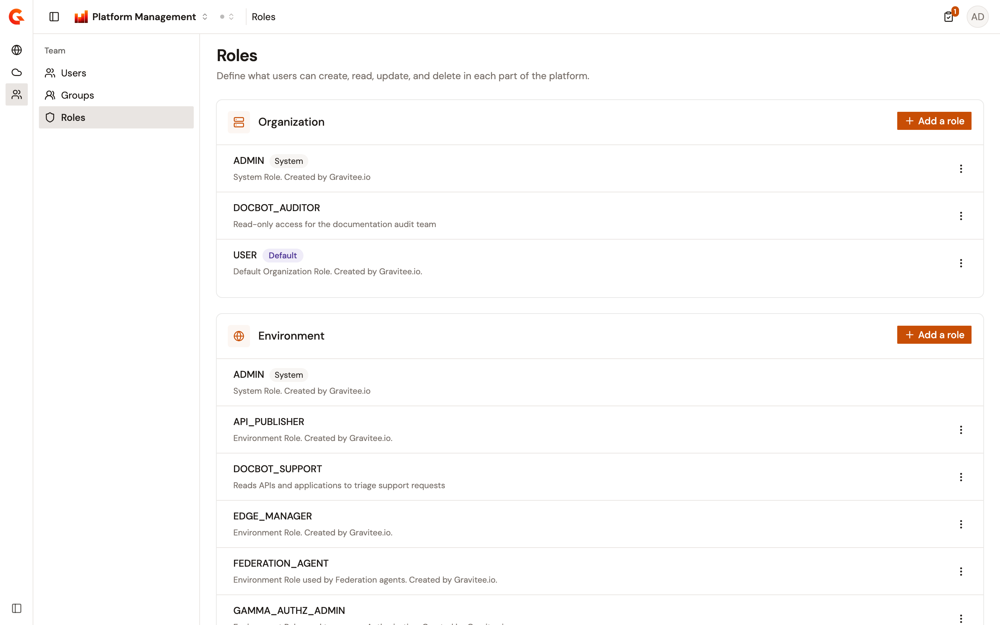
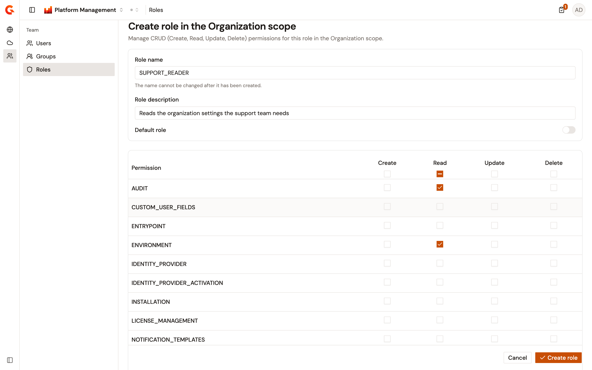
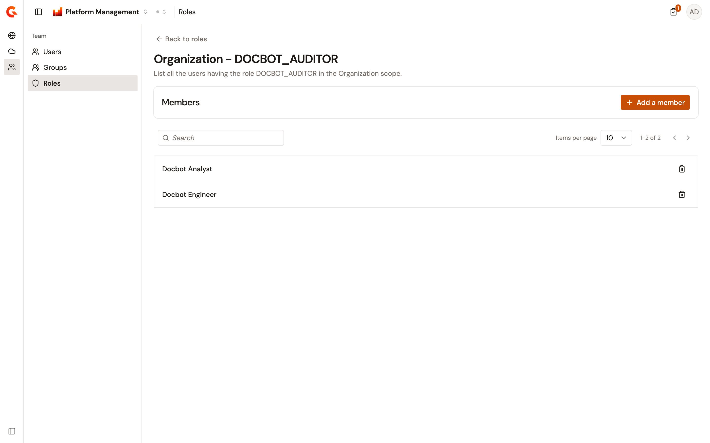
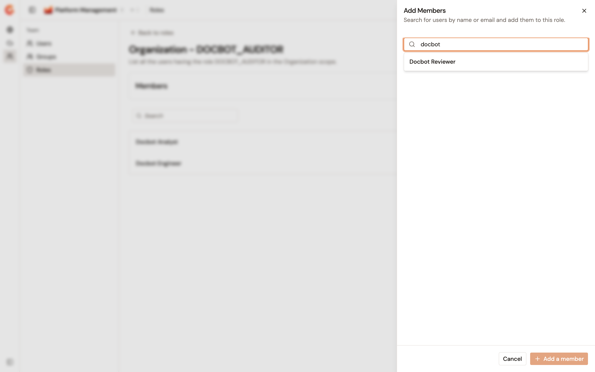
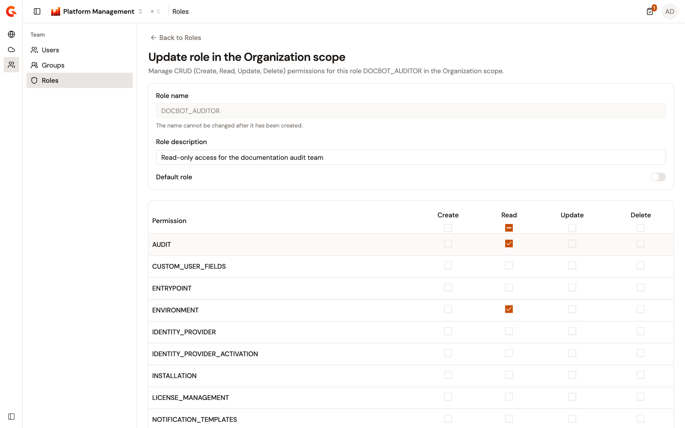

# Manage roles

A role is a named set of create, read, update, and delete permissions that applies to one scope, such as the organization, an environment, or an API. The Roles page in the Gamma console lists the roles of every scope and creates custom roles. From it you also edit the permissions a role grants, delete a role, and manage the users who hold an organization role.

Roles belong to the organization, so the list is the same whichever environment is selected in the console.

## Open Roles

From the Gamma console sidebar, select **Platform Management**, and open the **Team** section. Under **Team**, select **Roles**. **Roles** appears under **Team** only for a user whose own role grants read access to the organization's roles.

The page header reads **Roles**, above the line **Define what users can create, read, update, and delete in each part of the platform.**

Below it sits one card per scope, in this order: **Organization**, **Environment**, **API**, **Application**, **Integration**, **Cluster**, **Explorer**, **API Product**, and **AI Workspace**. Each card lists the roles of its scope, and each row shows the following:

* The role's name.
* A **System** badge on a protected role. A system role can't be deleted, and can't be edited either unless system role editing is unlocked.
* A **Default** badge on the role that new members of that scope receive.
* The role's description, when it has one.

A scope that holds no role shows **No role** in place of the list. A scope whose roles can't be loaded shows **Failed to load roles for this scope. Please refresh and try again.**

<figure><figcaption>
The Roles page lists the roles of each scope. The System and Default badges mark the built-in roles and the role new members receive.
</figcaption></figure>

## Create a custom role

Creating a role requires an enterprise license that includes the custom roles feature. Without it, **Add a role** carries a lock icon. Selecting it then opens the **Custom Roles** dialog, with a **Close** button and a **Start a free trial** link, instead of the form. The Management API refuses to create a role without the license too.

To create a custom role, complete the following steps:

1. In the card of the scope the role belongs to, select **Add a role**.
2. Enter a **Role name**. The console sends the name in upper case, and the Management API also replaces every space and every punctuation character with an underscore. A name that another role of the same scope already holds is rejected. By default, the names **ADMIN** and **PRIMARY_OWNER** are reserved and rejected in every scope.
3. Optional: enter a **Role description**.
4. Optional: turn on **Default role**. The role that held the default in that scope loses it.
5. In the permission table, select the **Create**, **Read**, **Update**, and **Delete** checkboxes the role grants. The checkbox in each column header selects or clears that column for every permission the role can manage, and shows a dash while only some of them are selected.
6. Select **Create role**.

The console reports **Role successfully saved!** and opens the new role.

<figure><figcaption>
The create form of a role in the Organization scope. The permission table carries one row per permission and one column per action.
</figcaption></figure>

**Create role** stays unavailable while **Role name** is empty, and an empty field that's been typed in shows **Name is required.**

The **Explorer** and **AI Workspace** scopes carry no permissions to manage. Their form shows **No permissions can be managed for this scope yet.** in place of the table, so a role created in either scope grants nothing.

## Review and edit a role

Select a role's name in its scope card to open it. The page header reads **Update role in the** *scope* **scope**, and the permission table shows what the role grants today. Opening a role needs the permission to update the organization's roles: a user without it returns to the list.

To change a role, complete the following steps:

1. Change the **Role description**, the **Default role** switch, or the checkboxes of the permission table. **Role name** stays unavailable, under the hint **The name cannot be changed after it has been created.**
2. Select **Save changes**. The button and the line **You have unsaved changes.** appear once something has changed, next to a **Discard** button that returns the form to its saved state.

The console reports **Role successfully saved!**, and the users who hold the role get the new permissions without signing in again.

A system role opens in read-only form, under the banner **System roles are not editable.** A console setting unlocks system role editing, and it's off by default. Turning it on narrows the protection to one role. The **Organization** scope's **ADMIN** role stays read-only and stays a reserved name, while every other system role becomes editable and its name stops being reserved.

In a role of the **Environment** scope, the `TAG`, `TENANT`, and `ENTRYPOINT` rows are unavailable, under the line **This permission has been moved to ORGANIZATION scope**. Grant those permissions from an **Organization** scope role instead.

## Delete a custom role

A role that carries the **System** badge or the **Default** badge has no delete action. Deleting is available on every other role, and needs the permission to delete the organization's roles.

To delete a role, complete the following steps:

1. In the role's row, open the actions menu, and select **Delete**.
2. In the **Delete a Role** dialog, select **Delete**.

The console reports **Role** *name* **successfully deleted!** Every member who held the role moves to the default role of the same scope, so nobody is left without one.

## Manage the members of an organization role

Members are managed from the role only in the **Organization** scope. **View members** appears in the actions menu of an Organization role, and on no other scope's roles. It needs the permission to update the organization's roles.

The members page header reads **Organization -** *name*, above the line **List all the users having the role** *name* **in the Organization scope.** The **Members** card holds the **Add a member** button. Below it, a **Search** field filters the list, and the list carries one row per member with a delete action on each. It paginates 10 rows at a time by default, and offers 25, 50, and 100. A role that nobody holds shows **No member** and **No one has been added to this role yet.**

<figure><figcaption>
The members page of an organization role. Each row names one member, and the search field filters the list.
</figcaption></figure>

### Add members to an organization role

To give users an organization role, complete the following steps:

1. On the role's members page, select **Add a member**.
2. In the **Add Members** panel, type a name or an email address in **Search a user by name or email…**. Users who already hold the role aren't offered, and a search that matches nobody shows **No users found.**
3. Select a user from the results. The user moves into the selection above the search, where the count reads **1 user selected** or *n* **users selected**, and each entry carries an action that removes it again.
4. Repeat for every user the role is for.
5. Select **Add a member**, or **Add** *n* **members** when several users are selected.

The console reports **Membership successfully created**. When only some users could be added, the panel stays open and reports how many of them succeeded.

<figure><figcaption>
The Add Members panel. Search for users, and add the selection to the role in one action.
</figcaption></figure>

### Remove a member from an organization role

To take an organization role away from a user, complete the following steps:

1. On the role's members page, select the delete action in the member's row.
2. In the **Delete a membership** dialog, select **Delete**.

The console reports **Membership has been successfully deleted**.

## Verification

To verify that role management is working as expected, follow these steps:

1. From the Gamma console sidebar, select **Platform Management**, and open the **Team** section.
2. Under **Team**, select **Roles**.
3. In the **Organization** card, select **Add a role**.
4. Enter a **Role name**, select the **Read** checkbox on one permission, and select **Create role**.
5. Confirm that the console reports **Role successfully saved!** and opens the role.
6. Select **Back to Roles**, and confirm that the new role appears in the **Organization** card without a **System** badge.

<figure><figcaption>
A custom role open for editing. The name stays fixed after creation, and the permission table holds the role's grants.
</figcaption></figure>

## Next steps

* [Manage users](manage-users.md). Give a user an organization or environment role from the user's own detail page.
* [Manage groups](manage-groups.md). Set the roles that a group grants its members on the APIs, API Products, and applications it's attached to.
* [Review organization and environment audit logs](review-audit-logs.md). Find the entries that record each role creation, change, and deletion.
