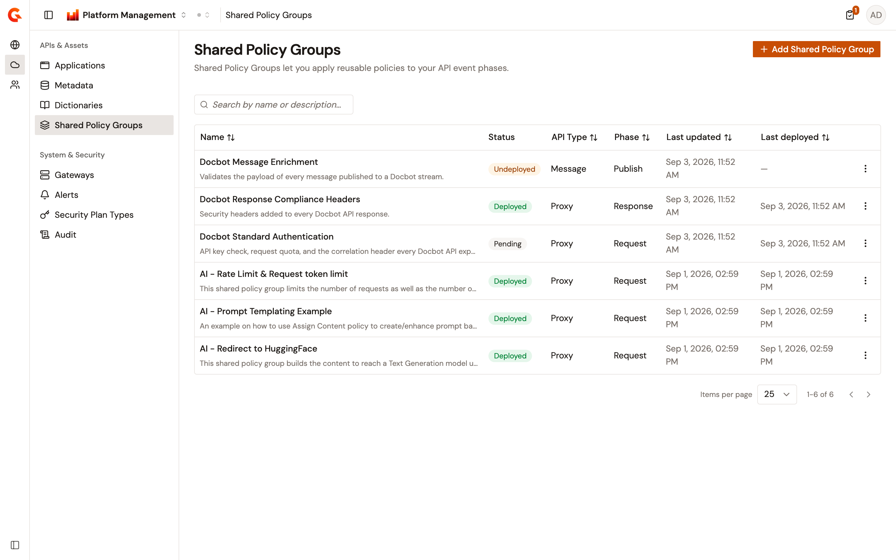
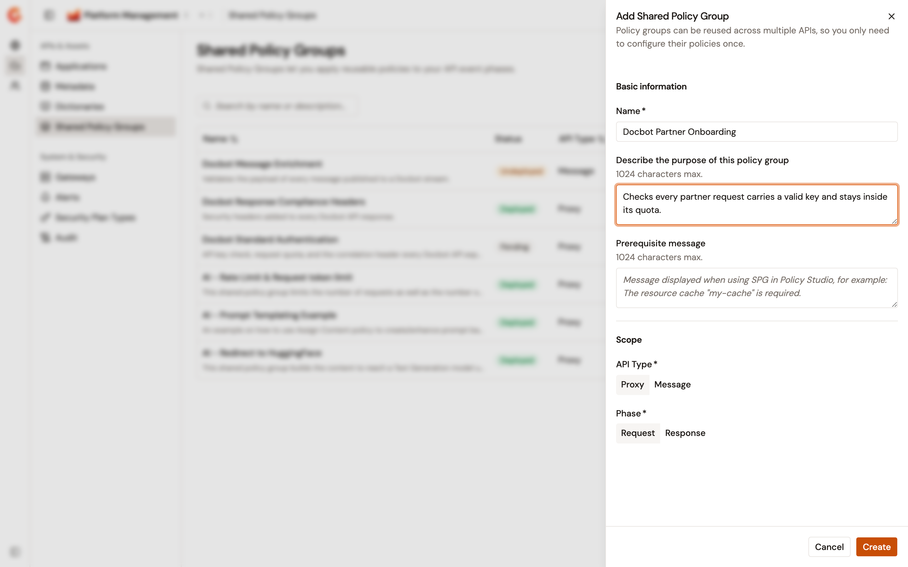
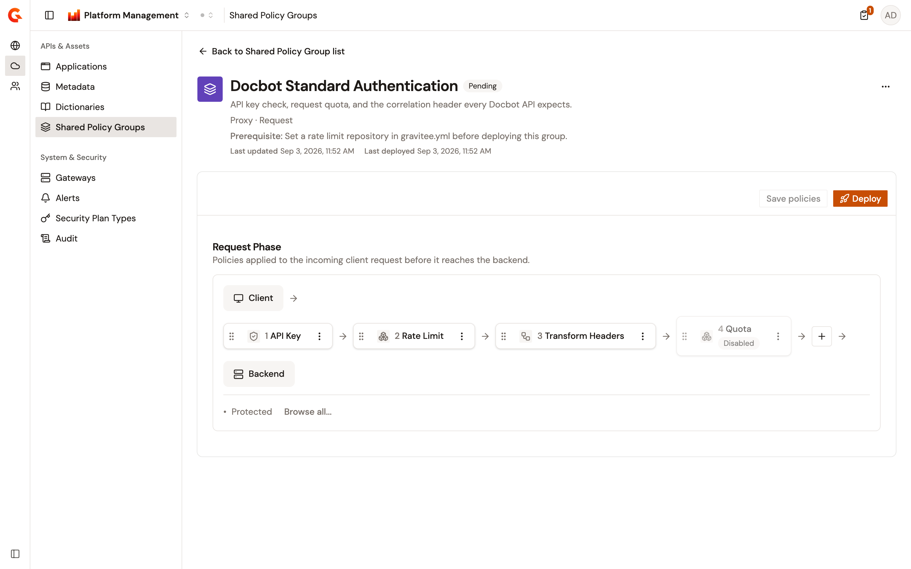
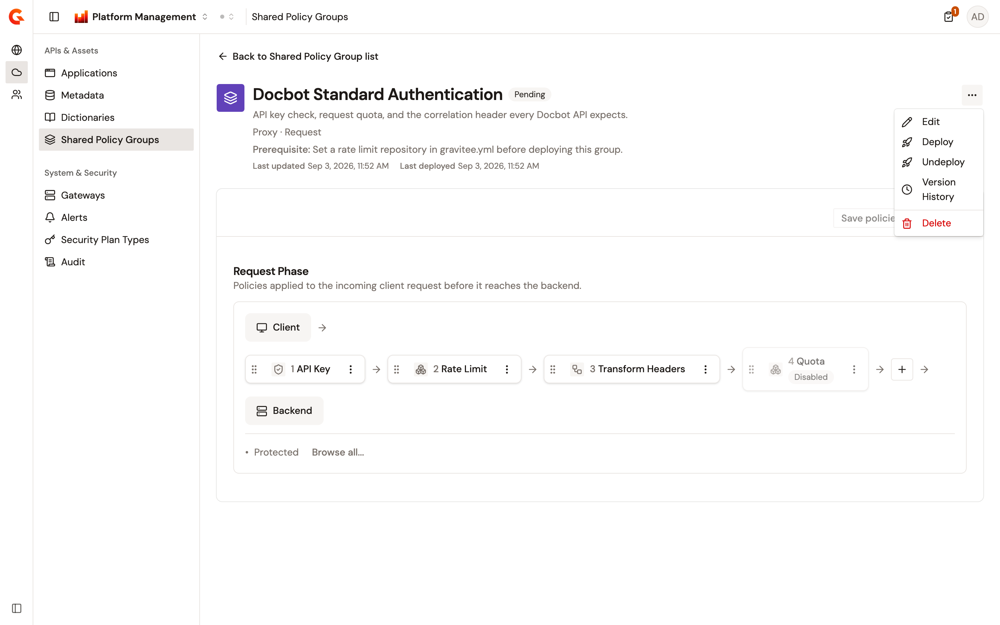
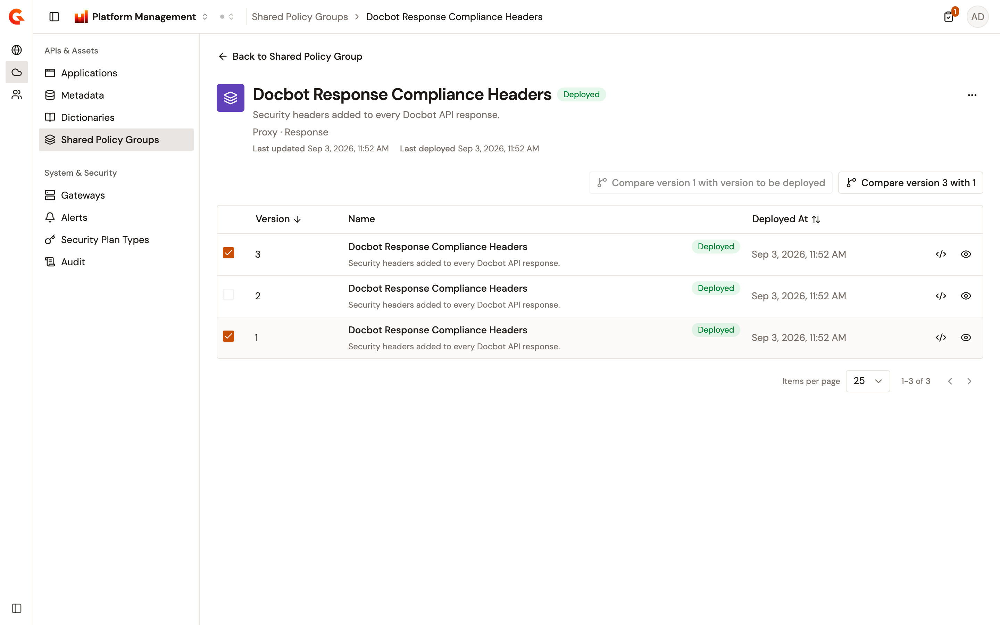

# Manage shared policy groups

A shared policy group is a reusable bundle of policy steps. You configure the steps once, then reuse the group in the flows of as many APIs as you like. Each group is fixed to one API type and one flow phase when you create it, so the steps it holds always run in the context they were configured for.

Shared policy groups belong to the environment. The Shared Policy Groups page lists the groups of the environment selected in the console, and every action on the page applies to that environment. The page owns the whole life of a group: its metadata, its policy steps, its deployment to the gateways, and its version history. Attaching a group to a flow happens on the API instead, and is covered in [Reuse policies with shared policy groups](../api-management/build/shared-policy-groups.md).

## Open Shared Policy Groups

From the Gamma console sidebar, select **Platform Management**. Open the **Environment** section. Under **APIs & Assets**, select **Shared Policy Groups**.

The table displays the following columns:

* **Name**. The name of the group, with its description beneath.
* **Status**. **Deployed**, **Undeployed**, or **Pending**.
* **API Type**. The type of API the group is built for.
* **Phase**. The flow phase the group's steps run in.
* **Last updated**. When the group was last changed.
* **Last deployed**. When the group was last deployed or undeployed, or **&#x2014;** when neither has happened.

Sort the list by the **Name**, **API Type**, **Phase**, **Last updated**, or **Last deployed** column. The list opens with the most recently updated group first. The search field filters the rows on the name and the description, and ignores case. The table paginates 25 rows at a time by default, and offers 10, 50, and 100.

When the environment has no groups yet, the table is replaced by a **No Shared Policy Groups** card that explains what a group does. When a search returns nothing, the table shows **No Shared Policy Group matches your search** and a **Clear search** button.

<figure><figcaption>
The Shared Policy Groups page lists the groups defined for the selected environment.
</figcaption></figure>

## Create a shared policy group

To create a shared policy group, complete the following steps:

1. Select **Add Shared Policy Group**.
2. Enter the group details described in the following table:

    | Field | Description | Required |
    | ----- | ----------- | -------- |
    | **Name** | The name of the group, up to 512 characters. | Yes |
    | **Describe the purpose of this policy group** | Freeform text of up to 1024 characters. | No |
    | **Prerequisite message** | Freeform text of up to 1024 characters, naming what the group expects to be in place before its steps can work, such as a cache resource the steps reference. | No |
    | **API Type** | **Proxy** or **Message**. Fixed once the group is created. | Yes |
    | **Phase** | The flow phase the steps run in. The choices follow the API type: **Request** and **Response** for **Proxy**, and **Request**, **Response**, **Publish**, and **Subscribe** for **Message**. Fixed once the group is created. | Yes |

3. Select **Create**.

**Create** stays disabled until you enter a name. The console doesn't reject a name that another group in the environment already uses.

A new group is created **Undeployed** at version 0, and the console opens its Policy Studio so you can add the policy steps.

<figure><figcaption>
The Add Shared Policy Group panel collects the metadata, the API type, and the phase.
</figcaption></figure>

## Add policies to a shared policy group

The group's Policy Studio holds the steps of the single phase the group targets, in the order they run. Open it by selecting the group's name in the list.

To add a step, complete the following steps:

1. Select the **+** button at the end of the step row.
2. Select a policy from the shortlist, or select `Browse all...` to open the full catalog.
3. Complete the policy's configuration form in the panel that opens.

The catalog and the shortlist offer only the policies that suit the group's API type and phase.

Work on an existing step from the canvas:

* Select the step to reopen its configuration panel.
* Drag the step by its handle to change where it runs in the order.
* Open the step's actions menu and select **Duplicate** to copy it, **Disable** to keep it in the group without running it, or **Remove** to take it out. A disabled step carries a **Disabled** badge.

Select **Save policies** to persist the steps. The button stays disabled until you make a change. It also stays disabled while any step's configuration is incomplete. The tooltip then reads `Fix the highlighted policy step(s) before saving.` Saving a group that's already **Deployed** moves it to **Pending**, because the gateways still run the version you deployed last. Saving a group that's **Undeployed** leaves it **Undeployed**.

<figure><figcaption>
The Policy Studio of a shared policy group holds the steps of its phase, in order.
</figcaption></figure>

## Deploy and undeploy a shared policy group

Deploying publishes the saved steps to the gateways of the environment and records the result as a version. A group carries one of three statuses:

| Status | What it means |
| ------ | ------------- |
| **Undeployed** | The group has never been deployed, or it was undeployed. This is the status of a group you've just created. |
| **Deployed** | The saved steps have been published to the gateways. |
| **Pending** | The group is deployed, and it has been changed since. The console shows the tooltip `Latest changes are not deployed`. |

Deploy a group from the **Deploy** button on the Policy Studio toolbar, or from **Deploy** in the actions menu on the group's row or detail header. The **Deploy** button on the toolbar stays disabled while the group has unsaved changes, so save the steps first. It also stays disabled once the group is **Deployed**, and the menu entry is hidden in the same case.

Each deployment moves the group to **Deployed**, raises its version by one, and adds an entry to the version history.

Undeploy a group with **Undeploy** in the same actions menus, which moves it to **Undeployed** and adds another history entry. The entry is hidden when the group is already **Undeployed**.

<figure><figcaption>
A Pending group offers both <strong>Deploy</strong> and <strong>Undeploy</strong> in its actions menu.
</figcaption></figure>

## Review and restore versions

Open the version history with **Version History** in the actions menu on the group's row or detail header. The table lists one entry per deployment and per undeployment, with the version number, the name and description recorded at the time, the status, and when it was deployed. Until the group has been deployed once, the table reads **No deployed versions yet**.

Each row offers two icon actions, named by their tooltips:

* **Show JSON source** opens the recorded definition of that version.
* **Show details or restore version** opens the version's name, description, and prerequisite message as read-only fields, above a read-only view of its policy steps.

To compare two versions, select the checkbox on each of the two rows, then select the compare button in the toolbar, which names the two versions. The dialog shows a line-by-line diff of the two definitions. When the group is **Pending**, select a single row and use the other toolbar button to compare that version against the changes you've saved but not yet deployed.

To restore a version, complete the following steps:

1. Select **Show details or restore version** on the row you want back.
2. Select **Restore version**.
3. Confirm with **Restore**.

Restoring writes the version's name, description, prerequisite message, and steps back onto the group, and returns you to the Policy Studio. It doesn't deploy: the console confirms with `Version has been restored. Review changes and click ‘Deploy’ to finalize the restoration.`, and the gateways keep running the last deployed version until you deploy again.

<figure><figcaption>
The version history lists one entry per deployment, and compares or restores any of them.
</figcaption></figure>

## Edit a shared policy group

Open the actions menu on the group's row or detail header and select **Edit**. The panel edits the name, the description, and the prerequisite message. The API type and the phase are shown as read-only values, because the steps were configured against them. Select **Save** to apply the changes.

## Delete a shared policy group

Open the actions menu on the group's row or detail header, select **Delete**, and confirm with **Remove**.

Deleting a group removes it and its whole version history, and undeploys it from the gateways. The console doesn't check first whether an API flow references the group. The confirmation dialog warns that an API flow still using the group ignores it and keeps running. Tell your API publishers before you delete a group that's in use.

## Work with groups managed by Kubernetes

A group created through the Kubernetes Operator rather than the console is marked with a Kubernetes icon in its row, labeled **Managed by Kubernetes**. The console treats it as read-only: the **Edit**, **Deploy**, **Undeploy**, and **Delete** entries don't appear in its actions menus, and its Policy Studio opens without the editing controls. **Version History** stays available, and its versions can be inspected and compared, but not restored. Change one of these groups through its Kubernetes resource instead.

## Next steps

* [Reuse policies with shared policy groups](../api-management/build/shared-policy-groups.md). Attach a group to the flows of an API proxy.
* [Review organization and environment audit logs](review-audit-logs.md). Trace who created, deployed, undeployed, or deleted a group.
