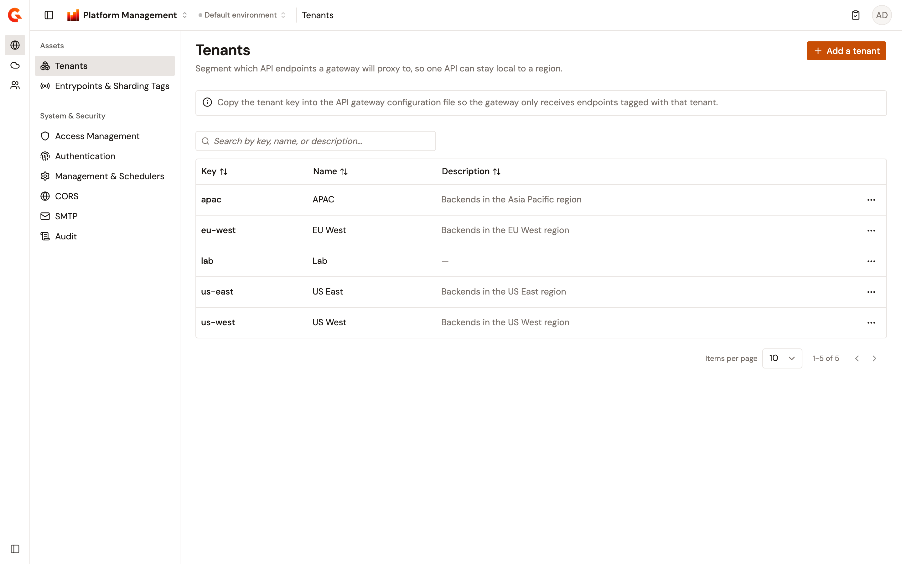
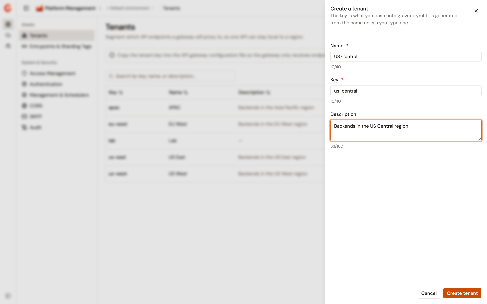

# Manage tenants

A tenant is a label you put on a gateway and on the API endpoints that gateway is meant to reach. Tag a gateway with a single tenant key in its configuration file, then assign the same key to the endpoints that belong with it. That gateway loads only the endpoints that match. One API can then serve several regions without a second copy of the API.

Tenants belong to the organization, and the Tenants page in the Gamma console creates, edits, and deletes them. The page is a registry rather than a routing switch. A tenant starts affecting traffic once its key reaches a gateway's configuration file and an API's endpoints.

## Open Tenants

From the Gamma console sidebar, select **Platform Management**, open the **Organization** section, and then navigate to **Tenants**. The section column collapses to icons by default, and hovering an icon shows its name.

The tenants table displays the following columns:

* **Key**. The value that gateway configuration files and API endpoints reference.
* **Name**. The tenant's display name.
* **Description**. The tenant's description, or **&#x2014;** when it has none.

Sort the list by any of the three columns. The search field filters the rows on the key, the name, and the description. The table paginates 10 rows at a time by default, and offers 25, 50, and 100.

When the organization has no tenants yet, the table is replaced by a **Why create a tenant?** card that explains what a tenant does.

<figure><figcaption><p>The Tenants page lists the tenants defined for the organization.</p></figcaption></figure>

## Create a tenant

To create a tenant, complete the following steps:

1. Select **Add a tenant**.
2. Enter the tenant details described in the following table:

    | Field             | Description                                                                                                                                                                         | Required |
    | ----------------- | ----------------------------------------------------------------------------------------------------------------------------------------------------------------------------------- | -------- |
    | **Name**          | A display name of up to 40 characters. The console fills **Key** from the name until you type in the **Key** field yourself.                                                          | Yes      |
    | **Key**           | The value to add to your gateway configuration files and API endpoints. The field accepts lowercase letters, digits, and hyphens, up to 40 characters, and rewrites what you type as you type it. Leaving the field strips trailing hyphens. | Yes      |
    | **Description**   | Freeform text of up to 160 characters describing the purpose of the tenant.                                                                                                          | No       |

3. Select **Create tenant**.

Only the key is unique within the organization, so two tenants can carry the same name. A key that another tenant already uses is rejected in the form.

<figure><figcaption><p>The Create a tenant panel generates the key from the name.</p></figcaption></figure>

## Edit a tenant

In the tenant row, open the actions menu and select **Edit**. The name and the description are editable, and the key is read-only because gateway configuration files and API endpoints already reference it. Select **Save** to apply the changes.

## Delete a tenant

In the tenant row, open the actions menu, select **Delete**, and confirm with **Delete**.

Deleting a tenant removes it from the organization's tenant list and from the tenant pickers that read that list. It doesn't rewrite any API definition or gateway configuration file. An endpoint that already carries the key keeps it, and a gateway configured with that key keeps loading that endpoint. To stop the routing, remove the key from the endpoints and from the gateway configuration files as well.

## Apply a tenant to a gateway

A gateway carries at most one tenant. Set it in the gateway's `gravitee.yml` file:

```yaml
# Multi-tenant configuration
# Allow only a single-value
tenant: usa
```

The `graviteeio/apim` Helm chart renders the `gateway.tenant` value into that same key. The `gravitee.tenant` system property takes precedence over the value in the configuration file.

The gateway reads the value from its configuration once and keeps it, so restart the gateway after you change it. Each running gateway reports its tenant with its heartbeat, and the **Tenant** column of the Gateways page shows what it reported.

## Assign a tenant to an API endpoint

Assign tenants to an endpoint from the **Tenants** field of that endpoint's configuration, described in [Configure endpoints](../api-management/build/configure-your-api-proxy/configure-backend-security.md). The field accepts more than one tenant.

## Review how a gateway matches endpoints

The gateway compares its own tenant against the tenants assigned to each endpoint:

| Gateway tenant | Endpoint tenants                       | Result                            |
| -------------- | -------------------------------------- | --------------------------------- |
| Not set        | Any value, or none                     | The gateway loads the endpoint    |
| Set            | None                                   | The gateway loads the endpoint    |
| Set            | Include the gateway's tenant           | The gateway loads the endpoint    |
| Set            | Don't include the gateway's tenant     | The gateway skips the endpoint    |

An endpoint with no tenant is shared, so every gateway loads it whatever its own tenant. A gateway with no tenant loads every endpoint, so give each gateway in a multi-region deployment its own tenant.

## Next steps

* [Configure endpoints](../api-management/build/configure-your-api-proxy/configure-backend-security.md). Assign tenants to the endpoints of an API proxy.
* [Monitor gateway instances](monitor-gateway-instances.md). Check the tenant each registered gateway reports.
