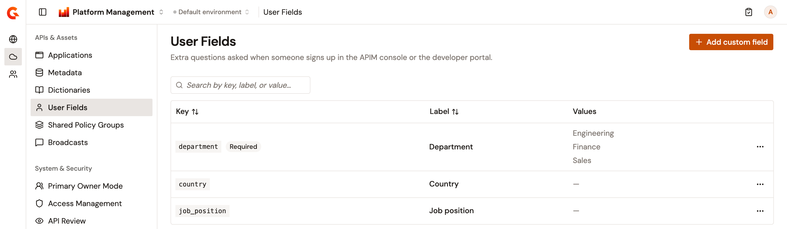
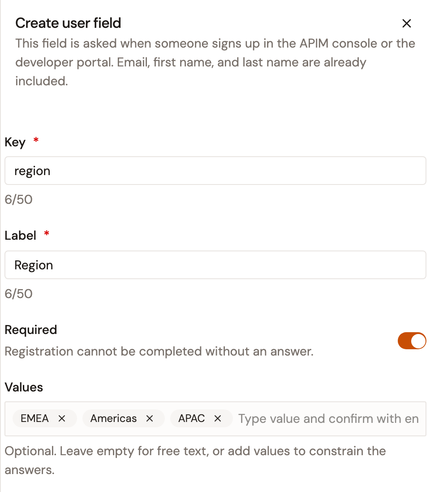
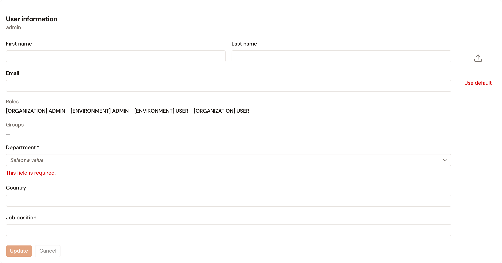

# Manage user fields

User fields are the extra questions people answer when they request an account, next to their first name, last name, and email address. Use them to collect details such as a department, a country, or a job title. Each answer is kept on the person's profile.

User fields belong to the organization, so the list is the same whichever environment is selected. The same fields are asked when someone signs up in the APIM Console or the Developer Portal.

Each person's answers appear on their detail page, which opens from the **Users** page. There, each answer is listed under its field's key. For more information, see [Manage users](manage-users.md).

## Open the User Fields page

To open the **User Fields** page, complete the following steps:

1. At the top of the Gamma console, click the name of the current product, such as **Home**.
2. Select **Platform Management**.
3. In the sidebar, open **Environment**.
4. Under **APIs & Assets**, click **User Fields**.

    <figure><figcaption>
The User Fields page lists each field's key, label, and values.
</figcaption></figure>

## Add a user field

To add a user field, complete the following steps:

1. On the **User Fields** page, click **Add custom field**.
2. Enter the field details described in the following table:

    | Field        | Description                                                                                                                                                                                                   | Required |
    | ------------ | ------------------------------------------------------------------------------------------------------------------------------------------------------------------------------------------------------------- | -------- |
    | **Key**      | The name the answer is stored under on each profile. Use letters, digits, underscores, and hyphens, up to 50 characters. The key is saved in lowercase, has to be unique, and is fixed once the field exists. | Yes      |
    | **Label**    | The question people read, up to 50 characters.                                                                                                                                                                | Yes      |
    | **Required** | When it's on, people have to answer the field to sign up.                                                                                                                                                     | No       |
    | **Values**   | The answers people choose from. Type each value and press Enter. Leave it empty to let people type their own answer.                                                                                          | No       |

    <figure><figcaption>
A required field whose answers come from a list of three values.
</figcaption></figure>

3. Click **Create field**.

## Edit a user field

To edit a user field, complete the following steps:

1. In the field's row, open the actions menu.
2. Select **Edit**.
3. Change the label, the **Required** switch, or the values. The key is read-only.
4. Click **Save changes**.

Answers people already gave stay on their profile unchanged, even when you remove their value from the list. When you make a field required, people who haven't answered it have to answer it before they can save changes to their own account.

## Delete a user field

Deleting a field removes it from the sign-up forms and deletes every person's answer to it. Creating a field with the same key later doesn't bring the answers back.

To delete a user field, complete the following steps:

1. In the field's row, open the actions menu.
2. Select **Delete**.
3. In the **Delete custom user field** dialog, click **Delete**.

## Verification

To verify your user fields are working as expected, follow these steps:

1. At the top right of the Gamma console, click your avatar.
2. Select **My Account**.

    Each user field appears in the **User information** card, under its label, where every person reviews and changes their own answers. A field with values offers them as a list to choose from.

    <figure><figcaption>
User fields in the User information card.
</figcaption></figure>
