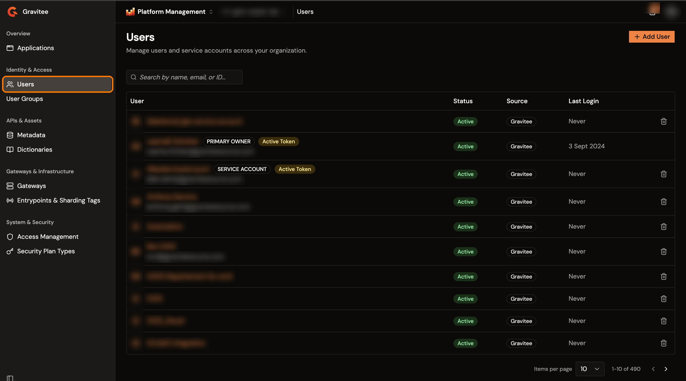
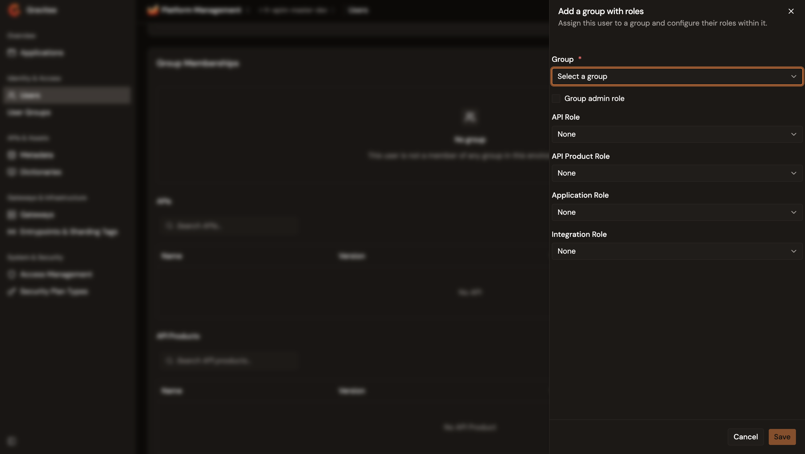
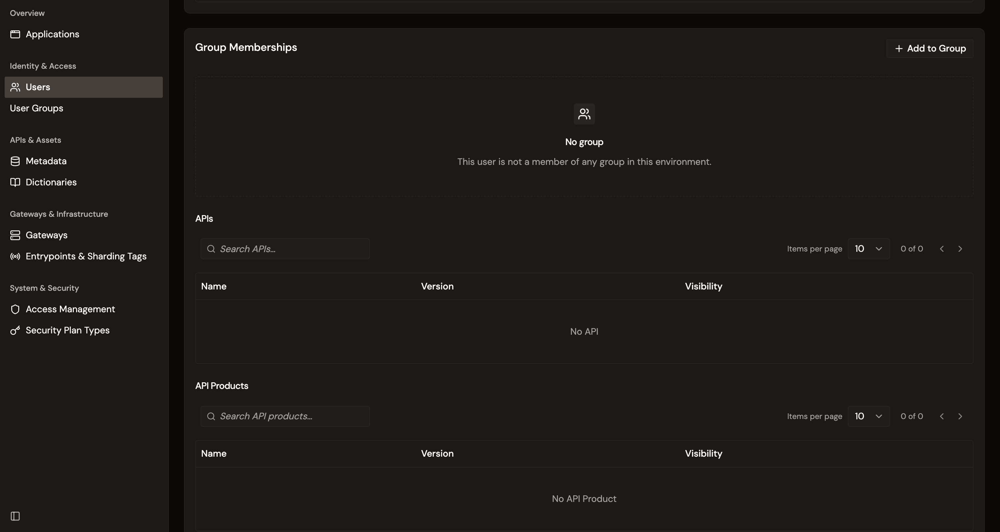
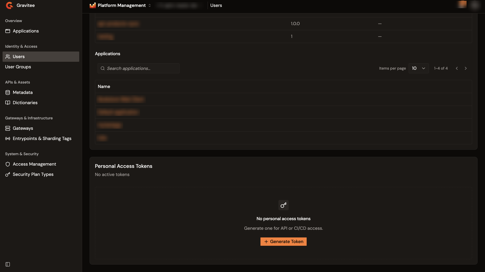
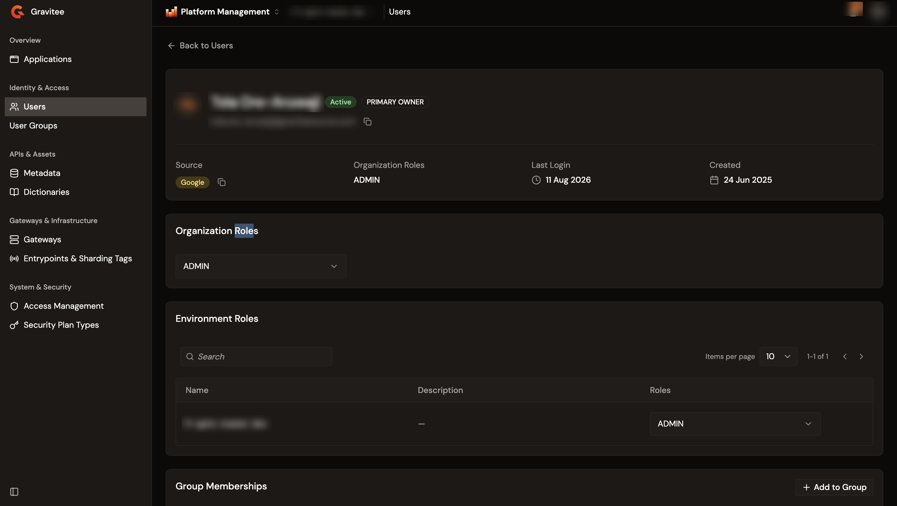

# Manage users

The Users page in the Gamma console holds every user of the organization: the people who sign in to the console and the service accounts that automation uses. From it you add users, review who they are, set the roles and group memberships that decide what they reach, issue personal access tokens, and remove users who leave.

Users belong to the organization, so the list is the same whichever environment is selected. Roles and group memberships are set per organization and per environment on each user's detail page.

## View users

From the Gamma console sidebar, select **Platform Management**, and then navigate to **Users**.

The users table displays the following columns:

* **User**. The user's display name and email address. Select the name to open the user's detail page. Badges next to the name mark a **Primary Owner**, a **Service account**, and a user who holds at least one active personal access token.
* **Status**. Active, Pending, Rejected, or Deletion In Progress.
* **Source**. The identity provider the user comes from, such as Gravitee, Memory, LDAP, or OIDC.
* **Last Login**. When the user last signed in, or **Never**.

Use the search field to filter by name, email, or ID. Searching a full email address finds the user, because the lookup uses the part before the `@`. The table paginates 10 rows at a time by default, and offers 25, 50, and 100.

<figure><figcaption>
The Users page lists the users of the organization with their status, identity provider, and last login. Names and email addresses are obscured in this example.
</figcaption></figure>

## Add a user

Adding a user pre-registers an identity in the organization. To add a user, complete the following steps:

1. From the users list, select **Add User**.
2. Under **User type**, select **External User** for a person, or **Service Account** for an automation identity.
3. Enter the user details described in the following table:

    | Field            | Description                                                                                        | Required                          |
    | ---------------- | -------------------------------------------------------------------------------------------------- | --------------------------------- |
    | **First Name**   | The person's first name. Shown for an external user only.                                          | Yes, for an external user         |
    | **Last Name**    | The person's last name. Shown for an external user only.                                           | Yes, for an external user         |
    | **Service Name** | A meaningful name for the service account. Shown for a service account only.                       | Yes, for a service account        |
    | **Email**        | The user's email address. Rejected when the format is invalid.                                     | Yes, for an external user         |

4. Optional: for an external user, select an **Identity Provider**. This field appears only when the organization has an identity provider besides Gravitee. Selecting a provider other than Gravitee adds an **Identifier** field that takes the user's ID in that provider, and the identifier is required.
5. Select **Add User**.

The new user is created with the status Active, and receives the organization's default organization role and default environment role. An external user coming from the Gravitee identity provider also receives an email with a link to set a password. A service account receives no email, and neither does a user coming from another identity provider.

A user that already exists in the organization with the same identity provider and identifier is rejected.

## Accept or reject a pending registration

Users who sign themselves up arrive with the status Pending when the organization doesn't validate new registrations automatically. Their detail page carries a **Registration Pending** banner that reads "This user has been pre-registered and is waiting for approval." The same registration also appears under the **Users** area of the console's **Tasks & Approvals** page, and that entry links to the user's detail page.

To process a pending registration, complete the following steps:

1. From the users list, select the name of the pending user.
2. In the **Registration Pending** banner, select **Accept** or **Reject**.
3. In the **User registration** dialog, confirm the action.

Accepting sets the status to Active. Rejecting sets it to Rejected and frees the address, so the same person registers again with the same email. Either outcome sends the user an email that names the decision.

## Review a user's profile

Select a user's name in the table to open the detail page. The profile card at the top shows the display name, the status, the email address, and a **Service account** or **Primary Owner** badge where it applies, over four values:

* **Source**. The identity provider the user comes from.
* **Organization Roles**. The organization roles the user holds. A list longer than three names is shortened, and the full list opens on hover.
* **Last Login**. When the user last signed in, or **Never**.
* **Created**. When the account was created.

Custom fields that the user carries appear under those values, each with its own copy action. Select **Back to Users** to return to the list.

## Assign organization roles

Organization roles apply across the whole organization. To change them, complete the following steps:

1. From the users list, select the user's name.
2. In the **Organization Roles** card, open the role picker.
3. Select the roles to grant, and clear the roles to withdraw.
4. Close the picker.

Closing the picker saves the selection. Roles stay read-only unless the user's status is Active.

## Assign environment roles

Environment roles apply to one environment, so a user holds a different role in each. The **Environment Roles** card lists every environment of the organization in a table of **Name**, **Description**, and **Roles**.

To change a user's role in an environment, complete the following steps:

1. From the users list, select the user's name.
2. In the **Environment Roles** card, find the environment. Use the search field when the organization has many environments.
3. Open the role picker in the environment's row, and select the roles to grant.
4. Close the picker.

As with organization roles, closing the picker saves the selection, and the pickers stay read-only unless the user's status is Active.

## Manage group memberships

A group membership is scoped to an environment, so the **Group Memberships** card shows one tab per environment when the organization has more than one.

The membership table lists the groups the user belongs to in the selected environment. It has one column for each role a membership carries: **Group Admin**, **API Role**, **API Product Role**, **Application Role**, and **Integration Role**. The group name carries a **Group Admin** badge for a group administrator, and a **Member** badge for a user who holds one of the other roles.

### Add a user to a group

To add the user to a group, complete the following steps:

1. In the **Group Memberships** card, select the environment tab.
2. Select **Add to Group**.
3. In the **Group** list, select a group. Groups the user already belongs to aren't listed.
4. Select the roles the membership grants. Select the **Group admin role** checkbox to make the user an administrator of the group, and select an **API Role**, **API Product Role**, **Application Role**, or **Integration Role** as needed. At least one of the five is required.
5. Select **Save**.

<figure><figcaption>
The Add a group with roles panel. Pick the group, then set the roles the membership grants.
</figcaption></figure>

System roles appear in the role lists but aren't selectable.

### Change or remove a group membership

Change a role from the membership row: select the **Group Admin** checkbox, or pick another value in one of the role lists. The change saves immediately, and the membership keeps at least one role.

To remove the user from a group, select the delete action in the membership row, and confirm in the **Delete user from the group** dialog. Removal is blocked while the user is the API primary owner in that group.

## Review a user's resource memberships

Under the group table, three tables list what the user is a member of in the selected environment:

* **APIs**. Each API the user is a member of, with its **Name**, **Version**, and **Visibility**.
* **API Products**. Each API Product the user is a member of, with its **Name**, **Version**, and **Visibility**.
* **Applications**. Each application the user is a member of, by **Name**.

Each table has its own search field and pagination, and each name links to the resource.

<figure><figcaption>
The APIs and API Products tables under the Group Memberships card. This user belongs to no group and holds no resource membership in the selected environment.
</figcaption></figure>

## Convert a user to a service account

A service account is an identity that automation uses instead of a person. **Convert to service account** appears on the profile card only for a user who meets all three of the following conditions:

* The user comes from the Gravitee identity provider.
* The user holds no password.
* The user has no service account setting yet.

Selecting the action opens a confirmation dialog. The conversion is permanent: once the user is a service account, the action no longer appears.

## Reset a user's password

**Reset password** appears on the profile card for an Active user who comes from the Gravitee identity provider and isn't a service account. To reset a password, complete the following steps:

1. From the users list, select the user's name.
2. Select **Reset password**.
3. In the **Reset user password** dialog, select **Reset**.

The user receives an email with a link to set a new password, and the link opens the reset page of the Gamma console. The organization needs its Gamma URL configured for the reset to go through.

## Manage personal access tokens

A personal access token authenticates calls to the Management API as the user, in an `Authorization: Bearer` header. The **Personal Access Tokens** card on the detail page lists the tokens the user holds, with the **Name**, **Created at**, and **Last use** of each.

To generate a token, complete the following steps:

1. From the users list, select the user's name.
2. In the **Personal Access Tokens** card, select **Generate Token**.
3. Enter a **Name** of 2 to 64 characters. A name that one of the user's other tokens already uses is rejected, whatever its casing.
4. Select **Generate**.

The dialog then shows the token value once, together with a ready-made `curl` example that uses it. Copy the value before closing the dialog, because it's never shown again.

To revoke a token, select the revoke action in the token's row, and confirm in the **Revoke a token** dialog.

<figure><figcaption>
The Personal Access Tokens card for a user who holds no token yet. API and application names are obscured in this example.
</figcaption></figure>

## Delete a user

Deleting a user revokes their access to the organization. To delete a user, complete the following steps:

1. In the user's row, select the delete action.
2. In the **Delete a user** dialog, select **Delete**.

Deleting removes the user's memberships, notification settings, and personal access tokens, drops the account from the search index, and sets the status to Deletion In Progress.

The delete action isn't offered for a user who already holds that status, and it isn't offered for a user who carries the **Primary Owner** badge. A user who is the primary owner of an API is refused, and so is a user who is the primary owner of an application. Transfer that ownership first, then delete the user.

Deleted accounts keep their name unless the installation sets `user.anonymize-on-delete.enabled` to `true` in `gravitee.yml`. The default is `false`. When it's enabled, deleting replaces the first name with `Unknown` and empties the last name.

## Verification

To verify that user management is working as expected, follow these steps:

1. From the Gamma console sidebar, select **Platform Management**, and then navigate to **Users**.
2. Select **Add User**.
3. Enter a first name, a last name, and an email address.
4. Select **Add User**.
5. Confirm that the new user appears in the table with the status Active.
6. Select the new user's name.
7. In the **Organization Roles** card, open the role picker.
8. Select a role, and then close the picker.
9. Confirm that the role appears under **Organization Roles** on the profile card.

<figure><figcaption>
A user's detail page. The assigned role appears under Organization Roles on the profile card and in the Organization Roles picker below it. The name, email address, and environment name are obscured in this example.
</figcaption></figure>

## Next steps

* [Manage applications](manage-applications.md). Manage the consumer applications that subscribe to your API plans.
