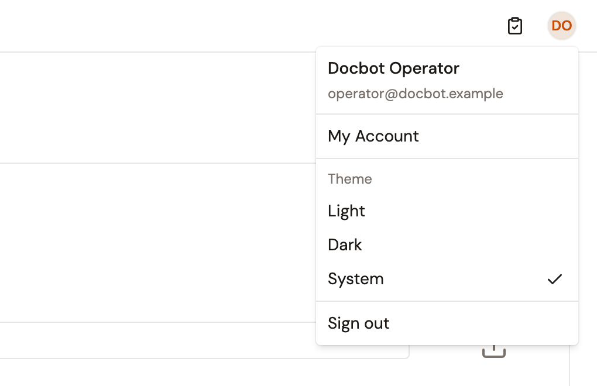
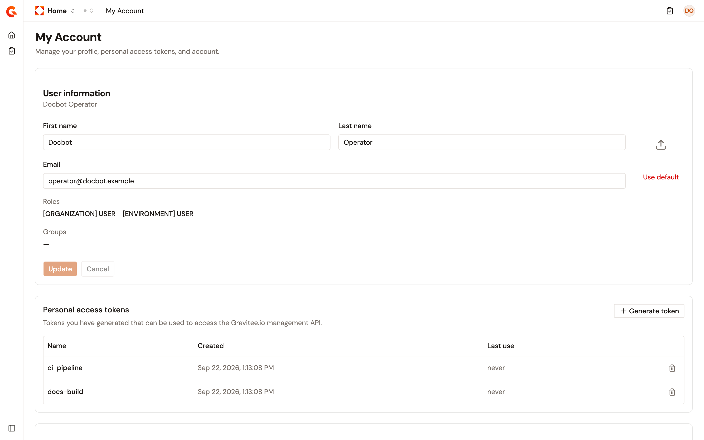
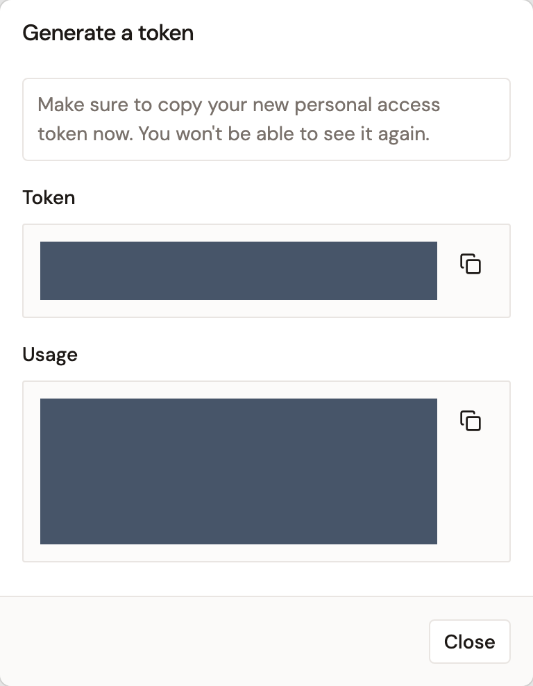

# Manage your account

The **My Account** page of the Gamma console is where you look after your own user account. It holds the name, email address, and avatar the console shows for you, your personal access tokens for the Management API, and the deletion of your own account. Every signed-in user has the page, whatever their role.

My Account is self-service only. To add users, assign their roles and groups, or manage the tokens of another user, use the **Users** page of Platform Management. See [Manage users](manage-users.md).

## Open My Account

My Account has no sidebar item. You open it from the account menu in the top-right corner of the console, which is also where you switch the console theme and sign out.

To open the page, complete the following steps:

1. In the top-right corner of the Gamma console, select your avatar. The menu opens with your name and email address at the top.
2. Select **My Account**.

The page opens under the environment you have selected, and switching environments from the header keeps you on it.

The same menu holds a **Theme** section, where you pick **Light**, **Dark**, or **System**, and a **Sign out** item that ends your session.

<figure><figcaption>
The account menu of the Gamma console. <strong>My Account</strong> opens your account page.
</figcaption></figure>

## Update your profile

The **User information** card shows your display name and holds the fields described in the following table.

| Field           | Description                                                                                                                                                                                                                                          |
| --------------- | ---------------------------------------------------------------------------------------------------------------------------------------------------------------------------------------------------------------------------------------------------- |
| **First name**  | Your first name. Editable when Gravitee holds your account, that is, when your source is Gravitee or Memory. Read-only when your account comes from an identity provider, because the provider owns it.                                              |
| **Last name**   | Your last name. Same rule as **First name**.                                                                                                                                                                                                         |
| **Email**       | Your email address. Same rule as **First name**.                                                                                                                                                                                                     |
| **Roles**       | The roles you hold, each shown as its scope in brackets followed by its name. Read-only.                                                                                                                                                             |
| **Groups**      | The groups you belong to. When you belong to groups in more than one environment, each environment's groups follow the environment's name in brackets. Read-only.                                                                                    |
| Custom fields   | One field per custom user field the organization defines. A required field is marked as such, and a field with a fixed list of values is a dropdown. Editable whatever your source.                                                                  |

To update your profile, complete the following steps:

1. Change the fields you want.
2. Select **Update**.

The console confirms with a **User has been updated successfully** message. The **Update** button stays disabled until you change something, and while a required field is empty. The **First name**, **Last name**, and **Email** fields are required when you can edit them. Select **Cancel** to put every field back to its last saved value.

The console applies the read-only rule itself. The Management API accepts a `PUT /user` request that renames an identity-provider account. An OpenID Connect, Gravitee Access Management, Google, or GitHub provider then writes its own values back at that user's next sign-in.

### Change your avatar

The avatar sits to the right of the profile fields. The console header shows it too, and shows your initials instead while you have no avatar.

To change your avatar, complete the following steps:

1. Select the avatar circle, and then choose an image file. The console refuses a file larger than 1 MB with **Image exceeds the maximum authorized size (1MB)**, and refuses a file that isn't an image.
2. Select **Update**.

To return to the default avatar, select **Use default** under the image, and then select **Update**.

The Management API keeps a copy of the image scaled to 200 by 200 pixels. It accepts GIF, JPEG, PNG, BMP, and TIFF images of at most 500,000 bytes, and rejects other formats, such as SVG and WebP. An image between that limit and 1 MB passes the console's check and fails on **Update**. The header avatar refreshes as soon as the update succeeds, without a page reload.

## Manage your personal access tokens

A personal access token authenticates calls to the Management API as you, with your roles and permissions, in an `Authorization: Bearer` header. Use one in scripts and CI/CD pipelines instead of your password. The **Personal access tokens** card lists the tokens you hold, oldest first, with the **Name**, **Created**, and **Last use** of each. **Last use** reads **never** until the token has authenticated a request, and updates each time it does.

<figure><figcaption>
The My Account page, with the <strong>User information</strong> card and the <strong>Personal access tokens</strong> card.
</figcaption></figure>

### Generate a token

To generate a token, complete the following steps:

1. In the **Personal access tokens** card, select **Generate token**.
2. In the **Generate a token** dialog, enter a **Name** of 2 to 64 characters. A counter under the field shows the length. A name that another of your tokens already uses, in any casing, is refused, and the error shows under the field.
3. Select **Generate**.

The dialog then shows the **Token** value and, under **Usage**, a `curl` command that calls the Management API for the current environment with it. Copy the value now with the copy button next to it. The dialog warns that you won't be able to see the token again, and the list never shows token values. Select **Close** when you're done.

<figure><figcaption>
The <strong>Generate a token</strong> dialog shows the token value once. The token value and the usage command are obscured in this example.
</figcaption></figure>

### Revoke a token

To revoke a token, complete the following steps:

1. In the token's row, select the revoke icon.
2. In the dialog, select **Revoke**.

The dialog names the token and warns that the applications and scripts using it lose their access to the Management API, and that you can't undo the action. The console confirms with **Token "name" has been revoked**, where name is the token's name. From then on, a request that carries the token is refused as unauthenticated.

## Delete your account

The **Danger Zone** card at the bottom of the page deletes your own account. Deleting is permanent. It removes your memberships, your notification settings, and your personal access tokens, archives the account, and signs you out. When the Management API sets `user.anonymize-on-delete.enabled` to `true`, the archived account keeps no name either. The default is `false`.

**Delete my account** is disabled while you're the primary owner of an API or an application. The card asks you to transfer the ownership of your APIs and applications, or to delete them, first.

To delete your account, complete the following steps:

1. In the **Danger Zone** card, select **Delete my account**.
2. In the **Are you sure you want to delete your account?** dialog, type your username exactly as the dialog shows it.
3. Select **Yes, delete my account**.

The console confirms with **You have been successfully deleted** and returns you to the sign-in page.

### Hide the Danger Zone

The card is shown by default. It's hidden when the Management API authenticates users through its external authentication mechanism and forbids those users from deleting their account. That's the case when `auth.external.enabled` is `true` and `auth.external.allowAccountDeletion` is `false` in the `gravitee.yml` file of the Management API. Their defaults are `false` and `true`. With the Helm chart, set them under `api.auth.external` in your values. Neither the Gamma console nor the APIM Console exposes them.

## Verification

To verify that your account page works as expected, follow these steps:

1. In the top-right corner of the Gamma console, select your avatar, and then select **My Account**.
2. In the **Personal access tokens** card, select **Generate token**.
3. Enter a name, and then select **Generate**.
4. Copy the **Usage** command, select **Close**, and run the command in a terminal. The Management API answers with the details of the current environment.
5. In the token's row, select the revoke icon, and then select **Revoke**.
6. Run the command again. The Management API refuses it with `401`.

## Next steps

* [Manage users](manage-users.md). Add users, assign their roles and groups, and generate tokens for them as an administrator.
* [Configure console authentication](configure-console-authentication.md). Decide how people sign in to the Gamma console, and add identity providers.
