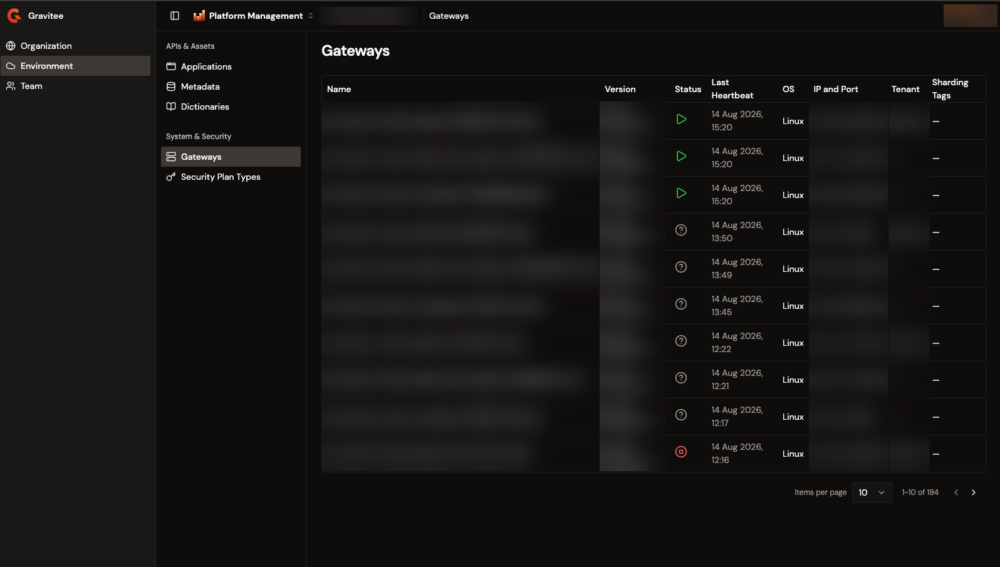
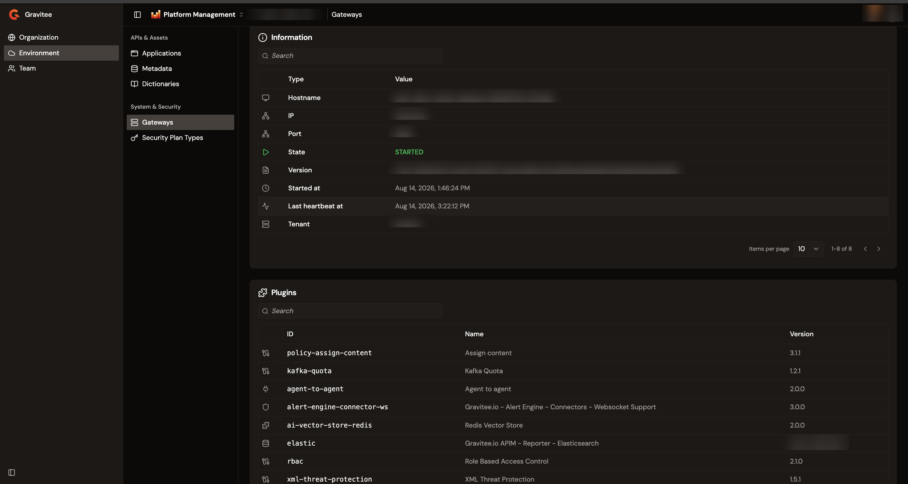
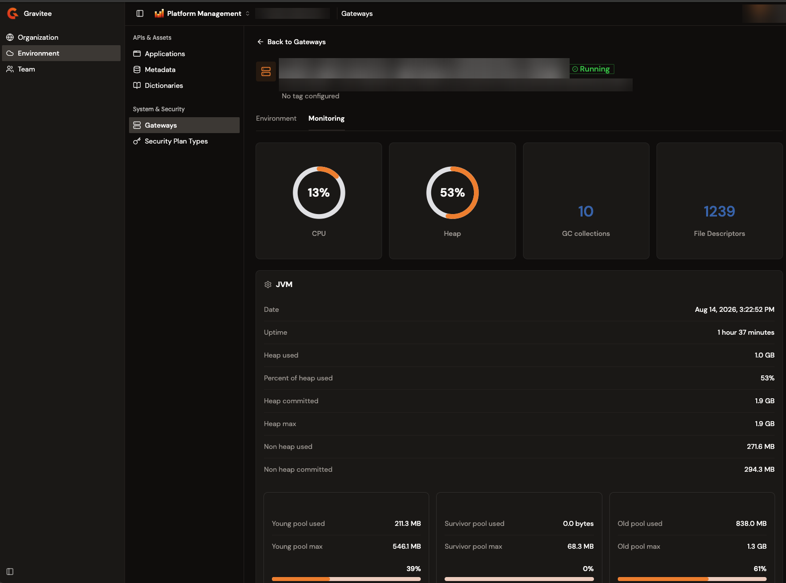

# Monitor gateway instances

A gateway instance is a running gateway process that reports itself to the platform with a periodic heartbeat. The Gateways page in the Gamma console lists the instances registered with the selected environment. Each instance opens a detail view that carries its configuration, its loaded plugins, and its live health metrics.

The page is read-only, and reports what each instance tells the platform about itself. Use it to confirm that the gateways behind an environment are up, and to check which version and sharding tags they run. It also follows CPU, heap, and thread activity while you troubleshoot.

## Open Gateways

From the Gamma console sidebar, select **Platform Management**. Open the **Environment** section, and then navigate to **Gateways**.

The instances table displays the following columns:

* **Name**. The instance's hostname. Select the name to open the instance's detail view.
* **Version**. The gateway version. An instance reports its version with a build and revision suffix, and the column trims everything from the opening parenthesis onward, so `4.13.0 (build: 123) revision#abc1234` displays as `4.13.0`.
* **Status**. An icon that reports whether the instance is running. Hover over the icon for the status name.
* **Last Heartbeat**. When the instance last reported itself.
* **OS**. The operating system the instance runs on.
* **IP and Port**. The address and port the instance reported.
* **Tenant**. The instance's tenant, or **&#x2014;** when it doesn't declare one.
* **Sharding Tags**. The sharding tags set in the instance's own configuration, or **&#x2014;** when it doesn't declare any.

The list is scoped to the environment selected in the console, and it returns to the first page when you switch environment. Stopped instances stay in the list. The table paginates 10 rows at a time by default, and offers 25, 50, and 100. The data refreshes every 30 seconds.

When the table has no rows, it shows **There are no Gateway instances (yet).** and explains that instances appear once they register a heartbeat with the environment.

<figure><figcaption>
The Gateways page lists the instances registered with the selected environment.
</figcaption></figure>

## Read an instance's status

The platform derives the status from the start and stop events an instance sends, and from the age of its last heartbeat. The instances table shows the status as an icon, and the detail view shows it as a badge next to the instance name. The two surfaces use different wording for a running instance:

| Icon tooltip | Detail badge | What it means                                                                                        |
| ------------ | ------------ | ---------------------------------------------------------------------------------------------------- |
| Started      | Running      | The instance reported a start event, and its last heartbeat is no more than five minutes old.        |
| Stopped      | Stopped      | The instance reported a stop event.                                                                  |
| Unknown      | Unknown      | The instance reported a start event, but its last heartbeat is more than five minutes old.           |

An instance that has never sent a heartbeat is also reported as Unknown.

Unknown is the state to investigate. The instance last reported that it started, and the platform hasn't heard from it in more than five minutes. A gateway that shuts down through its normal stop sequence reports Stopped instead, so Unknown points at an instance that stopped reporting without shutting down cleanly.

An instance that stays Unknown eventually drops out of the list. The Management API keeps an Unknown instance visible for as long as `gateway.unknown-expire-after` allows, which is `604800` seconds, or seven days, unless you set it in the Management API `gravitee.yml`.

## View instance details

To open an instance, select its name in the **Name** column. The header carries the instance's hostname, its status badge, its address and version, and its sharding tags, or **No tag configured** when it declares none. Select **Back to Gateways** to return to the list.

The detail view has an **Environment** tab and a **Monitoring** tab. The Environment tab holds three sections, described in the following subsections. Each section has its own search field, paginates 10 rows at a time by default, and offers 25, 50, and 100.

<figure><figcaption>
The Environment tab of a gateway instance, with the Information and Plugins sections.
</figcaption></figure>

### Information

The **Information** section reports what the instance declared about itself as a list of type and value pairs. The section always lists **Hostname**, **IP**, **Port**, **State**, **Version**, **Started at**, and **Last heartbeat at**.

The section adds the following rows when the instance reports them:

* **Sharding tags**. The sharding tags set in the instance's own configuration.
* **Tenant**. The instance's tenant.
* **Stopped at**. When the instance reported its stop event.

### Plugins

The **Plugins** section lists every plugin the instance has loaded, with its **ID**, **Name**, and **Version**. Use it to confirm that an instance carries the policy, connector, resource, or reporter a deployed API depends on. It also shows whether every instance behind the same environment runs the same set.

An instance that reports no plugins shows **No plugin**.

### System properties

The **System properties** section lists the JVM system properties of the instance as **Name** and **Value** pairs. Before it sends them, the gateway strips every property whose name starts with `gravitee` in any capitalization, so Gravitee's own properties don't appear here.

An instance that reports no system properties shows **No property**.

## Monitor instance health metrics

The **Monitoring** tab reports the instance's live resource use. It refreshes every 5 seconds while the instance is Started.

<figure><figcaption>
The Monitoring tab of a running instance, with the four headline cards above the JVM section.
</figcaption></figure>

### Headline indicators

Four cards sit at the top of the tab:

* **CPU**. A gauge of the gateway process's CPU use, as a percentage.
* **Heap**. A gauge of the JVM heap in use, as a percentage. The **JVM** section reports the same figure as **Percent of heap used**.
* **GC collections**. The number of old generation garbage collections the JVM has run.
* **File Descriptors**. The number of file descriptors the process currently holds.

### JVM

The **JVM** section reports the memory picture behind the Heap gauge. It opens with **Date**, the timestamp of the reading, and **Uptime**. The heap totals follow: **Heap used**, **Percent of heap used**, **Heap committed**, **Heap max**, **Non heap used**, and **Non heap committed**.

Three cards follow, one for each memory pool: young, survivor, and old. Each card reports the pool's used and maximum size with a bar for the ratio between them, then the peak used and peak maximum size with a second bar. The row labels carry the pool name, for example **Old pool used** and **Old pool peak max**. Sizes are reported in the largest unit that fits, from bytes up to petabytes.

### CPU, process, thread, and garbage collector

Four more cards close the tab:

* **CPU**. **Percent of use** for the host, and the host's **Load average** readings.
* **Process**. **Open file descriptors** and **Max file descriptors**. Compare the two to catch an instance approaching its limit.
* **Thread**. The current thread **Count** and the **Peak count** since the instance started.
* **Garbage collector**. **Young collection count**, **Young collection time**, **Old collection count**, and **Old collection time**, with both times in milliseconds.

## Troubleshoot missing data

The Gateways page reports only what the gateways send and what the platform stores. An empty section usually points at configuration rather than at a failing instance.

The instances table and the Environment tab are built from the heartbeat each gateway sends. The Monitoring tab is different: it reads metrics that the gateway samples on its own schedule and the platform stores. The following settings change what the page shows:

| Setting                                     | Where it's set          | Default        | Effect on the page                                                                              |
| ------------------------------------------- | ----------------------- | -------------- | ------------------------------------------------------------------------------------------------- |
| `services.heartbeat.enabled`                | Gateway `gravitee.yml`  | `true`         | An instance that doesn't send heartbeats never appears in the list.                              |
| `services.heartbeat.delay` and `.unit`      | Gateway `gravitee.yml`  | 5000 ms        | How often **Last Heartbeat** advances.                                                            |
| `services.heartbeat.storeSystemProperties`  | Gateway `gravitee.yml`  | `true`         | When `false`, the **System properties** section is empty and the **OS** column shows **&#x2014;**. |
| `services.monitoring.delay` and `.unit`     | Gateway `gravitee.yml`  | 5000 ms        | How often the metrics behind the Monitoring tab are sampled.                                      |
| `repositories.analytics.type`               | Management API `gravitee.yml` | `elasticsearch` | When `none`, the Monitoring tab has no metrics to read.                                     |

The Monitoring tab reports the following when it has nothing to display:

* **There is no data for stopped gateway instance**. The instance isn't Started, so the tab doesn't request metrics. This message also appears for an instance in the Unknown state.
* **There is no monitoring data for this gateway instance yet**. The instance is Started, but the analytics store holds no metrics for it.
* **Failed to load monitoring data. Please refresh and try again.** The request for metrics didn't succeed.

## Next steps

* [Manage entrypoints and sharding tags](manage-entrypoints-and-sharding-tags.md). Configure the sharding tags and entrypoint mappings of the organization.
