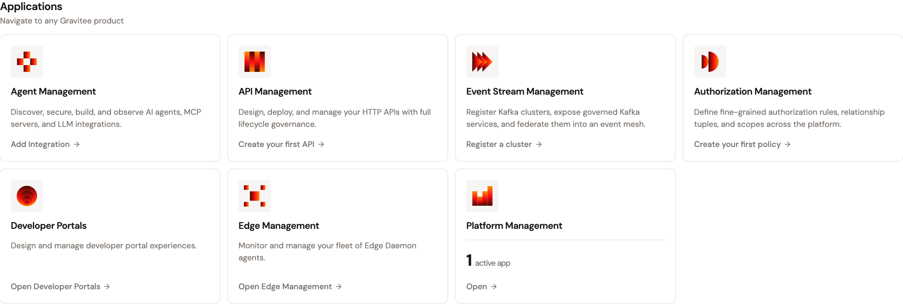
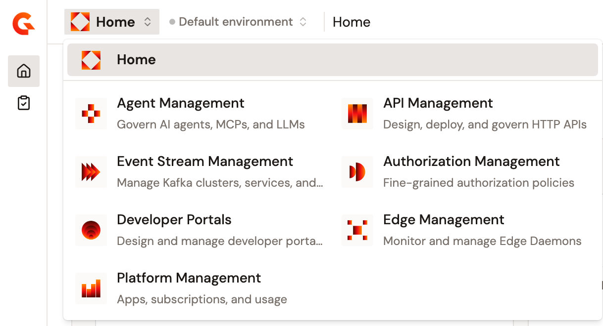
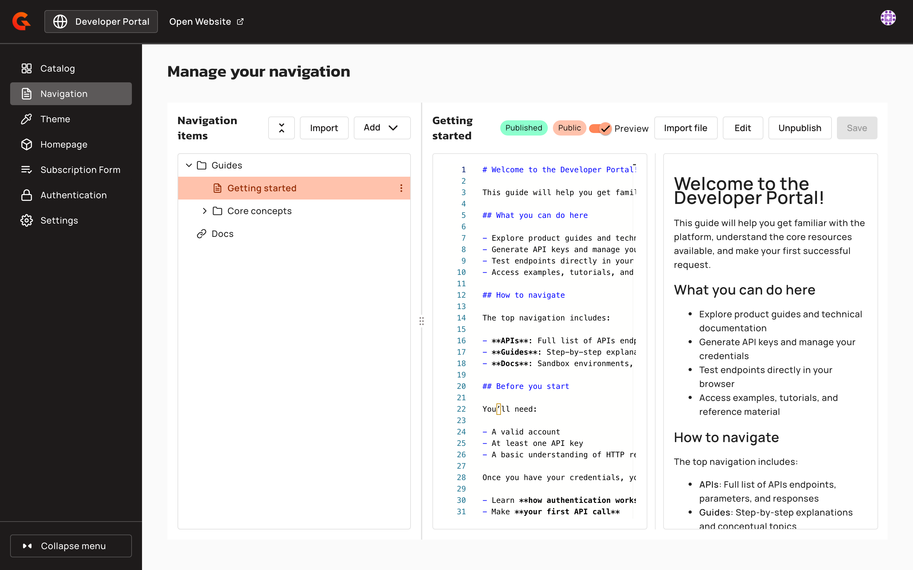

# Open the Developer Portal settings

The Gamma console links to the settings of the New Developer Portal as **Developer Portals**, on its home page and in the menu at the top of every page. Both open the Developer Portal settings of the environment selected in the Gamma console, on the **Navigation** page, in a new browser tab. If the APIM Console asks you to sign in, it opens the **Navigation** page once you're signed in.

## Prerequisites

Before you open the Developer Portal settings, complete the following steps:

* Set the address of your APIM Console. **Developer Portals** opens the APIM Console at that address, and opens `http://localhost:4000` while no address is set. For more information, see [Management URL](configure-console-management-and-schedulers.md#management-url).
* Make sure your role can view or change the settings of the environment. Without that access, the **Navigation** page doesn't open.

## Open the settings from the home page

To open the Developer Portal settings from the home page, complete the following steps:

1. Go to the home page of the Gamma console.
2. In the **Applications** section, click **Developer Portals**.

    <figure><figcaption>
The <strong>Developer Portals</strong> card in the <strong>Applications</strong> section of the home page
</figcaption></figure>

The Developer Portal settings open in a new tab.

## Open the settings from any page

To open the Developer Portal settings from any page of the Gamma console, complete the following steps:

1. At the top of the page, click **Home**, or the name of the product you're working in.
2. Select **Developer Portals**.

    <figure><figcaption>
<strong>Developer Portals</strong> in the menu at the top of the page
</figcaption></figure>

The Developer Portal settings open in a new tab.

## Verification

To verify the Developer Portal settings open as expected, follow these steps:

1. On the home page of the Gamma console, click **Developer Portals**.
2. In the new tab, check that the APIM Console shows **Manage your navigation**.

    <figure><figcaption>
The <strong>Navigation</strong> page of the Developer Portal settings in the APIM Console
</figcaption></figure>

## Next steps

* [Manage Portal Navigation and APIs](https://documentation.gravitee.io/apim/developer-portal/new-developer-portal/customize-the-navigation). Add pages, folders, links, APIs, and API Products to the navigation of the New Developer Portal.
