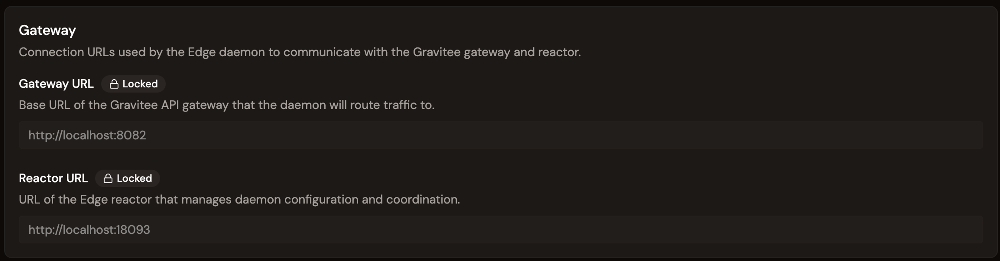
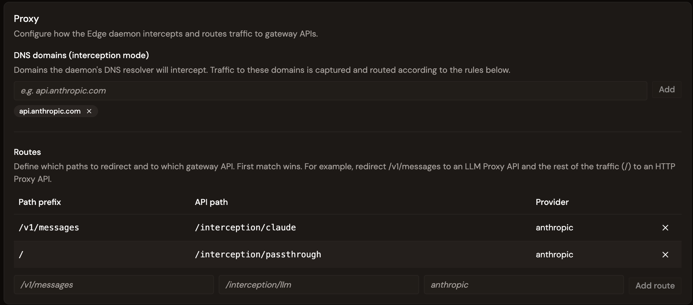
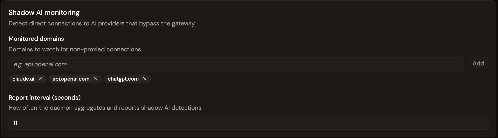

# Configure Edge Management

## Overview

Edge Management is configured from a single **Configuration** page in the Gamma console. The page is split into the following sections: Gateway, Proxy, Shadow AI monitoring, and a Daemon Deployment section used to deploy the daemon to devices. For more information about deploying Kandji to the Edge Daemon, see [Configure Kandji to deploy the Edge Daemon](configure-kandji-daemon.md).

The first time you open the page, there is no configuration. Configure the fields, and then save to create the configuration. When you save the configuration, the corresponding Edge API is published on the Gateway so the daemon's traffic can be captured.

## Configure Edge Management 

To configure Edge Management, complete the following steps:
* [Configure the Gateway](/docs/gamma/edge-management/connect/configure-edge-management.md#configure-the-gateway)
* [Configure the Proxy](/docs/gamma/edge-management/connect/configure-edge-management.md#configure-the-proxy)
* [Configure Shadow AI monitoring](/docs/gamma/edge-management/connect/configure-edge-management.md#configure-shadow-ai-monitoring)
* [Save the configuration](/docs/gamma/edge-management/connect/configure-edge-management.md#save-the-configuration)

## Configure the Gateway

Conection URLs are used by the Edge Daemon to reach the Gravitee Gateway and reactor. To configure the Edge Daemon for the Gateway, com

<figure><figcaption>
The Gateway and Reactor URLs are locked once the configuration is created.
</figcaption></figure>

The following fields define the connection URLs the Edge Daemon uses to reach the Gravitee gateway and reactor:

| Field           | Description                                                                                    |
| --------------- | ---------------------------------------------------------------------------------------------- |
| **Gateway URL** | Base URL of the AI Gateway the daemon routes proxied traffic to.                               |
| **Reactor URL** | URL of the Edge Reactor that serves daemon configuration and collects heartbeats and metrics.      |


The Gateway URL and Reactor URL are locked after you create the configuration is first created. They cannot be changed after you complete the configuration.


## Configure the Proxy

Configure how the daemon intercepts traffic and routes it to gateway APIs.

<figure><figcaption>
DNS domains to intercept, and routes mapping each path to a gateway API.
</figcaption></figure>

Configure the following settings:

* **DNS domains (interception mode).** The domains the daemon's DNS resolver intercepts. For example `api.anthropic.com`. Traffic to these domains is captured and routed according to the route configuration.
* **Routes.** Ordered rules that map a request path to a Gateway API. **First match wins.** Each route has the following properties:
  * A**path prefix**. For example `/v1/messages`.
  * An **API path**. The gateway API endpoint that handles it. For example `/interception/claude`.
  * (Optional)A **provider**. For example `anthropic`.

A typical Claude Code setup uses the following two routes:

| Path prefix     | API path                   | Provider    | Captured by     |
| --------------- | -------------------------- | ----------- | --------------- |
| `/v1/messages`  | `/interception/claude`     | `anthropic` | LLM Proxy API   |
| `/`             | `/interception/passthrough`| `anthropic` | HTTP Proxy API  |

LLM calls to `/v1/messages` are routed to the **LLM Proxy API**. All other traffic reaches the **HTTP Proxy API**.

## Configure Shadow AI monitoring

Detect direct connections to AI providers that bypass the Gateway.

<figure><figcaption>
Monitored domains and report interval for shadow AI detection.
</figcaption></figure>

Configure the following settings:

* **Monitored domains.** Domains to watch for non-proxied direct connections. For example `api.openai.com`. Detection is based on TCP connection monitoring. No traffic content is inspected.
* **Report interval (seconds).** How often the daemon aggregates and reports detections, with a minimum of 10 seconds.

## Save the configuration

* Select either of the following actions:
 * **Create connfiguration** to deploy your configuration. 
 * **Save changes** to save your configuration but not deploy it. 

 When you deploy the fconfiguration, The DNS domains, routes, and shadow AI settings are pushed to daemons the next time they poll the Edge Reactor for configuration. The configuration applies without restarting the daemon.

## Next steps

* **Deploy the Edge Daemon.** See [Configure Kandji to deploy the Edge Daemon](configure-kandji-daemon.md).
* **Connect AI tools.** See [Connect Claude Code to the Edge Daemon](connect-claude-code-to-daemon.md).
