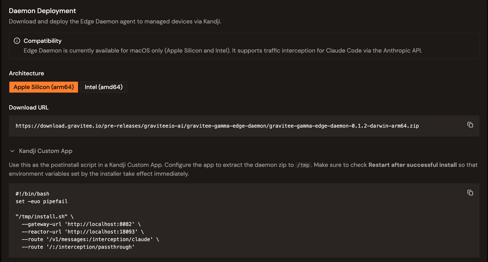

# Configure Kandji to deploy the Edge Daemon
<!-- GAP-STRUCTURAL: Missing procedural content source -->

Deploy the Edge Daemon to your device fleet using Kandji MDM. The Gamma console generates the download URL and the Kandji installation script for you, from the **Daemon Deployment** section of the Edge Management configuration page.

For an overview of the Edge Daemon, see the [Edge Management overview](../get-started/edge-management-overview.md). To configure the gateway URLs, proxy routes, and shadow AI monitoring first, see [Configure Edge Management](configure-edge-management.md).


**Compatibility.** The Edge Daemon is currently available for **macOS only** — Apple Silicon and Intel. It supports traffic interception for Claude Code through the Anthropic API.


## Prerequisites

Ensure the following are in place before continuing:

* Access to a running Gamma console with Edge Management enabled.
* An Edge Management configuration already created. For more information about configuring Edge Management, see [Configure Edge Management](configure-edge-management.md).
* A Kandji account with admin access to your device fleet.
* Your devices must run macOS.
* The gateway-side endpoints reachable from your devices. Specifically, the Edge Reactor port, `18093` by default, must be exposed. See [Gateway-side requirements](../get-started/edge-management-overview.md#gateway-side-requirements).

To deploy the Edge Daemon using Kandji, complete the following steps:

1. [Open the Daemon Deployment section](#open-the-daemon-deployment-section)
2. [Select the architecture](#select-the-architecture)
3. [Create the Kandji Custom App](#create-the-kandji-custom-app)
4. [Verify deployment](#verify-deployment)

## Open the Daemon Deployment section

* In the Gamma console, open **Edge Management** , and then and go to the **Daemon Deployment** section of the configuration page.

<figure><figcaption><p>The Daemon Deployment section generates the download URL and the Kandji postinstall script.</p></figcaption></figure>

## Select the architecture

* Choose one of the following architectures to match your devices:

* **Apple Silicon (arm64)**
* **Intel (amd64)**

The console generates the matching **Download URL** for the daemon package. Here is an example:

```text
https://download.gravitee.io/pre-releases/graviteeio-ai/gravitee-gamma-edge-daemon/gravitee-gamma-edge-daemon-0.1.2-darwin-arm64.zip
```

## Create the Kandji Custom App

The console generates a **Kandji postinstall script** pre-filled with your configuration, which includes the Gateway and reactor URLs, and the proxy routes. It looks like the following example:

```bash
#!/bin/bash
set -euo pipefail

"/tmp/install.sh" \
  --gateway-url 'http://localhost:8082' \
  --reactor-url 'http://localhost:18093' \
  --route '/v1/messages:/interception/claude' \
  --route '/:/interception/passthrough'
```

To deploy the script, complete the following actions:

1. In the Kandji admin console, create a new **Custom App**.
2. Configure the app to extract the daemon package to `/tmp`.
3. Paste the generated script as the **postinstall script**.
4. Enable **Restart after successful install** so the environment variables set by the installer take effect immediately.
5. Assign the Custom App to the appropriate device blueprints. Kandji then distributes and installs the Edge Daemon on all assigned devices.


The configuration page also exposes collapsible **Diagnostic commands** and **Uninstall** snippets to help validate or remove the daemon on a device.


## Verify your deployment

As your devices receive and start the daemon, they send heartbeats to the Edge Reactor and appear in the Edge Management dashboards. To verify your deplyoment, complete the following step:

* Open the **Devices** view to confirm that your devices report as active.

## Monitor usage

Once devices are reporting, the Gamma console provides the following dashboards:

* **Devices.** Registered devices, active/inactive status, daemon version, heartbeat counts.
* **Proxied traffic.** For more information about proxied traffic dashbaords, see [Monitor your proxied traffic](../observe/monitor-proxied-traffic.md).
* **Shadow AI.** For more information about Shadow AI dashboards, see [Monitor your shadow AI traffic](../observe/monitor-shadow-ai-traffic.md).

## Next steps

* **Connect AI tools.** Route Claude Code through the Edge Daemon. See [Connect Claude Code to the Edge Daemon](connect-claude-code-to-daemon.md).
